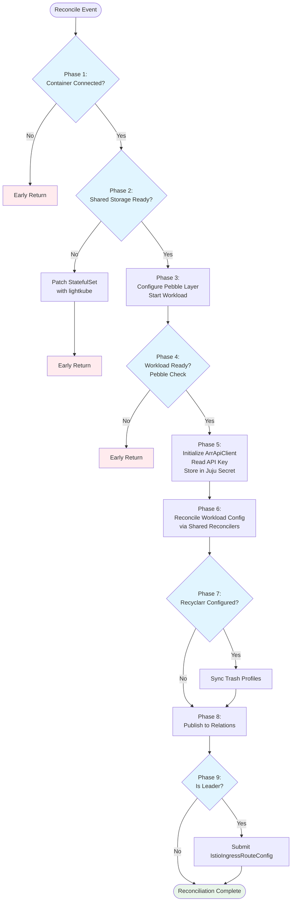

# Media Manager Charm Implementation (Radarr/Sonarr)

## Context and Problem Statement

Charmarr requires charm implementations for media manager applications (Radarr, Sonarr, and future Lidarr). These charms share ~95% identical logic, differing only in ports, media types, and Recyclarr templates. We need to define the implementation details including reconciler pattern, Pebble configuration, storage handling, relation management, config options, actions, and OCI image selection while ensuring compliance with all previously established MADRs.

**Note:** For shared arr infrastructure (ArrApiClient, reconcilers, config builders), see [lib/adr-001-arr-shared-infrastructure](../lib/adr-001-arr-shared-infrastructure.md).

## Considered Options

### Reconciler Event Handling
* **Option 1:** Single `observe_events()` for all events including custom interface events
* **Option 2:** `observe_events()` for standard K8s events + manual observation for custom interface events

### Workload Readiness
* **Option 1:** Poll API endpoint in reconciler loop
* **Option 2:** Pebble HTTP check with `level: ready`
* **Option 3:** Check service status only

### Recyclarr Execution
* **Option 1:** Track state to run once per lifecycle
* **Option 2:** Run every reconcile if configured (idempotent)

### Status Collection
* **Option 1:** Early returns on first issue found
* **Option 2:** Collect all statuses, let Juju aggregate

### External URL Configuration
* **Option 1:** Manual charm config option
* **Option 2:** Auto-configure from ingress relation data

### OCI Image Selection
* **Option 1:** LinuxServer.io images with `:latest` tag
* **Option 2:** LinuxServer.io images with pinned versions in charmcraft.yaml
* **Option 3:** Hotio images
* **Option 4:** Build Canonical Rocks for all applications

## Decision Outcome

### Reconciler: Option 2 - Hybrid event observation

Standard K8s events via `observe_events()`, custom interface events manually observed. All funnel to single `_reconcile()` method.

```python
def __init__(self, framework: ops.Framework):
    # Standard K8s events
    observe_events(self, reconcilable_events_k8s, self._reconcile)

    # Custom interface events
    self.framework.observe(self.indexer.on.changed, self._reconcile)
    self.framework.observe(self.download_clients.on.changed, self._reconcile)
    self.framework.observe(self.storage.on.changed, self._reconcile)

    # Secret rotation
    self.framework.observe(self.on.secret_changed, self._reconcile)

    # Status (separate handler)
    self.framework.observe(self.on.collect_unit_status, self._collect_status)
```

**Rationale:** Custom interface events from charmarr-lib are charm-specific and not part of the standard ops event set. Explicit observation makes dependencies clear.

### Workload Readiness: Option 2 - Pebble HTTP check

```python
"checks": {
    "radarr-ready": {
        "override": "replace",
        "level": "ready",
        "http": {"url": f"http://localhost:{port}/ping"},
        "period": "10s",
        "timeout": "3s",
        "threshold": 3,
    }
}
```

**Rationale:** Pebble checks are the idiomatic way to handle readiness. The `/ping` endpoint requires no authentication and returns 200 when service is ready. `level: ready` ensures container is only marked ready when check passes.

### Recyclarr: Option 2 - Run every reconcile

**Rationale:**
- Juju spawns fresh Python process per event → instance variables reset → state tracking impossible
- Recyclarr is idempotent and cheap (~2-5 seconds)
- Simpler code, no state management complexity

### Status Collection: Option 2 - Collect all statuses

**Rationale:** Juju aggregates statuses and shows the worst. Collecting all statuses gives operators complete visibility into charm state rather than hiding secondary issues.

### External URL: Option 2 - Auto-configure from ingress

**Rationale:** Ingress relation provides host and TLS status. Automation eliminates manual configuration. Follows Charmarr philosophy of "relate and it just works".

### OCI Images: Option 1 - LinuxServer.io with `:latest`

**Why LinuxServer.io over Hotio:**
- Larger organization and community reduces bus factor risk
- Matches legacy Docker Compose stack for migration continuity
- Proven at scale across thousands of deployments
- Multi-platform support (amd64, arm64, armhf)

**Why `:latest` tag:**
- Juju's resource model decouples images from charm code
- Users can pin at deploy time: `--resource radarr-image=lscr.io/linuxserver/radarr:5.14.0`
- Media apps benefit from updates (security patches, bug fixes)
- Juju resources are cached at deploy time, ensuring reproducibility

**Why NOT Canonical Rocks:**
- Would require replicating LinuxServer's sophisticated build pipeline
- Estimated effort: 3-6 months initial + ongoing maintenance
- Only consider if enterprise requirements demand it

## Implementation Details

### Reconciler Phases



### Phase 6: Workload Configuration via Shared Reconcilers

This phase uses the shared arr infrastructure from charmarr-lib. See [lib/adr-001-arr-shared-infrastructure](../lib/adr-001-arr-shared-infrastructure.md) for details on `ArrApiClient`, reconciler functions, and config builders.

```python
def _reconcile_workload_config(self) -> None:
    """Configure workload via shared arr reconcilers."""
    
    # Root folder - additive only
    reconcile_root_folder(self._api_client, self._root_folder)
    
    # External URL from ingress
    if self._ingress.is_ready():
        external_url = self._get_external_url_from_ingress()
        reconcile_external_url(self._api_client, external_url)
    
    # Download clients - AGGRESSIVE: deletes anything not in relations
    providers = self.download_clients.get_providers()
    reconcile_download_clients(
        api_client=self._api_client,
        desired_clients=providers,
        category=self._category,
        model=self.model,
    )
```

**Important:** Download client reconciliation is aggressive - any download client not present in Juju relations will be deleted, including manually-configured ones. See [lib/adr-001-arr-shared-infrastructure](../lib/adr-001-arr-shared-infrastructure.md) for rationale.

### Pebble Layer

```python
def _build_pebble_layer(self) -> ops.pebble.LayerDict:
    return {
        "summary": "Radarr layer",
        "services": {
            "radarr": {
                "override": "replace",
                "command": "/app/bin/Radarr -nobrowser -data=/config",
                "startup": "enabled",
                "environment": {
                    "RADARR__LOG__LEVEL": self._log_level_map.get(
                        self.config.get("log-level", "info").lower(),
                        "Info"
                    ),
                    "RADARR__APP__INSTANCENAME": self.app.name,
                },
            }
        },
        "checks": {
            "radarr-ready": {
                "override": "replace",
                "level": "ready",
                "http": {"url": f"http://localhost:{self._service_port}/ping"},
                "period": "10s",
                "timeout": "3s",
                "threshold": 3,
            }
        },
    }
```

### Storage Patching

Per [Storage ADR 003](../storage/adr-003-pvc-patching-in-arr-charms.md), use lightkube to patch StatefulSet for shared media storage.

### API Key Management

Per [Apps ADR 002](./adr-002-cross-app-auth.md), read auto-generated API key from config.xml, store in Juju Secret, detect drift on update-status.

### Recyclarr Integration

Per [Apps ADR 003](./adr-003-recyclarr-integration.md), embed Recyclarr binary in charm, run on reconcile if `trash-profiles` config is set.

## charmcraft.yaml

```yaml
name: radarr-k8s
type: charm
title: Radarr
summary: Movie collection manager for Usenet and BitTorrent users
description: |
  Radarr is a movie collection manager for Usenet and BitTorrent users.

  This charm provides automated deployment on Kubernetes with:
  - Automatic indexer sync via Prowlarr integration
  - Automatic download client configuration
  - Trash Guides quality profiles via embedded Recyclarr
  - Shared media storage for hardlinks
  - Istio ingress integration

links:
  documentation: https://github.com/charmarr/radarr-k8s
  source: https://github.com/charmarr/radarr-k8s
  issues: https://github.com/charmarr/radarr-k8s/issues

assumes:
  - k8s-api
  - juju >= 3.6

platforms:
  amd64:
    - name: ubuntu
      channel: "24.04"

charm-libs:
  - lib: charms.istio_ingress_k8s.v0.istio_ingress_route

parts:
  charm:
    source: .
    plugin: uv
    build-packages: [git]
    build-snaps: [astral-uv]
    override-build: |
      craftctl default
      git describe --always > $CRAFT_PART_INSTALL/version

  recyclarr:
    plugin: dump
    source: https://github.com/recyclarr/recyclarr/releases/latest/download/recyclarr-linux-x64.tar.xz
    source-type: tar
    organize:
      recyclarr: bin/recyclarr

containers:
  radarr:
    resource: radarr-image

resources:
  radarr-image:
    type: oci-image
    description: OCI image for Radarr (LinuxServer)
    upstream-source: lscr.io/linuxserver/radarr:latest

storage:
  config:
    type: filesystem
    location: /config
    minimum-size: 1G

provides:
  media-manager:
    interface: media-manager

requires:
  media-indexer:
    interface: media-indexer
    limit: 1
  download-client:
    interface: download-client
  media-storage:
    interface: media-storage
    limit: 1
  ingress:
    interface: istio_ingress_route
    limit: 1

config:
  options:
    trash-profiles:
      type: string
      default: ""
      description: |
        Comma-separated list of Trash Guide profile templates to sync via Recyclarr.

        Leave empty to skip auto-configuration (manual profile management).

        Examples:
          - hd-bluray-web (1080p Bluray + WEB-DL)
          - uhd-bluray-web (4K Bluray + WEB-DL)
          - remux-web-1080p (1080p Remux + WEB-DL)
          - remux-web-2160p (4K Remux + WEB-DL)
          - anime (Anime-optimized)

        WARNING: Do not mix 1080p and 4K profiles. Deploy separate instances instead.

        See: https://trash-guides.info/Radarr/

    log-level:
      type: string
      default: "info"
      description: |
        Application log level.
        One of: trace, debug, info, warn, error

actions:
  sync-trash-profiles:
    description: |
      Manually sync quality profiles and custom formats from Trash Guides via Recyclarr.
      Requires trash-profiles config to be set.

  rotate-api-key:
    description: |
      Rotate the Radarr API key.
      Generates new key, restarts Radarr, updates Juju secret.
      Related applications update automatically via secret-changed event.
```

## Radarr vs Sonarr Differences

| Aspect | Radarr | Sonarr |
|--------|--------|--------|
| Charm name | `radarr-k8s` | `sonarr-k8s` |
| Container name | `radarr` | `sonarr` |
| Service port | 7878 | 8989 |
| Root folder | `/data/media/movies` | `/data/media/tv` |
| Manager enum | `MediaManager.RADARR` | `MediaManager.SONARR` |
| Category (for DCs) | `radarr` | `sonarr` |
| Trash profile examples | hd-bluray-web, uhd-bluray-web | web-1080p, web-2160p |
| Image | `lscr.io/linuxserver/radarr:latest` | `lscr.io/linuxserver/sonarr:latest` |
| Trash Guides URL | https://trash-guides.info/Radarr/ | https://trash-guides.info/Sonarr/ |

All other implementation (reconciler phases, relations, config options, actions, storage, shared reconcilers) is identical.

## Consequences

### Good

* Single MADR covers both Radarr and Sonarr (95% identical)
* Reconciler pattern ensures idempotent, self-healing behavior
* Pebble checks provide robust readiness detection
* Auto-configuration minimizes user setup (root folder, external URL, download clients)
* Shared arr infrastructure eliminates code duplication (see [lib/adr-001](../lib/adr-001-arr-shared-infrastructure.md))
* LinuxServer images provide production stability with large community support
* Compliant with all existing MADRs

### Bad

* Requires `--trust` for RBAC permissions (StatefulSet patching)
* Aggressive reconciliation deletes manually-configured items (documented behavior)
* No observability in v1 (deferred)

## Deferred to v1.x/v2

- **Observability integrations:** grafana-dashboard, metrics-endpoint, logging relations
- **PostgreSQL support:** Native SQLite only in v1

## Related MADRs

- [lib/adr-001-arr-shared-infrastructure](../lib/adr-001-arr-shared-infrastructure.md) - ArrApiClient, shared reconcilers, config builders
- [storage/adr-001](../storage/adr-001-shared-pvc-architecture.md) - Shared PVC architecture
- [storage/adr-003](../storage/adr-003-pvc-patching-in-arr-charms.md) - StatefulSet patching via lightkube
- [storage/adr-004](../storage/adr-004-config-storage.md) - Config storage (native SQLite)
- [interfaces/adr-003](../interfaces/adr-003-media-indexer.md) - media-indexer interface
- [interfaces/adr-004](../interfaces/adr-004-download-client.md) - download-client interface
- [interfaces/adr-005](../interfaces/adr-005-media-storage.md) - media-storage interface
- [interfaces/adr-006](../interfaces/adr-006-media-manager.md) - media-manager interface
- [apps/adr-002](./adr-002-cross-app-auth.md) - Authentication and credential management
- [apps/adr-003](./adr-003-recyclarr-integration.md) - Recyclarr integration
