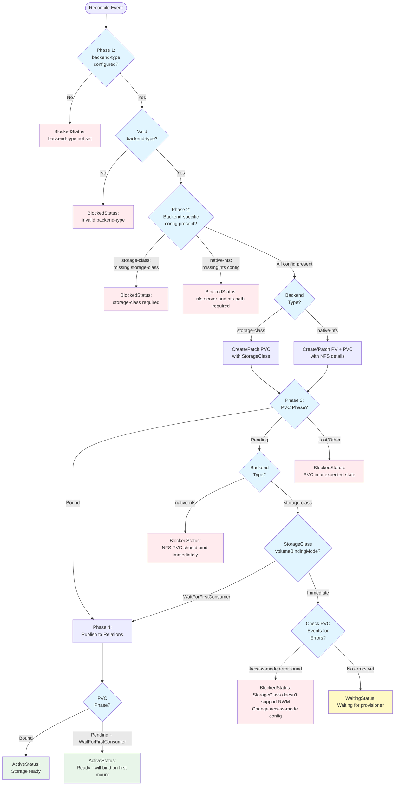

# Charmarr Storage Charm Implementation

## Context and Problem Statement

Per [Storage ADR-002](../storage/adr-002-charmarr-storage-charm.md), Charmarr requires a dedicated charm to manage the shared PVC lifecycle that enables hardlinks across all media applications per [Storage ADR-001](../storage/adr-001-shared-pvc-architecture.md). This charm must be **workload-less** (no container workload), operate purely through Kubernetes API calls, support both storage-class and native-nfs backends, handle expansion, and publish storage details via the media-storage interface defined in [Interfaces ADR-005](../interfaces/adr-005-media-storage.md).

**Key questions:**
- How do we implement a workload-less Juju charm that manages K8s resources without running a container?
- How do we handle smart PVC binding checks across different StorageClass configurations?
- How do we detect and surface access-mode mismatches?
- What config options and actions do we need?

## Considered Options

### Charm Architecture
* **Option 1:** Regular sidecar charm with dummy container
* **Option 2:** Workload-less charm (no container)

### K8s API Interaction
* **Option 1:** Shell out to `kubectl` commands
* **Option 2:** Use `lightkube` Python library
* **Option 3:** Use `kubernetes` Python library

### State Management
* **Option 1:** Track state in peer relation data
* **Option 2:** Query K8s API every reconcile (stateless)

### Expansion Handling
* **Option 1:** Patch PVC, check conditions for success/failure
* **Option 2:** Patch PVC, let K8s surface errors naturally

### Access Mode Configuration
* **Option 1:** Always use ReadWriteMany
* **Option 2:** Always use ReadWriteOnce
* **Option 3:** Make it configurable with default ReadWriteMany
* **Option 4:** Query StorageClass capabilities and auto-select

### Actions
* **Option 1:** `expand-storage` action + `get-info` action
* **Option 2:** Size via config only, `get-info` for debugging
* **Option 3:** No actions at all

## Decision Outcome

**Charm Architecture: Option 2 - Workload-less**
**K8s API: Option 2 - lightkube**
**State: Option 2 - Stateless**
**Expansion: Option 2 - Reactive, let K8s surface errors**
**Access Mode: Option 3 - Configurable with RWM default**
**Actions: Option 3 - No actions**

### Rationale

**Workload-less charm:**
- No workload to manage → simpler architecture
- Pure orchestration role → no container needed
- Lower resource usage (no pod, just operator process running in controller)
- Juju 3.6+ supports workload-less K8s charms natively

**lightkube:**
- Type-safe Kubernetes API client
- Already used in arr charms for StatefulSet patching (consistency)
- Lighter weight than official `kubernetes` library
- Active maintenance, good Juju ecosystem adoption

**Stateless:**
- K8s is authoritative source of truth (PVC/PV status)
- No risk of drift between Juju state and K8s reality
- Simpler reconciler logic - always query current state
- No peer relation data management needed

**Reactive expansion:**
- User changes `size` config → charm patches PVC
- CSI driver handles expansion (success or failure)
- If fails: PVC stays at old size, CSI creates Events/Conditions
- Users check `kubectl describe pvc` for CSI errors
- Simpler than parsing PVC conditions and surfacing in charm status
- K8s native tooling already provides error visibility

**Configurable access mode:**
- Explicit > implicit (user knows what they're choosing)
- Default to ReadWriteMany (more flexible, multi-node capable)
- Clear error detection if StorageClass doesn't support RWM
- Native-NFS always uses RWM (ignored config)

**No actions:**
- Size changes via config (standard Juju pattern)
- No `get-info` needed - `juju status` shows connected apps, `kubectl get pvc` shows K8s state
- Keeps charm focused and simple

## Implementation Details

### Type Safety

```python
from enum import Enum

class PVCPhase(str, Enum):
    """PVC binding phases."""
    PENDING = "Pending"
    BOUND = "Bound"
    LOST = "Lost"

class VolumeBindingMode(str, Enum):
    """StorageClass volume binding modes."""
    IMMEDIATE = "Immediate"
    WAIT_FOR_FIRST_CONSUMER = "WaitForFirstConsumer"

class BackendType(str, Enum):
    """Storage backend types."""
    STORAGE_CLASS = "storage-class"
    NATIVE_NFS = "native-nfs"

class AccessMode(str, Enum):
    """PVC access modes."""
    READ_WRITE_MANY = "ReadWriteMany"
    READ_WRITE_ONCE = "ReadWriteOnce"
```

### charmcraft.yaml

```yaml
name: charmarr-storage-k8s
type: charm
title: Charmarr Storage
summary: Shared media storage provider for Charmarr applications
description: |
  Manages a shared PersistentVolumeClaim (PVC) that enables hardlinks
  across all Charmarr media applications (Radarr, Sonarr, qBittorrent, Plex).

  Supports two backend modes:
  - storage-class: Use existing Kubernetes StorageClass
  - native-nfs: Manage PV/PVC for Kubernetes native NFS driver

  This is a workload-less charm - it manages K8s resources via API calls
  without running any container workload.

links:
  documentation: https://github.com/charmarr/charmarr-storage-k8s
  source: https://github.com/charmarr/charmarr-storage-k8s
  issues: https://github.com/charmarr/charmarr-storage-k8s/issues

assumes:
  - k8s-api
  - juju >= 3.6

platforms:
  amd64:
    - name: ubuntu
      channel: "24.04"

parts:
  charm:
    source: .
    plugin: uv
    build-packages: [git]
    build-snaps: [astral-uv]
    override-build: |
      craftcraft default
      git describe --always > $CRAFT_PART_INSTALL/version

# NO containers section - workload-less charm

provides:
  media-storage:
    interface: media-storage

config:
  options:
    backend-type:
      type: string
      default: ""
      description: |
        Storage backend type. REQUIRED.

        Options:
        - storage-class: Use existing Kubernetes StorageClass
        - native-nfs: Use Kubernetes native NFS driver (managed by charm)

        Cannot be changed after initial deployment.

    storage-class:
      type: string
      default: ""
      description: |
        Kubernetes StorageClass name to use (backend-type: storage-class).

        Examples:
        - local-path (single-node, RWO)
        - topolvm-provisioner (multi-node local storage, RWO)
        - nfs-csi (multi-node NFS, RWX)

        Use 'kubectl get storageclass' to see available options.

    size:
      type: string
      default: "100Gi"
      description: |
        Storage size to provision. Can be increased later (not decreased).

        For storage-class: Initial PVC size, expansion handled by CSI driver.
        For native-nfs: Informational only (NFS share size managed externally).

        Examples: 100Gi, 1Ti, 5Ti

    nfs-server:
      type: string
      default: ""
      description: |
        NFS server IP or hostname (backend-type: native-nfs).

        Example: 192.168.1.100 or nas.local

    nfs-path:
      type: string
      default: ""
      description: |
        NFS export path (backend-type: native-nfs).

        Example: /mnt/pool/charmarr-media

    access-mode:
      type: string
      default: "ReadWriteMany"
      description: |
        PVC access mode (storage-class backend only).

        ReadWriteMany: Pods can run on any node (requires NFS or similar)
        ReadWriteOnce: All pods locked to same node (works with local storage)

        Ignored for native-nfs backend (always ReadWriteMany).

        If StorageClass doesn't support ReadWriteMany, charm will detect
        and suggest changing to ReadWriteOnce.
```

### Reconciler Implementation Pattern

```python
class CharmarrStorageCharm(ops.CharmBase):
    _pvc_name = "charmarr-shared-media"
    _pv_name = "charmarr-shared-media-pv"  # Only for native-nfs
    _mount_path = "/data"

    def __init__(self, framework: ops.Framework):
        super().__init__(framework)

        self.storage_provider = MediaStorageProvider(self, "media-storage")
        observe_events(self, reconcilable_events_k8s, self._reconcile)
        framework.observe(self.on.collect_unit_status, self._collect_status)

    def _reconcile(self, event: ops.EventBase) -> None:
        # Phase 1: Validate configuration
        backend_type = BackendType(self.config.get("backend-type", ""))
        # ... validate backend-specific config

        # Phase 2: Ensure K8s resources exist
        client = Client()
        if backend_type == BackendType.STORAGE_CLASS:
            self._ensure_pvc_storage_class(client)
        else:
            self._ensure_pv_pvc_nfs(client)

        # Phase 3: Check PVC binding state
        pvc = client.get(PersistentVolumeClaim, self._pvc_name, self.model.name)

        if pvc.status.phase == PVCPhase.BOUND:
            pass  # Happy path
        elif pvc.status.phase == PVCPhase.PENDING:
            if backend_type == BackendType.NATIVE_NFS:
                return  # BlockedStatus

            sc = client.get(StorageClass, self.config["storage-class"])
            if sc.volumeBindingMode == VolumeBindingMode.WAIT_FOR_FIRST_CONSUMER:
                pass  # Expected - proceed to publish
            else:
                # Check for access-mode errors
                self._check_access_mode_error(client)
                return  # WaitingStatus
        else:
            return  # BlockedStatus

        # Phase 4: Publish to relations
        self.storage_provider.publish_data(MediaStorageProviderData(
            pvc_name=self._pvc_name,
            mount_path=self._mount_path
        ))
```

### Access Mode Error Detection

```python
def _check_access_mode_error(self, client: Client) -> None:
    """Check PVC Events for access-mode mismatch errors."""
    events = client.list(
        Event,
        namespace=self.model.name,
        fields={"involvedObject.name": self._pvc_name}
    )

    for event in events:
        msg = event.message.lower()
        if any(keyword in msg for keyword in ["access mode", "unsupported", "not supported"]):
            # Found access-mode error
            # Status will be BlockedStatus with fix suggestion
            raise AccessModeError(event.message)
```

### Expansion Handling

```python
def _ensure_pvc_storage_class(self, client: Client) -> None:
    """Ensure PVC exists for storage-class backend."""
    try:
        pvc = client.get(PersistentVolumeClaim, self._pvc_name, self.model.name)

        # Handle expansion
        current_size = pvc.spec.resources.requests["storage"]
        desired_size = self.config["size"]

        if current_size != desired_size:
            logger.info(f"Expanding PVC from {current_size} to {desired_size}")
            pvc.spec.resources.requests["storage"] = desired_size
            client.patch(PersistentVolumeClaim, self._pvc_name, pvc, self.model.name)
            # CSI handles expansion - if fails, visible in kubectl describe pvc

    except Exception:
        # PVC doesn't exist - create it
        self._create_pvc(client)
```

### Reconciler Flow Diagram



## Usage Examples

### Storage-Class Backend (Local Path)
```bash
juju deploy charmarr-storage-k8s charmarr-storage --trust \
  --config backend-type=storage-class \
  --config storage-class=local-path \
  --config access-mode=ReadWriteOnce \
  --config size=500Gi

# Relate to media apps
juju integrate charmarr-storage:media-storage radarr-k8s:media-storage
juju integrate charmarr-storage:media-storage sonarr-k8s:media-storage
juju integrate charmarr-storage:media-storage qbittorrent-k8s:media-storage
```

### Storage-Class Backend (NFS CSI)
```bash
juju deploy charmarr-storage-k8s charmarr-storage --trust \
  --config backend-type=storage-class \
  --config storage-class=nfs-csi \
  --config access-mode=ReadWriteMany \
  --config size=2Ti
```

### Native NFS Backend
```bash
juju deploy charmarr-storage-k8s charmarr-storage --trust \
  --config backend-type=native-nfs \
  --config nfs-server=192.168.1.100 \
  --config nfs-path=/mnt/pool/charmarr-media \
  --config size=5Ti
```

### Expanding Storage
```bash
# Just change the config
juju config charmarr-storage size=1Ti

# Charm patches PVC, CSI driver handles expansion
# Check progress: kubectl describe pvc charmarr-shared-media -n <model>
```

## Error Scenarios and Handling

### Access Mode Mismatch
**Scenario:** User configures `storage-class=local-path` (RWO-only) with `access-mode=ReadWriteMany`

**Flow:**
1. Charm creates PVC with ReadWriteMany
2. Provisioner fails after ~5-10 seconds
3. K8s creates Event: "access mode ReadWriteMany not supported"
4. Reconciler detects Pending + Immediate binding mode
5. Checks Events, finds access-mode error
6. **BlockedStatus:** "StorageClass doesn't support ReadWriteMany. Set access-mode=ReadWriteOnce"

**Fix:**
```bash
juju config charmarr-storage access-mode=ReadWriteOnce
# Charm patches PVC → provisions successfully
```

### NFS Server Unreachable
**Scenario:** `native-nfs` backend with wrong NFS server IP

**Flow:**
1. Charm creates PV + PVC
2. PVC binds to PV (has claimRef)
3. First requiring pod tries to mount → fails
4. Pod stuck in ContainerCreating with Event: "mount.nfs: Connection timed out"

**Detection:** Users check pod events via `kubectl describe pod`

**Fix:**
```bash
juju config charmarr-storage nfs-server=<correct-ip>
# Charm patches PV with new NFS server
```

### Expansion Failure
**Scenario:** User expands beyond available backend capacity

**Flow:**
1. User: `juju config charmarr-storage size=10Ti`
2. Charm patches PVC to 10Ti
3. CSI driver fails (insufficient space)
4. PVC stays at old size, CSI creates Condition: "ExpandError"
5. **Charm doesn't detect** - expansion is best-effort
6. Apps keep working with old size

**Detection:** `kubectl describe pvc charmarr-shared-media` shows error in Conditions

## Deployment Requirements

### RBAC Permissions
Must deploy with `--trust` flag:
```bash
juju deploy charmarr-storage-k8s --trust
```

Grants permissions for:
- **Namespace-scoped:** PersistentVolumeClaim (get, create, patch)
- **Cluster-scoped:** PersistentVolume (get, create, patch), StorageClass (get), Event (list)

### Backend Requirements

**storage-class backend:**
- StorageClass must exist in cluster
- User must know if StorageClass supports RWX or RWO
- CSI driver must support expansion (if user wants to expand later)

**native-nfs backend:**
- NFS server must be accessible from cluster nodes
- NFS export must exist and be properly configured
- Network connectivity from nodes to NFS server

## Consequences

### Good

* **Workload-less architecture** → minimal resource usage, no unnecessary pod
* **Stateless reconciler** → K8s is source of truth, no drift risk between Juju and K8s state
* **Type-safe K8s interactions** → lightkube provides typed API, reduces runtime errors
* **Smart PVC binding logic** → handles WaitForFirstConsumer correctly, doesn't block requiring charms
* **Access-mode mismatch detection** → clear error messages guide users to fix, not silent failure
* **Idempotent operations** → safe to run reconcile repeatedly, handles expansion gracefully
* **Backend flexibility** → supports both managed StorageClass and self-managed NFS
* **Simple configuration** → 5 config options cover all use cases without overloading
* **No unnecessary actions** → size changes via config (standard Juju pattern)
* **Compliant with ADRs** → implements all decisions from storage and interface ADRs

### Bad

* **Requires `--trust`** → needs cluster-level RBAC, more permissions than typical charm
* **No expansion validation** → users don't know if expansion succeeded until checking kubectl
* **No PVC condition monitoring** → expansion failures not surfaced in charm status
* **lightkube dependency** → another library to maintain, potential version conflicts
* **Native-NFS size is informational** → actual NFS capacity managed externally, charm just tracks metadata
* **Access-mode error detection not instant** → must wait ~5-10 sec for provisioner to fail

### Neutral

* **Two backend modes** → adds conditional logic but necessary for flexibility
* **Reactive error handling** → simpler implementation, relies on K8s native error reporting
* **Five config options** → more than minimal but each serves clear purpose
* **No observability integrations** → deferred to v1.x (grafana-dashboard, metrics-endpoint)

## Deferred to v1.x/v2

- **Observability integrations:** grafana-dashboard, metrics-endpoint relations for storage metrics
- **PVC condition monitoring:** Surface expansion failures in charm status
- **Proactive capacity checking:** Validate backend capacity before expansion requests
- **Multiple PVC support:** Currently single shared PVC, could support per-app PVCs in future

## Related MADRs

- [storage/adr-001](../storage/adr-001-shared-pvc-architecture.md) - Establishes need for shared PVC with hardlinks
- [storage/adr-002](../storage/adr-002-charmarr-storage-charm.md) - Defines storage charm's responsibilities and backend options
- [interfaces/adr-005](../interfaces/adr-005-media-storage.md) - Defines media-storage interface and data models
- [storage/adr-003](../storage/adr-003-pvc-patching-in-arr-charms.md) - Defines how requiring charms mount the shared PVC
