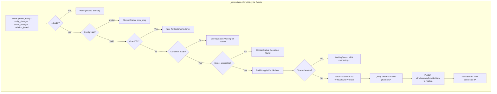
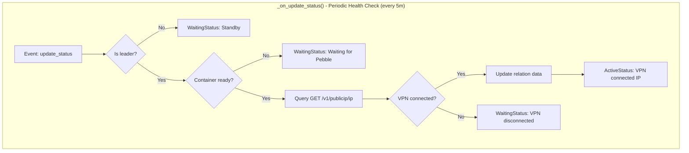
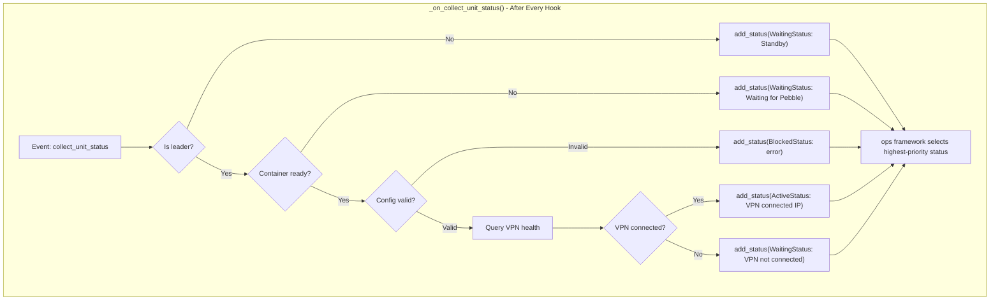

# Gluetun-K8s Charm Implementation

**Status:** Accepted

## Context and Problem Statement

Charmarr's download clients (qBittorrent, SABnzbd) need to route external traffic through a VPN for privacy. [ADR-002: VPN Gateway Solution](../networking/adr-002-vpn-gateway.md) established gluetun as the VPN client with pod-gateway for VXLAN overlay networking. This ADR defines the gluetun-k8s charm implementation: configuration options, credential management, health monitoring, and integration with vpn-k8s-lib.

Key questions:
- How should VPN provider credentials be configured?
- Which VPN protocols should be supported?
- How should the charm handle multi-unit deployments?
- What validation is needed for provider-specific requirements?

## Considered Options

### VPN Protocol Support
* **Option 1:** WireGuard only (v1)
* **Option 2:** WireGuard + OpenVPN from day one
* **Option 3:** OpenVPN only (legacy)

### Credential Management
* **Option 1:** Juju secrets for all credentials
* **Option 2:** Charm config for credentials (plaintext)
* **Option 3:** Kubernetes secrets mounted as files

### Multi-Unit Strategy
* **Option 1:** Block scaling beyond 1 unit
* **Option 2:** Leader-gated reconciliation (standby replicas)
* **Option 3:** Active-active with VXLAN ID partitioning

### Provider Configuration
* **Option 1:** Provider-specific typed configs with validation
* **Option 2:** Generic environment variable passthrough
* **Option 3:** Hybrid - typed configs for common cases, escape hatch for edge cases

## Decision Outcome

**VPN Protocol: Option 1 (WireGuard only for v1)** - Simplifies credential management (single private key vs username/password/certificates). OpenVPN support deferred to v1.x, raises `NotImplementedError` if attempted.

**Credentials: Option 1 (Juju secrets)** - Private key never exposed in charm config or logs. Users create secret, grant to charm, reference via secret ID.

**Multi-Unit: Option 2 (Leader-gated reconciliation)** - Reconciliation logic guarded by leader check. Non-leader units remain as standby. Avoids VXLAN ID conflicts while allowing Juju's native HA patterns. Documented that only leader is active.

**Provider Config: Option 1 (Typed configs with validation)** - Explicit config options for common providers with charm-side validation. Clearer UX than raw environment passthrough.

## Charm Configuration

```yaml
options:
  # === MANDATORY ===
  cluster-cidrs:
    type: string
    description: |
      Space-separated CIDRs for pod and service networks.
      Traffic to these CIDRs will NOT be routed through VPN.
      Example: "10.42.0.0/16 10.43.0.0/16" (k3s)
               "10.1.0.0/16 10.152.183.0/24" (MicroK8s)
      REQUIRED - charm will block if not set.
    default: ""

  vpn-provider:
    type: string
    description: |
      VPN provider name. Supported: nordvpn, mullvad, protonvpn, pia, 
      surfshark, ivpn, windscribe, custom.
      See gluetun wiki for full provider list.
    default: ""

  vpn-type:
    type: string
    description: |
      VPN protocol. Only 'wireguard' supported in v1.
      OpenVPN support planned for v1.x.
    default: "wireguard"

  # === CREDENTIALS (Juju Secrets) ===
  wireguard-private-key-secret:
    type: secret
    description: |
      Juju secret containing WireGuard private key.
      Secret must have key 'private-key'.
      
      Create: juju add-secret vpn-key private-key="<your-key>"
      Grant: juju grant-secret vpn-key gluetun
      Config: juju config gluetun wireguard-private-key-secret=secret:vpn-key

  # === PROVIDER-SPECIFIC ===
  wireguard-addresses:
    type: string
    description: |
      WireGuard interface address in CIDR format.
      REQUIRED for: mullvad, custom
      NOT REQUIRED for: nordvpn, protonvpn, pia, surfshark
      Example: "10.64.222.21/32"
    default: ""

  server-countries:
    type: string
    description: |
      Comma-separated list of preferred server countries.
      Example: "Switzerland,Netherlands"
    default: ""

  server-cities:
    type: string
    description: |
      Comma-separated list of preferred server cities.
      Example: "Zurich,Amsterdam"
    default: ""

  # === CUSTOM PROVIDER ONLY ===
  vpn-endpoint-ip:
    type: string
    description: |
      VPN server IP address (required for custom provider).
    default: ""

  vpn-endpoint-port:
    type: int
    description: |
      VPN server port (required for custom provider).
    default: 51820

  wireguard-public-key:
    type: string
    description: |
      Server's WireGuard public key (required for custom provider).
    default: ""

  # === GATEWAY CONFIG ===
  vxlan-id:
    type: int
    description: |
      VXLAN tunnel ID. Must be unique if deploying multiple VPN gateways.
      Range: 1-16777215
    default: 42

  # === DNS ===
  dns-over-tls:
    type: boolean
    description: |
      Enable DNS-over-TLS for privacy. Recommended.
    default: true
```

## Provider Requirements Matrix

| Provider | `wireguard-addresses` | `vpn-endpoint-ip` | `wireguard-public-key` | Notes |
|----------|----------------------|-------------------|------------------------|-------|
| nordvpn | ❌ | ❌ | ❌ | Private key from web interface |
| mullvad | ✅ Required | ❌ | ❌ | Address from WG config file |
| protonvpn | ❌ | ❌ | ❌ | Private key from web interface |
| pia | ❌ | ❌ | ❌ | Private key extraction required |
| surfshark | ❌ | ❌ | ❌ | Private key from manual setup |
| custom | ✅ Required | ✅ Required | ✅ Required | Full manual config |

## Validation Logic

```python
PROVIDERS_REQUIRING_ADDRESSES = {"mullvad", "custom"}

def _validate_config(self) -> str | None:
    """Return error message if config invalid, None if valid."""
    provider = self.config.get("vpn-provider", "").strip().lower()
    vpn_type = self.config.get("vpn-type", "wireguard").strip().lower()
    
    # VPN type check
    if vpn_type != "wireguard":
        raise NotImplementedError(
            f"VPN type '{vpn_type}' not supported. "
            "Only 'wireguard' is supported in v1. OpenVPN planned for v1.x."
        )
    
    # Mandatory fields
    if not self.config.get("cluster-cidrs", "").strip():
        return "cluster-cidrs config is required"
    
    if not provider:
        return "vpn-provider config is required"
    
    if not self.config.get("wireguard-private-key-secret"):
        return "wireguard-private-key-secret is required"
    
    # Provider-specific validation
    if provider in PROVIDERS_REQUIRING_ADDRESSES:
        if not self.config.get("wireguard-addresses", "").strip():
            return f"wireguard-addresses is required for provider '{provider}'"
    
    if provider == "custom":
        if not self.config.get("vpn-endpoint-ip", "").strip():
            return "vpn-endpoint-ip is required for custom provider"
        if not self.config.get("wireguard-public-key", "").strip():
            return "wireguard-public-key is required for custom provider"
    
    return None
```

## Gluetun Environment Variable Mapping

Charm config maps to gluetun environment variables:

| Charm Config | Gluetun Env Var |
|--------------|-----------------|
| `vpn-provider` | `VPN_SERVICE_PROVIDER` |
| `vpn-type` | `VPN_TYPE` |
| (from secret) | `WIREGUARD_PRIVATE_KEY` |
| `wireguard-addresses` | `WIREGUARD_ADDRESSES` |
| `server-countries` | `SERVER_COUNTRIES` |
| `server-cities` | `SERVER_CITIES` |
| `vpn-endpoint-ip` | `VPN_ENDPOINT_IP` |
| `vpn-endpoint-port` | `VPN_ENDPOINT_PORT` |
| `wireguard-public-key` | `WIREGUARD_PUBLIC_KEY` |
| `dns-over-tls` | `DOT` (`on`/`off`) |

**Hardcoded values:**
- `VPN_BLOCK_OTHER_TRAFFIC=true` - Kill switch at gateway level
- `FIREWALL_OUTBOUND_SUBNETS=<cluster-cidrs>` - Allow cluster traffic

## Health Monitoring

Gluetun exposes HTTP API endpoints for health monitoring:

| Endpoint | Purpose |
|----------|---------|
| `GET /v1/openvpn/status` | Connection status (OpenVPN) |
| `GET /v1/publicip/ip` | Current external IP address |

The charm queries `/v1/publicip/ip` to:
1. Populate `vpn_connected` in `VPNGatewayProviderData`
2. Populate `external_ip` for user verification
3. Set unit status: `Active: VPN connected (185.112.34.56)`

### Event-Driven Health Checks

The charm uses two complementary events for health monitoring:

**`update-status` (periodic):**
- Fired automatically every 5 minutes (configurable via `juju model-config update-status-hook-interval`)
- Used for periodic VPN connectivity checks between other events
- Updates relation data with current `vpn_connected` and `external_ip`
- Critical for detecting VPN disconnections that occur between charm events

**`collect-unit-status` (after every hook):**
- Fired at the end of every hook to collect statuses for evaluation
- Ensures consistent status reporting regardless of which event triggered
- Uses `event.add_status()` to let ops framework evaluate highest-priority status

### Implementation

```python
GLUETUN_HTTP_PORT = 8000

def _check_vpn_health(self) -> tuple[bool, str | None]:
    """Check VPN health via gluetun API.
    
    Returns:
        Tuple of (connected: bool, external_ip: str | None)
    """
    try:
        response = requests.get(
            f"http://localhost:{GLUETUN_HTTP_PORT}/v1/publicip/ip",
            timeout=5,
        )
        if response.ok:
            data = response.json()
            return True, data.get("public_ip")
    except requests.RequestException:
        pass
    return False, None

def _on_update_status(self, event: UpdateStatusEvent):
    """Periodic VPN connectivity check (every 5m by default)."""
    if not self.unit.is_leader():
        self.unit.status = WaitingStatus("Standby (non-leader unit)")
        return
    
    if not self._container.can_connect():
        self.unit.status = WaitingStatus("Waiting for Pebble")
        return
    
    vpn_connected, external_ip = self._check_vpn_health()
    
    # Update relation data for consumers
    if self.vpn_gateway.is_ready():
        self._publish_provider_data(vpn_connected, external_ip)
    
    # Update unit status
    if vpn_connected:
        self.unit.status = ActiveStatus(f"VPN connected ({external_ip})")
    else:
        self.unit.status = WaitingStatus("VPN disconnected - reconnecting...")

def _on_collect_unit_status(self, event: CollectStatusEvent):
    """Evaluate and add status at end of every hook."""
    if not self.unit.is_leader():
        event.add_status(WaitingStatus("Standby (non-leader unit)"))
        return
    
    if not self._container.can_connect():
        event.add_status(WaitingStatus("Waiting for Pebble"))
        return
    
    # Check for config validation errors
    if error := self._validate_config():
        event.add_status(BlockedStatus(error))
        return
    
    vpn_connected, external_ip = self._check_vpn_health()
    
    if vpn_connected:
        event.add_status(ActiveStatus(f"VPN connected ({external_ip})"))
    else:
        event.add_status(WaitingStatus("VPN not connected"))
```

## Integration with vpn-k8s-lib

The charm uses `VPNGatewayProvider` from [vpn-k8s-lib](../lib/adr-002-vpn-k8s-lib.md) which handles:

1. **StatefulSet patching** - Adds pod-gateway gateway containers (`gateway_init.sh`, `gateway_sidecar.sh`)
2. **Relation data publishing** - Publishes `VPNGatewayProviderData` to consumers
3. **Container specs** - Provides correct environment variables and capabilities

```python
from charms.vpn_k8s_lib.v0.vpn_gateway import VPNGatewayProvider, VPNGatewayProviderData

class GluetunCharm(CharmBase):
    def __init__(self, framework):
        super().__init__(framework)
        self.vpn_gateway = VPNGatewayProvider(self, "vpn-gateway")
        self._container = self.unit.get_container("gluetun")
        
        # Core lifecycle events
        self.framework.observe(self.on.gluetun_pebble_ready, self._reconcile)
        self.framework.observe(self.on.config_changed, self._reconcile)
        self.framework.observe(self.on.secret_changed, self._reconcile)
        self.framework.observe(self.on.vpn_gateway_relation_joined, self._reconcile)
        
        # Health monitoring events
        self.framework.observe(self.on.update_status, self._on_update_status)
        self.framework.observe(self.on.collect_unit_status, self._on_collect_unit_status)

    def _reconcile(self, event):
        if not self.unit.is_leader():
            self.unit.status = WaitingStatus("Standby (non-leader unit)")
            return
        
        # Validation, Pebble layer, wait for healthy...
        
        # Publish to relation via library
        vpn_connected, external_ip = self._check_vpn_health()
        provider_data = VPNGatewayProviderData(
            gateway_dns_name=f"{self.app.name}.{self.model.name}.svc.cluster.local",
            vxlan_id=self.config.get("vxlan-id", 42),
            vxlan_ip_network="172.16.0",
            cluster_cidrs=self.config["cluster-cidrs"],
            vpn_connected=vpn_connected,
            external_ip=external_ip,
        )
        self.vpn_gateway.publish_data(provider_data)
```

## Charm Structure

```
gluetun-k8s/
├── charmcraft.yaml
├── config.yaml
├── metadata.yaml
├── requirements.txt
├── src/
│   └── charm.py
```

## Reconciliation Flow







## Pebble Layer

```python
def _build_pebble_layer(self, private_key: str) -> Layer:
    """Build Pebble layer for gluetun service."""
    env = {
        "VPN_SERVICE_PROVIDER": self.config["vpn-provider"],
        "VPN_TYPE": "wireguard",
        "WIREGUARD_PRIVATE_KEY": private_key,
        "VPN_BLOCK_OTHER_TRAFFIC": "true",
        "FIREWALL_OUTBOUND_SUBNETS": self.config["cluster-cidrs"],
    }
    
    # DNS-over-TLS
    env["DOT"] = "on" if self.config.get("dns-over-tls", True) else "off"
    
    # Optional provider-specific
    if addr := self.config.get("wireguard-addresses", "").strip():
        env["WIREGUARD_ADDRESSES"] = addr
    if countries := self.config.get("server-countries", "").strip():
        env["SERVER_COUNTRIES"] = countries
    if cities := self.config.get("server-cities", "").strip():
        env["SERVER_CITIES"] = cities
    
    # Custom provider
    if self.config.get("vpn-provider", "").lower() == "custom":
        env["VPN_ENDPOINT_IP"] = self.config["vpn-endpoint-ip"]
        env["VPN_ENDPOINT_PORT"] = str(self.config.get("vpn-endpoint-port", 51820))
        env["WIREGUARD_PUBLIC_KEY"] = self.config["wireguard-public-key"]
    
    return Layer({
        "services": {
            "gluetun": {
                "override": "replace",
                "command": "/gluetun-entrypoint",
                "startup": "enabled",
                "environment": env,
            }
        }
    })
```

## User Workflow

```bash
# 1. Create Juju secret with WireGuard private key
juju add-secret vpn-key private-key="wOEI9rqqbDwnN8/Bpp22sVz48T71vJ4fYmFWujulwUU="

# 2. Deploy gluetun-k8s (must use --trust for StatefulSet patching)
juju deploy gluetun-k8s gluetun --trust \
    --config vpn-provider=nordvpn \
    --config cluster-cidrs="10.1.0.0/16 10.152.183.0/24"

# 3. Grant secret access to the charm
juju grant-secret vpn-key gluetun

# 4. Configure secret reference
juju config gluetun wireguard-private-key-secret=secret:vpn-key

# 5. Optionally configure server location
juju config gluetun server-countries=Switzerland

# 6. Check status
juju status
# gluetun/0  active  VPN connected: Switzerland (185.112.34.56)

# 7. Deploy download client and relate
juju deploy qbittorrent-k8s qbittorrent --trust
juju relate qbittorrent:vpn-gateway gluetun:vpn-gateway
```

## Deployment Notes

### Trust Requirement

The charm requires `--trust` for StatefulSet patching via lightkube. This grants RBAC permissions to modify the charm's own StatefulSet to add pod-gateway containers.

### Namespace and Service Mesh

**IMPORTANT:** gluetun-k8s should NOT be deployed in a namespace enrolled in Istio Ambient mesh.

Per [ADR-005: Istio Mesh Integration](../networking/adr-005-istio-mesh-vpn-integration.md), the gateway pod must remain outside the mesh to avoid ztunnel interference with VXLAN routing. Deploy gluetun-k8s in a separate namespace without the `istio.io/dataplane-mode: ambient` label.

```yaml
# Correct: separate namespace, no mesh enrollment
apiVersion: v1
kind: Namespace
metadata:
  name: gluetun
  # NO istio.io/dataplane-mode label
```

### Multi-Unit Deployment

While multiple units can be deployed, only the leader unit actively manages the VPN gateway. Non-leader units remain in standby (`WaitingStatus`). This avoids VXLAN ID conflicts while allowing standard Juju HA patterns.

For true multi-gateway deployments (e.g., different VPN regions), deploy separate gluetun-k8s applications with unique names and `vxlan-id` values:

```bash
juju deploy gluetun-k8s gluetun-us --trust --config vxlan-id=42 --config server-countries=USA
juju deploy gluetun-k8s gluetun-eu --trust --config vxlan-id=43 --config server-countries=Switzerland
```

### Health Check Interval

The charm checks VPN connectivity via the `update-status` event, which fires every 5 minutes by default. To detect VPN disconnections faster, reduce the interval:

```bash
# Check every 1 minute instead of 5
juju model-config update-status-hook-interval=1m
```

Note: Reducing this interval increases load on the Juju controller. For most deployments, the default 5-minute interval is sufficient since the kill switch (NetworkPolicy + gluetun firewall) protects traffic even before the charm detects disconnection.

## Consequences

* Good, because WireGuard-only simplifies v1 implementation (single credential type)
* Good, because Juju secrets keep private key secure (not in config, logs, or relation data)
* Good, because typed provider configs with validation provide clear UX
* Good, because leader-gated reconciliation avoids VXLAN conflicts without blocking scaling
* Good, because DNS-over-TLS default protects DNS privacy
* Good, because vpn-k8s-lib handles StatefulSet patching complexity
* Good, because health monitoring via gluetun API provides accurate status
* Good, because `update-status` event enables periodic connectivity checks (default 5m)
* Good, because `collect-unit-status` ensures consistent status after every hook
* Bad, because OpenVPN users must wait for v1.x
* Bad, because `--trust` required (necessary for StatefulSet patching)
* Bad, because separate namespace required (can't share with mesh-enrolled apps)
* Bad, because Mullvad users must obtain `wireguard-addresses` from config file (provider limitation)
* Bad, because VPN disconnection detection depends on `update-status` interval (default 5m delay)

## Security Considerations

**Private key handling:**
- Stored in Juju secret (encrypted in Juju backend)
- Retrieved via `model.get_secret()` at runtime
- Passed to container as environment variable
- Environment vars visible via `kubectl exec <pod> -- env` (cluster admin access required)
- Acceptable for homelab threat model; document for users requiring higher security

**Kill switch:**
- `VPN_BLOCK_OTHER_TRAFFIC=true` - Gluetun's built-in firewall blocks non-VPN egress
- Consumer-side NetworkPolicy provides second layer (see [ADR-004: VPN Kill Switch](../networking/adr-004-vpn-kill-switch.md))

## Related ADRs

- [ADR-002: VPN Gateway Solution](../networking/adr-002-vpn-gateway.md) - Architecture decision for gluetun + pod-gateway
- [ADR-003: Download Client VPN Integration](../networking/adr-003-download-client-egress.md) - Consumer self-patching approach
- [ADR-004: VPN Kill Switch](../networking/adr-004-vpn-kill-switch.md) - Two-layer kill switch strategy
- [ADR-005: Istio Mesh Integration](../networking/adr-005-istio-mesh-vpn-integration.md) - Why gateway must be outside mesh
- [ADR-007: VPN Gateway Interface](../networking/adr-007-vpn-gateway-interface.md) - Interface data models
- [ADR-002: vpn-k8s-lib](../lib/adr-002-vpn-k8s-lib.md) - Library implementation details
