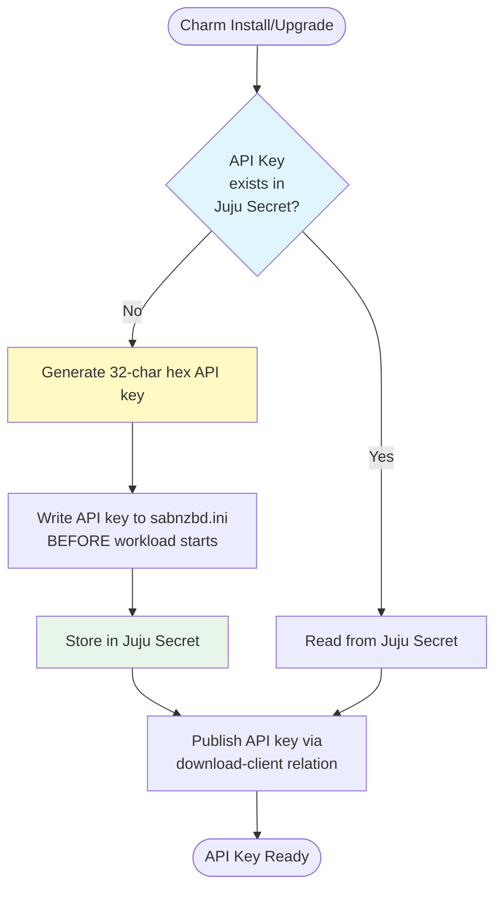
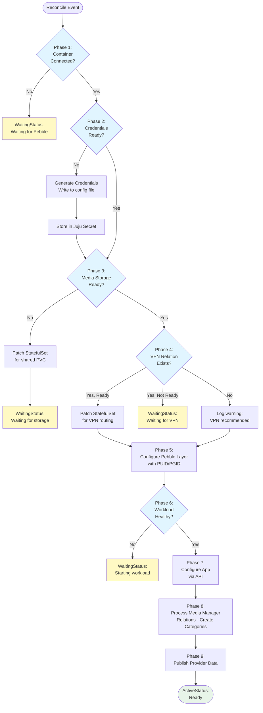

# Download Client Charm Implementation (qBittorrent/SABnzbd)

## Context and Problem Statement

Charmarr requires download client charms to handle torrent (qBittorrent) and Usenet (SABnzbd) downloads for media managers (Radarr, Sonarr, Lidarr). These charms share ~80% identical logic, differing primarily in credential management, category path formats, and API specifics. We need to define implementation details including reconciler pattern, Pebble configuration, storage handling, credential management, category creation, and VPN integration.

**Key insight:** Category names are determined by media managers (using their app name), not configured in download clients. The download client charm's responsibility is to create matching categories with appropriate save paths when media managers connect.

## Considered Options

### Credential Management
* **Option 1:** Let application generate credentials on first start, read from config
* **Option 2:** Charm generates credentials before first start, writes to config file
* **Option 3:** Use environment variables for credentials

### Category Creation Timing
* **Option 1:** Pre-create all possible categories on startup
* **Option 2:** Create categories dynamically when media managers connect
* **Option 3:** Require users to manually create categories

### Save Path Strategy
* **Option 1:** Single flat folder for all downloads
* **Option 2:** Per-category save paths based on media type (Trash Guides compliant)
* **Option 3:** Configurable paths via charm config

### Automatic Torrent Management (qBittorrent only)
* **Option 1:** Enable autoTMM globally (Trash Guides recommendation)
* **Option 2:** Disable autoTMM, let Radarr/Sonarr specify paths
* **Option 3:** Make autoTMM configurable

## Decision Outcome

**Credentials:**
- **qBittorrent: Option 2** - Charm generates credentials before first start, writes PBKDF2 hash to config. Ensures credentials are known for sharing via relations.
- **SABnzbd: Option 2** - Charm generates API key before first start, writes to sabnzbd.ini. Consistent with qBittorrent pattern; credentials available immediately without waiting for workload.

**Category Creation: Option 2** - Create categories dynamically when media managers connect. No unnecessary categories, automatic setup.

**Save Paths: Option 2** - Per-category save paths based on media type. Follows Trash Guides folder structure for hardlink compatibility.

**autoTMM: Option 1** - Enable globally. This is the Trash Guides recommended setup and ensures categories control download locations.

## Implementation Details

### Credential Management Flow

#### qBittorrent: Generate Before Start


**Why plaintext in Juju Secret?**
- qBittorrent WebUI uses HTTP Basic Auth
- Radarr/Sonarr need plaintext username/password to authenticate
- Juju Secrets provide secure storage with access control

#### SABnzbd: Generate Before Start



**Why this approach?**
- SABnzbd supports pre-setting API key in sabnzbd.ini before first start
- Consistent pattern with qBittorrent (credentials ready before workload)
- No waiting for workload to initialize before publishing to relations
- Simpler reconciliation flow

### Reconciler Flow (Shared Pattern)

Both charms follow the same reconciler phases:



### Phase 7: Application Configuration

#### qBittorrent

```python
def _configure_qbittorrent(self) -> None:
    """Configure qBittorrent via WebUI API."""
    
    # Enable Automatic Torrent Management (Trash Guides recommended)
    self._api_call("POST", "/api/v2/app/setPreferences", json={
        "save_path": "/data/torrents",
        "auto_tmm_enabled": True,
        "torrent_changed_tmm_enabled": True,
        "category_changed_tmm_enabled": True,
        "save_path_changed_tmm_enabled": True,
    })
```

#### SABnzbd

```python
def _configure_sabnzbd(self) -> None:
    """Configure SABnzbd via API."""
    
    # Set completed and incomplete download folders
    self._api_call("set_config", {
        "section": "misc",
        "keyword": "complete_dir",
        "value": "/data/usenet/complete",
    })
    
    self._api_call("set_config", {
        "section": "misc",
        "keyword": "download_dir", 
        "value": "/data/usenet/incomplete",
    })
```

### Phase 8: Media Manager Category Creation


**Shared category mapping:**

```python
MEDIA_TYPE_PATHS = {
    MediaManager.RADARR: "movies",
    MediaManager.SONARR: "tv",
    MediaManager.LIDARR: "music",
    MediaManager.READARR: "books",
    MediaManager.WHISPARR: "xxx",
}
```

**Category creation differs by client:**

| Aspect | qBittorrent | SABnzbd |
|--------|-------------|---------|
| Path type | Absolute | Relative from complete_dir |
| Example | `/data/torrents/movies` | `movies` |
| API | `POST /api/v2/torrents/createCategory` | `GET /api?mode=set_config&section=categories` |

```python
# qBittorrent - absolute paths
def _ensure_category_qbit(self, name: str, media_type: MediaManager) -> None:
    type_folder = MEDIA_TYPE_PATHS.get(media_type, "other")
    save_path = f"/data/torrents/{type_folder}"  # Absolute
    
    self._api_call("POST", "/api/v2/torrents/createCategory", data={
        "category": name,
        "savePath": save_path,
    })

# SABnzbd - relative paths
def _ensure_category_sab(self, name: str, media_type: MediaManager) -> None:
    relative_dir = MEDIA_TYPE_PATHS.get(media_type, "other")  # Relative
    
    self._api_call("set_config", {
        "section": "categories",
        "name": name,
        "dir": relative_dir,
    })
```

### Folder Structure (Trash Guides Compliant)

```
/data                          # Shared PVC mount (from charmarr-storage)
├── torrents/                  # qBittorrent
│   ├── movies/               # Category: radarr, radarr-4k, etc.
│   ├── tv/                   # Category: sonarr, sonarr-anime, etc.
│   └── music/                # Category: lidarr
├── usenet/                    # SABnzbd
│   ├── incomplete/           # Temp downloads
│   └── complete/             # Completed folder
│       ├── movies/           # Category: radarr, radarr-4k (relative)
│       ├── tv/               # Category: sonarr (relative)
│       └── music/            # Category: lidarr (relative)
└── media/                     # Media libraries (managed by arr apps)
    ├── movies/
    ├── tv/
    └── music/
```

### Process Ownership and Pebble Configuration

Both charms use the Pebble/LinuxServer.io pattern documented in [ADR-015](adr-015-pebble-linuxserver-pattern.md):
- Bypass s6-overlay by running application binaries directly
- Use Pebble's `user-id`/`group-id` for process ownership (from storage relation)
- Use Kubernetes `fsGroup` for volume permissions (from storage relation)

See [ADR-015](adr-015-pebble-linuxserver-pattern.md) for implementation details and rationale.

### Provider Data Publication

```python
# qBittorrent
def _publish_provider_data(self) -> None:
    provider_data = DownloadClientProviderData(
        api_url="http://qbittorrent:8080",
        credentials_secret_id=self._credentials_secret_id,  # Single secret with username + password
        client=DownloadClient.QBITTORRENT,
        client_type=DownloadClientType.TORRENT,
        instance_name=self.app.name,
    )
    self.download_client_provider.publish_data(provider_data)

# SABnzbd
def _publish_provider_data(self) -> None:
    provider_data = DownloadClientProviderData(
        api_url="http://sabnzbd:8080",
        api_key_secret_id=self._api_key_secret_id,
        client=DownloadClient.SABNZBD,
        client_type=DownloadClientType.USENET,
        instance_name=self.app.name,
    )
    self.download_client_provider.publish_data(provider_data)
```

## qBittorrent-Specific Details

### Credential Generation

```python
import secrets
import hashlib

def _generate_credentials(self) -> tuple[str, str]:
    """Generate secure username and password."""
    username = "charmarr"
    password = secrets.token_urlsafe(32)
    return username, password

def _compute_pbkdf2_hash(self, password: str) -> str:
    """Compute PBKDF2 hash for qBittorrent config.
    
    qBittorrent uses PBKDF2-SHA512 with specific format:
    @ByteArray(SALT:HASH)
    """
    salt = secrets.token_bytes(16)
    iterations = 100000
    
    dk = hashlib.pbkdf2_hmac(
        'sha512',
        password.encode('utf-8'),
        salt,
        iterations,
        dklen=64
    )
    
    return f"@ByteArray({salt.hex()}:{dk.hex()})"

def _write_initial_config(self, username: str, password_hash: str) -> None:
    """Write qBittorrent.conf before first start."""
    config_content = f"""[Preferences]
WebUI\\Username={username}
WebUI\\Password_PBKDF2={password_hash}
WebUI\\LocalHostAuth=false
WebUI\\AuthSubnetWhitelist=10.0.0.0/8, 172.16.0.0/12, 192.168.0.0/16
WebUI\\AuthSubnetWhitelistEnabled=true

[BitTorrent]
Session\\DefaultSavePath=/data/torrents
Session\\TempPath=/data/torrents/incomplete
Session\\TempPathEnabled=true
Session\\DisableAutoTMMByDefault=false
"""
    container = self.unit.get_container("qbittorrent")
    container.push("/config/qBittorrent/qBittorrent.conf", config_content)
```

## SABnzbd-Specific Details

### API Key Generation

```python
import secrets

def _generate_api_key() -> str:
    """Generate a 32-character hex API key (SABnzbd format)."""
    return secrets.token_hex(16)

def _build_sabnzbd_config(api_key: str) -> str:
    """Build minimal sabnzbd.ini with API key and required settings.

    This config is written BEFORE the first Pebble start so SABnzbd
    reads it on startup. Only includes essential settings; SABnzbd fills
    in defaults for everything else.
    """
    return f"""[misc]
api_key = {api_key}
host = 0.0.0.0
port = 8080
local_ranges = 10., 172.16., 172.17., 172.18., 172.19., 172.20., 172.21., 172.22., 172.23., 172.24., 172.25., 172.26., 172.27., 172.28., 172.29., 172.30., 172.31., 192.168.
"""

def _write_initial_config(self, api_key: str) -> None:
    """Write sabnzbd.ini before first start."""
    config_content = _build_sabnzbd_config(api_key)
    container = self.unit.get_container("sabnzbd")
    container.push("/config/sabnzbd.ini", config_content, make_dirs=True)
```

### API Key Rotation Action

```python
def _on_rotate_api_key_action(self, event: ActionEvent) -> None:
    """Handle rotate-api-key action."""
    if not self.unit.is_leader():
        event.fail("Only leader can rotate API key")
        return

    # Generate new API key
    new_key = secrets.token_hex(16)

    # Update Juju secret
    secret = self.model.get_secret(label=API_KEY_SECRET_LABEL)
    secret.set_content({"api-key": new_key})

    # Stop workload, rewrite config, restart
    container = self.unit.get_container("sabnzbd")
    if container.can_connect():
        container.stop(SERVICE_NAME)
        self._write_initial_config(new_key)
        container.replan()

    event.set_results({"message": "API key rotated successfully"})
```

## qBittorrent vs SABnzbd Comparison

| Aspect | qBittorrent | SABnzbd |
|--------|-------------|---------|
| Charm name | `qbittorrent-k8s` | `sabnzbd-k8s` |
| Container name | `qbittorrent` | `sabnzbd` |
| Protocol | BitTorrent | Usenet |
| Auth method | Username + Password | API Key |
| Credential source | Charm generates | Charm generates |
| When to write creds | Before first start | Before first start |
| Config file | `/config/qBittorrent/config/qBittorrent.conf` | `/config/sabnzbd.ini` |
| Category path type | Absolute (`/data/torrents/movies`) | Relative (`movies`) |
| Category API | `POST /api/v2/torrents/createCategory` | `GET /api?mode=set_config&section=categories` |
| Base folder | `save_path` in preferences | `complete_dir` in misc |
| Health check | `/api/v2/app/version` | `/api?mode=version` |
| Default port | 8080 | 8080 |
| Image | `lscr.io/linuxserver/qbittorrent:latest` | `lscr.io/linuxserver/sabnzbd:latest` |
| Special feature | Automatic Torrent Management | - |

## charmcraft.yaml (qBittorrent)

```yaml
name: qbittorrent-k8s
type: charm
title: qBittorrent
summary: Torrent download client for Charmarr media automation
description: |
  qBittorrent is a BitTorrent client with a feature-rich WebUI.

  This charm provides:
  - Automatic credential management
  - Dynamic category creation for media managers
  - Trash Guides compliant folder structure
  - Optional VPN integration for privacy
  - Automatic Torrent Management enabled by default

links:
  documentation: https://github.com/charmarr/qbittorrent-k8s
  source: https://github.com/charmarr/qbittorrent-k8s
  issues: https://github.com/charmarr/qbittorrent-k8s/issues

assumes:
  - k8s-api
  - juju >= 3.6

platforms:
  amd64:
    - name: ubuntu
      channel: "24.04"

parts:
  charm:
    source: .
    plugin: uv
    build-packages: [git]
    build-snaps: [astral-uv]

containers:
  qbittorrent:
    resource: qbittorrent-image

resources:
  qbittorrent-image:
    type: oci-image
    description: OCI image for qBittorrent (LinuxServer)
    upstream-source: lscr.io/linuxserver/qbittorrent:latest

storage:
  config:
    type: filesystem
    location: /config
    minimum-size: 1G

provides:
  download-client:
    interface: download-client

requires:
  media-storage:
    interface: media-storage
    limit: 1
  vpn-gateway:
    interface: vpn-gateway
    limit: 1
    optional: true

config:
  options:
    log-level:
      type: string
      default: "info"
      description: Application log level. One of: trace, debug, info, warn, error

actions:
  rotate-credentials:
    description: |
      Rotate qBittorrent WebUI credentials.
      Generates new password, updates config, restarts workload.
      Related applications update automatically via secret-changed event.
    params:
      username:
        type: string
        default: "charmarr"
        description: Username for WebUI (default: charmarr)
```

## charmcraft.yaml (SABnzbd)

```yaml
name: sabnzbd-k8s
type: charm
title: SABnzbd
summary: Usenet download client for Charmarr media automation
description: |
  SABnzbd is a free and easy binary newsreader.

  This charm provides:
  - Automatic API key management
  - Dynamic category creation for media managers
  - Trash Guides compliant folder structure
  - Optional VPN integration for privacy

links:
  documentation: https://github.com/charmarr/sabnzbd-k8s
  source: https://github.com/charmarr/sabnzbd-k8s
  issues: https://github.com/charmarr/sabnzbd-k8s/issues

assumes:
  - k8s-api
  - juju >= 3.6

platforms:
  amd64:
    - name: ubuntu
      channel: "24.04"

parts:
  charm:
    source: .
    plugin: uv
    build-packages: [git]
    build-snaps: [astral-uv]

containers:
  sabnzbd:
    resource: sabnzbd-image

resources:
  sabnzbd-image:
    type: oci-image
    description: OCI image for SABnzbd (LinuxServer)
    upstream-source: lscr.io/linuxserver/sabnzbd:latest

storage:
  config:
    type: filesystem
    location: /config
    minimum-size: 1G

provides:
  download-client:
    interface: download-client

requires:
  media-storage:
    interface: media-storage
    limit: 1
  vpn-gateway:
    interface: vpn-gateway
    limit: 1
    optional: true

config:
  options:
    log-level:
      type: string
      default: "info"
      description: Application log level.

actions:
  rotate-api-key:
    description: |
      Rotate SABnzbd API key.
      Generates new key via SABnzbd API, updates Juju secret.
      Related applications update automatically via secret-changed event.
```

## Consequences

### Good

* **Single ADR for both clients** - Consistent patterns, easier maintenance
* **Automatic credential management** - No manual setup, secure by default
* **Consistent credential flow** - Both charms generate and write credentials before workload starts
* **Dynamic categories** - Created on-demand when media managers connect
* **Trash Guides compliant** - Proper folder structure for hardlinks
* **Multiple instance support** - `radarr-4k` and `radarr-1080p` get separate categories automatically
* **VPN optional** - Works without VPN (with warning), full support when related
* **PUID/PGID from storage** - Consistent file ownership across all apps
* **Shared reconciler pattern** - ~90% code reuse between implementations

### Bad

* **Requires media-storage relation** - Cannot function without shared storage
* **Config file manipulation** - Both charms require writing config before first start
* **Categories never deleted** - Orphaned categories persist (safe, but not clean)

## Related MADRs

- [interfaces/adr-004](../interfaces/adr-004-download-client.md) - download-client interface
- [interfaces/adr-005](../interfaces/adr-005-media-storage.md) - media-storage interface (defines PUID/PGID)
- [apps/adr-005](./adr-005-charmarr-storage.md) - Storage charm that publishes PUID/PGID
- [interfaces/adr-007](../interfaces/adr-007-vpn-gateway.md) - vpn-gateway interface
- [apps/adr-004](./adr-004-radarr-sonarr.md) - Media managers that use these charms
- [storage/adr-001](../storage/adr-001-shared-pvc-architecture.md) - Shared PVC for hardlinks
- [networking/adr-002](../networking/adr-002-vpn-gateway.md) - VPN gateway architecture
