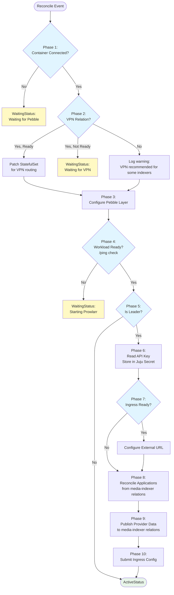

# Prowlarr Charm Implementation (Indexer Manager)

## Context and Problem Statement

Charmarr requires a Prowlarr charm to serve as the central indexer manager, synchronizing indexers to media managers (Radarr, Sonarr, Lidarr). Prowlarr is architecturally different from the media manager charms: it's a **provider** on the `media-indexer` interface rather than a requirer, and it doesn't need download client or media storage relations. We need to define implementation details including reconciler pattern, application registration, VPN handling, credential management, and scaling constraints.

**Key insight:** Prowlarr's role is to register arr apps as "Applications" via its API. Once registered, Prowlarr handles indexer synchronization internally - the charm doesn't trigger sync operations.

## Considered Options

### VPN Relation
* **Option 1:** Require VPN relation (mandatory)
* **Option 2:** Optional VPN relation with warning if absent
* **Option 3:** No VPN support

### Application Registration Approach
* **Option 1:** Charm triggers sync API after registering applications
* **Option 2:** Set `syncLevel: fullSync`, let Prowlarr handle sync internally
* **Option 3:** Manual sync only via Prowlarr UI

### Tag Management
* **Option 1:** Implement tag-based indexer filtering in v1
* **Option 2:** Skip tags, all indexers sync to all applications
* **Option 3:** User-configurable tags via charm config

### API Client Architecture
* **Option 1:** Extend existing `ArrApiClient` with Prowlarr methods
* **Option 2:** Separate `ProwlarrApiClient` with shared base class
* **Option 3:** Completely separate client, no code sharing

### Unit FQDN Discovery
* **Option 1:** Construct FQDN manually from model name and unit ordinal
* **Option 2:** Use `socket.getfqdn()` which returns headless service FQDN

## Decision Outcome

### VPN: Option 2 - Optional with warning

**Rationale:** Trash Guides recommends VPN only for torrent clients, not arr apps. Most indexers work fine without VPN. Edge case of `*.prowlarr.com` blocking VPN IPs (for indexer definitions) is rare. Users who need VPN can relate; those who don't aren't forced into unnecessary complexity.

### Application Registration: Option 2 - Set syncLevel, let Prowlarr handle it

**Rationale:** Prowlarr's internal sync mechanism is robust and handles edge cases (indexer updates, failures, retries). The charm's job is to register applications with `syncLevel: fullSync` - Prowlarr does the rest. Simpler charm code, proven sync logic.

### Tags: Option 2 - Skip for v1

**Rationale:** Quality profiles in each arr instance handle filtering. radarr-1080p won't grab 4K content even if indexer returns it. Tag management adds complexity without clear benefit for typical deployments. Users can configure tags manually in Prowlarr UI if needed.

### API Client: Option 2 - Separate client with shared base

**Decision:** Use `ProwlarrApiClient` which extends `BaseArrApiClient`, alongside `ArrApiClient` for Radarr/Sonarr/Lidarr. Both live in charmarr-lib.

- `BaseArrApiClient`: Shared HTTP mechanics (get, post, put, delete)
- `ArrApiClient`: Radarr/Sonarr/Lidarr endpoints (`/api/v3`)
- `ProwlarrApiClient`: Prowlarr endpoints (`/api/v1`)

**Rationale:** Clean separation - Prowlarr uses `/api/v1`, arr apps use `/api/v3`. Shared base avoids duplicating HTTP mechanics. No method pollution between clients.

See [lib/adr-001-shared-arr-code](../lib/adr-001-shared-arr-code.md) for full API client architecture and implementation details.

### Unit FQDN: Option 2 - Use `socket.getfqdn()`

**Rationale:** In a Juju K8s StatefulSet, `socket.getfqdn()` returns the pod's FQDN via the headless service (e.g., `prowlarr-0.prowlarr-endpoints.charmarr.svc.cluster.local`). No manual construction needed. This FQDN routes directly to the specific pod, avoiding load balancing issues.

## Implementation Details

### Reconciler Flow



### Phase 8: Application Reconciliation (Core Logic)

```python
def _reconcile_applications(self) -> None:
    """Reconcile Prowlarr applications from media-indexer relations.

    AGGRESSIVE: Deletes any application not present in relations.
    """
    # 1. Get current applications from Prowlarr
    current_apps = self._api_client.get_applications()
    current_by_name = {app["name"]: app for app in current_apps}

    # 2. Build desired applications from relations
    desired_apps: dict[str, dict] = {}
    for requirer in self.indexer_provider.get_requirers():
        config = ApplicationConfigBuilder.from_requirer_data(
            requirer=requirer,
            prowlarr_url=self._get_prowlarr_url(),
            model=self.model,
        )
        desired_apps[requirer.instance_name] = config

    # 3. Delete removed (AGGRESSIVE)
    for name, current_app in current_by_name.items():
        if name not in desired_apps:
            logger.info(f"Removing application: {name}")
            self._api_client.delete_application(current_app["id"])

    # 4. Add or update
    for name, app_config in desired_apps.items():
        existing = current_by_name.get(name)
        if existing:
            if self._needs_update(existing, app_config):
                logger.info(f"Updating application: {name}")
                self._api_client.update_application(existing["id"], app_config)
        else:
            logger.info(f"Adding application: {name}")
            self._api_client.add_application(app_config)
```

### ApplicationConfigBuilder

See [lib/adr-001-shared-arr-code](../lib/adr-001-shared-arr-code.md) for full `ApplicationConfigBuilder` implementation.

Transforms `MediaIndexerRequirerData` into Prowlarr application API payloads, handling:
- Media manager to implementation/configContract mapping
- API key retrieval from Juju secrets
- Base URL construction

### ProwlarrApiClient

See [lib/adr-001-shared-arr-code](../lib/adr-001-shared-arr-code.md) for full `ProwlarrApiClient` implementation.

Key methods:
- `get_applications()` / `add_application()` / `update_application()` / `delete_application()`
- `get_host_config()` / `update_host_config()`
- `get_indexers()` (read-only)

### Pebble Layer

```python
def _build_pebble_layer(self) -> ops.pebble.LayerDict:
    return {
        "summary": "Prowlarr layer",
        "services": {
            "prowlarr": {
                "override": "replace",
                "command": "/app/bin/Prowlarr -nobrowser -data=/config",
                "startup": "enabled",
                "environment": {
                    "PROWLARR__LOG__LEVEL": self._log_level_map.get(
                        self.config.get("log-level", "info").lower(),
                        "Info"
                    ),
                    "PROWLARR__APP__INSTANCENAME": self.app.name,
                },
            }
        },
        "checks": {
            "prowlarr-ready": {
                "override": "replace",
                "level": "ready",
                "http": {"url": "http://localhost:9696/ping"},
                "period": "10s",
                "timeout": "3s",
                "threshold": 3,
            }
        },
    }
```

### Provider Data Publication

```python
def _publish_provider_data(self) -> None:
    """Publish Prowlarr's connection info to all media-indexer relations."""
    # Use socket.getfqdn() to get unit's FQDN via headless service
    unit_fqdn = socket.getfqdn()
    api_url = f"http://{unit_fqdn}:9696"

    provider_data = MediaIndexerProviderData(
        api_url=api_url,
        api_key_secret_id=self._api_key_secret_id,
        indexer=MediaIndexer.PROWLARR,
        base_path=None,
    )
    self.indexer_provider.publish_data(provider_data)
```

## charmcraft.yaml

```yaml
name: prowlarr-k8s
type: charm
title: Prowlarr
summary: Indexer manager for Usenet and BitTorrent
description: |
  Prowlarr is an indexer manager/proxy for Usenet and BitTorrent.

  This charm provides:
  - Automatic registration of media managers (Radarr, Sonarr, Lidarr)
  - Full indexer synchronization to connected applications
  - Optional VPN integration for privacy
  - Juju-native credential management

  Users add indexers via Prowlarr UI. The charm handles application
  registration and synchronization automatically.

links:
  documentation: https://github.com/charmarr/prowlarr-k8s
  source: https://github.com/charmarr/prowlarr-k8s
  issues: https://github.com/charmarr/prowlarr-k8s/issues

assumes:
  - k8s-api
  - juju >= 3.6

platforms:
  amd64:
    - name: ubuntu
      channel: "24.04"

parts:
  charm:
    source: .
    plugin: uv
    build-packages: [git]
    build-snaps: [astral-uv]

containers:
  prowlarr:
    resource: prowlarr-image

resources:
  prowlarr-image:
    type: oci-image
    description: OCI image for Prowlarr (LinuxServer)
    upstream-source: lscr.io/linuxserver/prowlarr:latest

storage:
  config:
    type: filesystem
    location: /config
    minimum-size: 1G

provides:
  media-indexer:
    interface: media-indexer

requires:
  ingress:
    interface: ingress
    limit: 1
    optional: true
  vpn-gateway:
    interface: vpn-gateway
    limit: 1
    optional: true

config:
  options:
    sync-level:
      type: string
      default: "full-sync"
      description: |
        Sync level for connected applications.
        - full-sync: Keep apps fully in sync with Prowlarr (recommended)
        - add-remove-only: Only add/remove indexers, don't update
        - disabled: Don't auto-sync (manual only)
    log-level:
      type: string
      default: "info"
      description: |
        Application log level.
        One of: trace, debug, info, warn, error

actions:
  sync-indexers:
    description: |
      Manually trigger indexer sync to all connected applications.
      Useful after adding new indexers via Prowlarr UI.

  rotate-api-key:
    description: |
      Rotate the Prowlarr API key.
      Generates new key, restarts Prowlarr, updates Juju secret.
      Connected applications update automatically via secret-changed event.
```

## Differences from Radarr/Sonarr Charms

| Aspect | Prowlarr | Radarr/Sonarr |
|--------|----------|---------------|
| media-indexer role | **Provider** | Requirer |
| download-client | Not needed | Required |
| media-storage | Not needed | Required |
| VPN | Optional | Not needed |
| Recyclarr | Not applicable | Optional integration |
| API version | `/api/v1` | `/api/v3` |
| Default port | 9696 | 7878 / 8989 |
| Core function | Register arr apps | Configure download clients |

## What Prowlarr Charm Does NOT Do

- **Manage indexers** - User adds indexers via Prowlarr UI
- **Trigger sync API** - Prowlarr handles sync internally based on `syncLevel`
- **Manage tags** - User configures tags manually if needed
- **Configure FlareSolverr** - Separate charm if needed (v2+)

## Consequences

### Good

* Clean separation from arr charm pattern (provider vs requirer)
* Simple reconciler - just register applications, Prowlarr does the rest
* `socket.getfqdn()` provides unit FQDN without manual construction
* VPN optional - most users don't need it
* No tag complexity in v1
* Shared API client infrastructure via charmarr-lib (see [lib/adr-001](../lib/adr-001-shared-arr-code.md))

### Bad

* No tag-based filtering in v1 (users must configure manually)
* No FlareSolverr integration in v1
* Aggressive reconciliation deletes manually-added applications
* Single unit constraint (see scaling ADR)

## Related MADRs

- [interfaces/adr-003-media-indexer](../interfaces/adr-003-media-indexer.md) - media-indexer interface
- [interfaces/adr-002-secret-management](../interfaces/adr-002-secret-management.md) - Juju secrets for API keys
- [lib/adr-001-shared-arr-code](../lib/adr-001-shared-arr-code.md) - Shared arr infrastructure
- [apps/adr-004-radarr-sonarr](./adr-004-radarr-sonarr.md) - Media manager charms (consumers)
- [apps/adr-012-app-scaling-v1](./adr-012-app-scaling-v1.md) - Scaling constraints (leader-only pattern)
