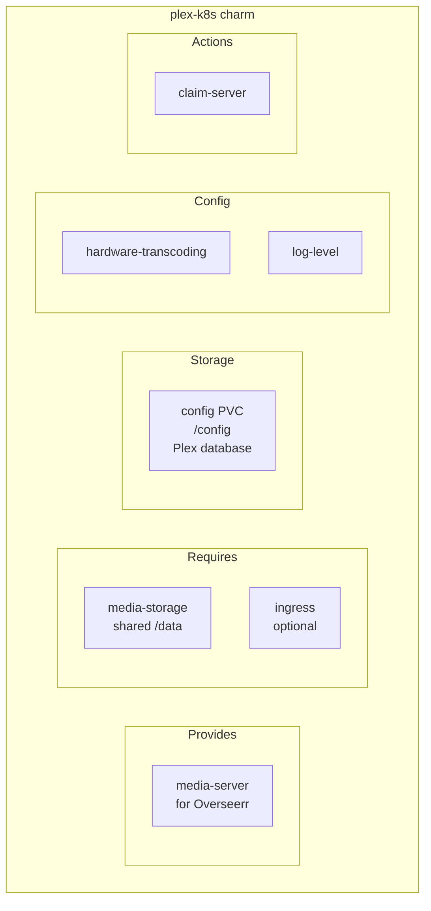
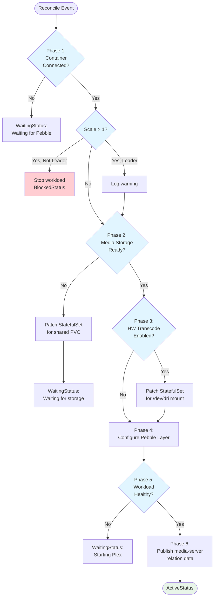

# Plex Media Server Charm Implementation

## Context and Problem Statement

Charmarr requires a Plex Media Server charm to provide media streaming capabilities. Plex is the primary media server for v1, with Jellyfin planned for v1.2. The charm must handle Plex's unique characteristics including claim token authentication, hardware transcoding, and remote access configuration.

Key challenges:
- Plex claim tokens expire in 4 minutes and are single-use
- Hardware transcoding requires `/dev/dri` device access
- Remote access requires user configuration of custom server URLs
- Plex uses SQLite (no HA possible)

## Considered Options

### Claim Token Handling
* **Option 1:** Charm config option for claim token
* **Option 2:** Juju action for claiming server
* **Option 3:** User claims via web UI only

### Hardware Transcoding
* **Option 1:** Always mount `/dev/dri` (fail if not available)
* **Option 2:** Config option to enable hardware transcoding
* **Option 3:** Auto-detect GPU and configure

### Remote Access Configuration
* **Option 1:** Charm auto-configures custom server URL from ingress
* **Option 2:** User configures via Plex UI after deployment
* **Option 3:** Charm config option for custom URL

## Decision Outcome

**Claim Token: Option 2** - Juju action (with Option 3 as alternative)
**Hardware Transcoding: Option 2** - Config option
**Remote Access: Option 2** - User configures via Plex UI

### Rationale

**Claim via action** because:
- `PLEX_CLAIM` env var expires in 4 minutes, single-use
- Storing in config leaves expired token visible forever
- Action is ephemeral: set env var, restart, token never persisted
- Alternative: user can claim via web UI (works fine, just manual)

**Hardware transcoding as config option** because:
- Not all nodes have Intel QuickSync/GPU
- Charm shouldn't fail if hardware not available
- User explicitly opts in when hardware is available
- Same StatefulSet patching pattern as VPN and storage

**User configures remote access** because:
- Remote access method varies: Tailscale, Cloudflare Tunnel, port forwarding, VPS
- Charm has no visibility into user's chosen method
- One-time configuration, rarely changed
- Drift detection adds complexity for minimal value

## Implementation Details

### Charm Architecture



### Reconciler Flow



### Pebble Layer

```python
def _build_pebble_layer(self) -> ops.pebble.LayerDict:
    """Build Pebble layer for Plex."""
    
    # Get PUID/PGID from storage relation
    storage = self.media_storage.get_provider()
    if not storage:
        raise RuntimeError("Storage relation required")
    
    env = {
        "PUID": str(storage.puid),
        "PGID": str(storage.pgid),
        "TZ": "Etc/UTC",
        "VERSION": "docker",  # Auto-update within container
    }
    
    # Add claim token if set via action (temporary)
    if self._pending_claim_token:
        env["PLEX_CLAIM"] = self._pending_claim_token
        self._pending_claim_token = None  # Clear after use
    
    return {
        "summary": "Plex Media Server",
        "services": {
            "plex": {
                "override": "replace",
                "command": "/init",
                "startup": "enabled",
                "environment": env,
            }
        },
        "checks": {
            "plex-ready": {
                "override": "replace",
                "level": "ready",
                "http": {"url": "http://localhost:32400/identity"},
                "period": "10s",
                "timeout": "3s",
                "threshold": 3,
            }
        },
    }
```

### Hardware Transcoding

When `hardware-transcoding` config is enabled, patch StatefulSet to mount GPU:

```python
def _patch_statefulset_for_hw_transcode(self) -> None:
    """Patch StatefulSet to mount /dev/dri for Intel QuickSync."""
    
    patch = {
        "spec": {
            "template": {
                "spec": {
                    "containers": [{
                        "name": "plex",
                        "volumeMounts": [{
                            "name": "dri",
                            "mountPath": "/dev/dri",
                        }],
                        "securityContext": {
                            "privileged": True,  # Required for device access
                        },
                    }],
                    "volumes": [{
                        "name": "dri",
                        "hostPath": {
                            "path": "/dev/dri",
                            "type": "Directory",
                        },
                    }],
                }
            }
        }
    }
    
    client = lightkube.Client()
    client.patch(
        StatefulSet,
        name=self.app.name,
        namespace=self.model.name,
        obj=patch,
        patch_type=PatchType.STRATEGIC,
    )
```

**Note:** Intel QuickSync (integrated GPU) is the target. Discrete GPUs (NVIDIA) would require different configuration (nvidia-device-plugin).

### Claim Server Action

```python
def _on_claim_server_action(self, event: ops.ActionEvent) -> None:
    """Handle claim-server action.
    
    Sets PLEX_CLAIM env var temporarily and restarts workload.
    Token is NOT persisted - it's single-use and expires in 4 minutes.
    """
    token = event.params.get("token")
    
    if not token or not token.startswith("claim-"):
        event.fail("Invalid token. Get one from https://plex.tv/claim")
        return
    
    container = self.unit.get_container("plex")
    if not container.can_connect():
        event.fail("Cannot connect to Plex container")
        return
    
    # Store temporarily for next Pebble layer update
    self._pending_claim_token = token
    
    # Trigger reconcile to apply new layer with claim token
    self._configure_pebble_layer()
    
    # Restart to pick up the claim token
    container.restart("plex")
    
    event.set_results({
        "message": "Claim token applied. Plex is restarting. "
                   "Check Plex UI to verify server is claimed."
    })
```

### Media Server Relation

```python
def _publish_media_server_data(self) -> None:
    """Publish connection info for Overseerr/Jellyseerr."""
    
    if not self.media_server_provider.relations:
        return
    
    self.media_server_provider.publish_data(
        MediaServerProviderData(
            api_url=f"http://{self.app.name}:32400",
            server=MediaServer.PLEX,
            instance_name=self.app.name,
        )
    )
```

### Scaling Protection

Per [ADR-008 Scaling Constraints](../cross-cutting/adr-008-scaling-constraints.md):

```python
def _reconcile(self, event: ops.EventBase) -> None:
    # ... container checks ...
    
    if self.app.planned_units() > 1:
        if not self.unit.is_leader():
            container = self.unit.get_container("plex")
            if container.can_connect():
                try:
                    container.stop("plex")
                except Exception:
                    pass
            self.unit.status = ops.BlockedStatus(
                "Scaling not supported - only leader runs workload"
            )
            return
        else:
            logger.warning(
                "Scaling > 1 not supported. Non-leader units idle."
            )
    
    # Continue with normal reconciliation...
```

## charmcraft.yaml

```yaml
name: plex-k8s
type: charm
title: Plex Media Server
summary: Stream your media anywhere with Plex
description: |
  Plex Media Server organizes your video, music, and photo collections
  and streams them to all of your devices.

  This charm provides:
  - Automatic media storage integration via relation
  - Optional hardware transcoding (Intel QuickSync)
  - Ingress integration for remote access
  - Integration with Overseerr for content requests

  After deployment:
  1. Access Plex UI via ingress or port-forward
  2. Sign in with your Plex account (or use claim-server action)
  3. Configure libraries pointing to /data/media
  4. (Optional) Configure remote access in Settings → Network

links:
  documentation: https://github.com/charmarr/plex-k8s
  source: https://github.com/charmarr/plex-k8s
  issues: https://github.com/charmarr/plex-k8s/issues

assumes:
  - k8s-api
  - juju >= 3.6

platforms:
  amd64:
    - name: ubuntu
      channel: "24.04"

charm-libs:
  - lib: charms.istio_ingress_k8s.v0.istio_ingress_route

parts:
  charm:
    source: .
    plugin: uv
    build-packages: [git]
    build-snaps: [astral-uv]

containers:
  plex:
    resource: plex-image

resources:
  plex-image:
    type: oci-image
    description: OCI image for Plex Media Server (LinuxServer)
    upstream-source: lscr.io/linuxserver/plex:latest

storage:
  config:
    type: filesystem
    location: /config
    minimum-size: 10G
    description: |
      Plex configuration and metadata database.
      Recommend 10GB+ for large libraries (thumbnails, metadata).

provides:
  media-server:
    interface: media-server

requires:
  media-storage:
    interface: media-storage
    limit: 1
  ingress:
    interface: istio_ingress_route
    limit: 1
    optional: true

config:
  options:
    hardware-transcoding:
      type: boolean
      default: false
      description: |
        Enable hardware transcoding using Intel QuickSync.
        
        Requires:
        - Intel CPU with integrated graphics (most non-F SKUs)
        - Node must have /dev/dri available
        - Plex Pass subscription
        
        When enabled, the charm mounts /dev/dri into the container
        and runs with elevated privileges.

    log-level:
      type: string
      default: "info"
      description: |
        Plex logging verbosity.
        Note: Plex doesn't have granular log levels like arr apps.
        This primarily affects charm logging.

actions:
  claim-server:
    description: |
      Claim this Plex server to your Plex account.
      
      Get a claim token from https://plex.tv/claim
      Token expires in 4 minutes and is single-use.
      
      Alternative: Access Plex web UI and sign in directly.
    params:
      token:
        type: string
        description: "Claim token from plex.tv/claim (format: claim-xxxxx)"
    required: [token]
```

## User Experience

### Initial Setup

```bash
# Deploy Plex
juju deploy plex-k8s plex --trust

# Relate to storage (required)
juju relate plex charmarr-storage

# Relate to ingress (optional but recommended)
juju relate plex istio-ingress

# Wait for deployment
juju status --watch 2s
```

### Claiming Server

**Option A: Via Web UI (recommended)**
```bash
# Port forward to access UI
kubectl port-forward -n charmarr svc/plex 32400:32400

# Open http://localhost:32400/web
# Sign in with Plex account
# Server is automatically claimed
```

**Option B: Via Action (for automation)**
```bash
# Get claim token (expires in 4 minutes!)
# Visit https://plex.tv/claim

# Apply token
juju run plex/0 claim-server token=claim-xxxxxxxxxxxxxxxxxxxx
```

### Hardware Transcoding

```bash
# Enable hardware transcoding
juju config plex hardware-transcoding=true

# Verify in Plex UI:
# Settings → Transcoder → "Use hardware acceleration when available"
```

### Remote Access

After deployment, configure in Plex UI:
1. Settings → Network
2. Set "Custom server access URLs" to your external URL
   - Example: `https://plex.yourdomain.com:443`
3. Optionally disable "Remote Access" if using custom URLs only

### Library Setup

Libraries point to paths under `/data/media`:
- Movies: `/data/media/movies`
- TV Shows: `/data/media/tv`
- Music: `/data/media/music`

These paths are provided by the `media-storage` relation (charmarr-storage charm).

## Comparison: Plex vs Jellyfin

| Aspect | Plex | Jellyfin (v1.2) |
|--------|------|-----------------|
| Charm name | `plex-k8s` | `jellyfin-k8s` |
| Port | 32400 | 8096 |
| Health endpoint | `/identity` | `/health` |
| Authentication | Plex account (OAuth) | Local accounts |
| Claim token | Yes (via plex.tv) | No |
| Hardware transcoding | QuickSync (Plex Pass required) | QuickSync (free) |
| Remote access | Custom server URLs | Base URL config |
| Request manager | Overseerr | Jellyseerr |

## Consequences

### Good

* Simple deployment - relate to storage and it works
* Hardware transcoding support for QuickSync
* Claim action enables automation while avoiding config pollution
* Scaling protection prevents SQLite corruption
* Integration with Overseerr via media-server relation

### Bad

* Remote access requires manual Plex UI configuration
* Hardware transcoding requires privileged container
* Claim token UX is awkward (4-minute expiry)
* No Plex Pass validation (user must have subscription for HW transcode)

### Neutral

* User must have Plex account (can't use Plex without one anyway)
* Library setup is manual (but that's expected - Plex doesn't auto-detect)

## Future Enhancements (v2+)

### ClusterPlex Integration

When user scales plex > 1, could automatically:
- Leader: Run PMS + ClusterPlex Orchestrator
- Non-leaders: Run ClusterPlex Workers

This enables distributed transcoding across multiple nodes.

**Requirements:**
- Shared transcode directory (RWX storage)
- Different container images per role
- Orchestrator sidecar or separate container

**Deferred:** Complex, needs more research. v1 focuses on single-instance stability.

## Related ADRs

- [interfaces/adr-007-media-server](../interfaces/adr-007-media-server.md) - media-server interface
- [cross-cutting/adr-008-scaling-constraints](../cross-cutting/adr-008-scaling-constraints.md) - Scaling protection
- [storage/adr-001-shared-pvc-architecture](../storage/adr-001-shared-pvc-architecture.md) - Shared media storage
- [interfaces/adr-005-media-storage](../interfaces/adr-005-media-storage.md) - media-storage interface
