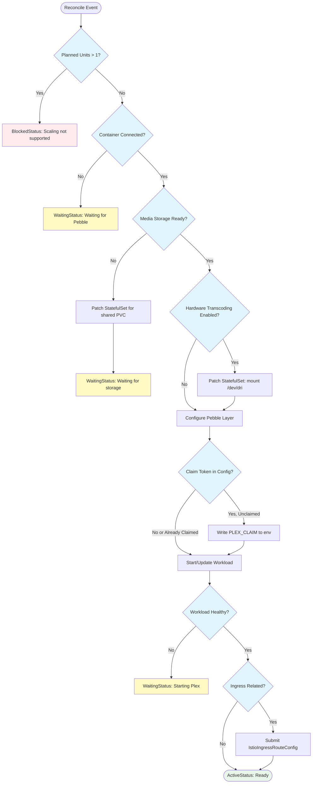
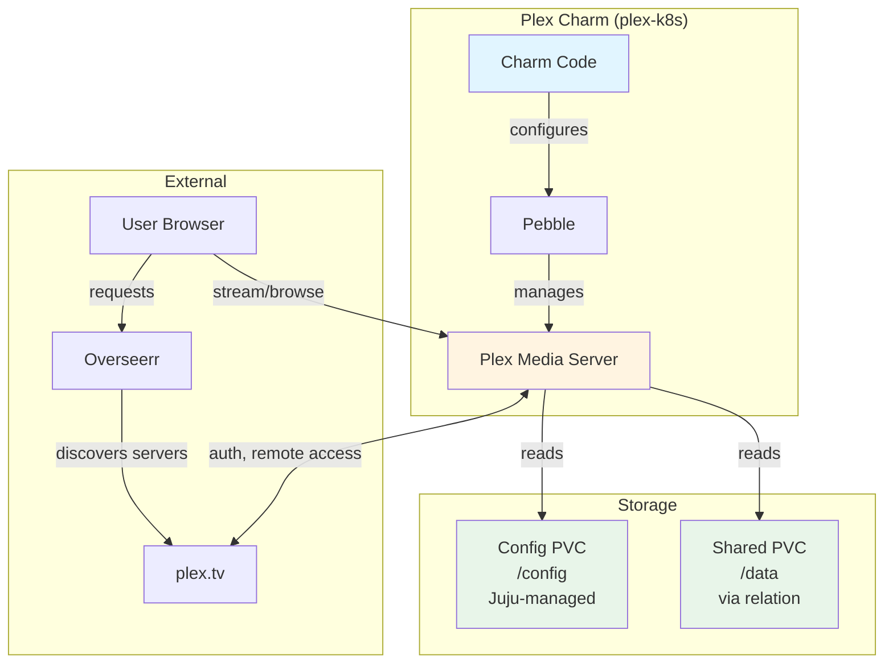

# Plex Media Server Charm Implementation

## Context and Problem Statement

Charmarr requires a Plex Media Server charm to serve media to users. Unlike arr apps, Plex doesn't need programmatic integration with other Charmarr components - it simply watches the filesystem for media files. The charm needs to handle initial server claiming, hardware transcoding, and storage integration.

**Key insight:** Plex does NOT need a relation to Overseerr. Overseerr discovers Plex servers automatically via plex.tv after the user completes OAuth. Users select their Plex server from a dropdown - they don't enter URLs manually. Therefore, no `media-server` interface is needed.

## Considered Options

### Initial Server Claiming
* **Option 1:** Require claim token via config before first start
* **Option 2:** Manual claiming via web UI after deployment
* **Option 3:** Both - optional config for automation, manual as fallback

### Hardware Transcoding
* **Option 1:** Always mount /dev/dri (fails on nodes without Intel iGPU)
* **Option 2:** Config option to enable hardware transcoding
* **Option 3:** Auto-detect GPU availability

### Plex-to-Overseerr Integration
* **Option 1:** Create `media-server` interface for URL sharing
* **Option 2:** No interface - Overseerr auto-discovers via plex.tv

## Decision Outcome

**Claiming: Option 3** - Both methods supported. Config option for automation, manual claiming always available.

**Hardware transcoding: Option 2** - Config option. Not all nodes have Intel iGPU, and Plex Pass is required.

**Overseerr integration: Option 2** - No interface needed. After OAuth, Overseerr queries plex.tv which returns all Plex servers the user has access to. User selects from dropdown - no URL typing required.

### Why No media-server Interface?

We initially planned a `media-server` interface for Plex to publish its URL to Overseerr. Research revealed this adds zero value:

1. **Overseerr setup flow:**
   - User signs into Overseerr with Plex account (OAuth)
   - User clicks "refresh" button next to Server dropdown
   - Overseerr queries plex.tv with user's auth token
   - plex.tv returns list of all Plex servers user has access to
   - User selects server from dropdown (auto-populated)

2. **Why pre-filling doesn't help:**
   - Users don't type URLs - they select from dropdown
   - Dropdown is auto-populated by plex.tv
   - plex.tv knows about servers even on private networks
   - Pre-filled URL would be redundant or confusing

3. **Comparison with Jellyfin (future):**
   - Jellyseerr → Jellyfin requires: hostname + API key
   - Overseerr → Plex requires: OAuth only (plex.tv handles discovery)
   - Different auth models = different interface needs

**Conclusion:** Skip `media-server` interface entirely. Re-evaluate when adding Jellyfin support - may need interface for Jellyseerr integration.

## Implementation Details

### Reconciler Flow



### Architecture



### Pebble Layer

```python
def _build_pebble_layer(self) -> ops.pebble.LayerDict:
    """Build Pebble layer for Plex."""
    storage = self.media_storage.get_provider()
    
    env = {
        "PUID": str(storage.puid),
        "PGID": str(storage.pgid),
        "TZ": "Etc/UTC",
        "VERSION": "docker",  # Use container's bundled version
    }
    
    # Add claim token if provided and server unclaimed
    claim_token = self.config.get("claim-token")
    if claim_token and not self._is_server_claimed():
        env["PLEX_CLAIM"] = claim_token
    
    return {
        "summary": "Plex Media Server layer",
        "services": {
            "plex": {
                "override": "replace",
                "command": "/init",
                "startup": "enabled",
                "environment": env,
            }
        },
        "checks": {
            "plex-ready": {
                "override": "replace",
                "level": "ready",
                "http": {"url": "http://localhost:32400/identity"},
                "period": "10s",
                "timeout": "5s",
                "threshold": 3,
            }
        },
    }
```

### Hardware Transcoding

When `hardware-transcoding` config is enabled, the charm patches the StatefulSet to mount `/dev/dri`:

```python
def _patch_for_hardware_transcoding(self) -> None:
    """Patch StatefulSet to mount /dev/dri for Intel QuickSync."""
    client = lightkube.Client()
    
    patch = {
        "spec": {
            "template": {
                "spec": {
                    "containers": [{
                        "name": "plex",
                        "securityContext": {
                            "privileged": True,  # Required for /dev/dri access
                        },
                        "volumeMounts": [{
                            "name": "dri",
                            "mountPath": "/dev/dri",
                        }],
                    }],
                    "volumes": [{
                        "name": "dri",
                        "hostPath": {
                            "path": "/dev/dri",
                            "type": "Directory",
                        },
                    }],
                }
            }
        }
    }
    
    client.patch(
        StatefulSet,
        name=self.app.name,
        namespace=self.model.name,
        obj=patch,
        patch_type=PatchType.STRATEGIC,
    )
```

**Requirements for hardware transcoding:**
- Intel CPU with integrated graphics (non-F SKUs)
- `/dev/dri` available on node
- Plex Pass subscription
- `--trust` flag for privileged container

### Server Claiming

Plex requires "claiming" to link a server to a Plex account. Two methods supported:

**Method 1: Claim Token (Automated)**
```bash
# Get token from https://plex.tv/claim (expires in 4 minutes)
juju config plex claim-token="claim-xxxxxxxxxxxx"
```

**Method 2: Manual (Web UI)**
1. Access Plex at `http://<plex-ip>:32400/web`
2. Sign in with Plex account
3. Server is automatically claimed

The charm detects if server is already claimed by checking `Preferences.xml`:

```python
def _is_server_claimed(self) -> bool:
    """Check if Plex server is already claimed."""
    container = self.unit.get_container("plex")
    try:
        prefs = container.pull("/config/Library/Application Support/Plex Media Server/Preferences.xml")
        content = prefs.read()
        # Server is claimed if PlexOnlineToken exists
        return "PlexOnlineToken" in content
    except (PathError, FileNotFoundError):
        return False
```

### Remote Access via Tailscale

Plex has built-in "Remote Access" that uses UPnP/NAT-PMP to punch through firewalls. For Charmarr deployments using Tailscale:

**Recommended approach:**
1. **Disable Plex Remote Access** in Settings → Network
2. **Use Tailscale URL** as custom server access URL in Plex settings
3. **Configure Overseerr** to use Tailscale URL when setting up Plex manually (if needed)

**Plex settings for Tailscale:**
- Settings → Network → Custom server access URLs: `https://plex.tailnet-name.ts.net:32400`
- This tells Plex clients where to find the server on your Tailnet

**Why this works:**
- Tailscale provides secure, encrypted access without exposing ports
- No UPnP/NAT-PMP complexity
- Works from anywhere on your Tailnet
- Istio ingress handles routing within the cluster

## charmcraft.yaml

```yaml
name: plex-k8s
type: charm
title: Plex Media Server
summary: Media streaming server for Charmarr
description: |
  Plex Media Server streams your media to devices anywhere.

  This charm provides:
  - Automatic media storage integration via relation
  - Optional hardware transcoding (Intel QuickSync)
  - Ingress integration for remote access

  After deployment:
  1. Access Plex UI via ingress or port-forward
  2. Sign in with your Plex account (or use claim-token config)
  3. Configure libraries pointing to /data/media
  4. (Optional) Configure Tailscale URL for remote access

  Note: Plex is automatically discovered by Overseerr via plex.tv
  after OAuth - no manual URL configuration needed.

links:
  documentation: https://github.com/charmarr/plex-k8s
  source: https://github.com/charmarr/plex-k8s
  issues: https://github.com/charmarr/plex-k8s/issues

assumes:
  - k8s-api
  - juju >= 3.6

platforms:
  amd64:
    - name: ubuntu
      channel: "24.04"

charm-libs:
  - lib: charms.istio_ingress_k8s.v0.istio_ingress_route

parts:
  charm:
    source: .
    plugin: uv
    build-packages: [git]
    build-snaps: [astral-uv]

containers:
  plex:
    resource: plex-image

resources:
  plex-image:
    type: oci-image
    description: OCI image for Plex Media Server (LinuxServer)
    upstream-source: lscr.io/linuxserver/plex:latest

storage:
  config:
    type: filesystem
    location: /config
    minimum-size: 10G
    description: |
      Plex configuration and metadata database.
      Recommend 10GB+ for large libraries (thumbnails, metadata).

# NO provides section - Plex doesn't provide any interfaces
# Overseerr discovers Plex via plex.tv, not via Juju relation

requires:
  media-storage:
    interface: media-storage
    limit: 1
  ingress:
    interface: istio_ingress_route
    limit: 1
    optional: true

config:
  options:
    claim-token:
      type: string
      default: ""
      description: |
        Plex claim token for automated server setup.
        
        Get token from https://plex.tv/claim
        Token expires in 4 minutes and is single-use.
        
        Leave empty to claim manually via web UI after deployment.
        
        Note: Token is only used if server is not already claimed.

    hardware-transcoding:
      type: boolean
      default: false
      description: |
        Enable hardware transcoding using Intel QuickSync.
        
        Requires:
        - Intel CPU with integrated graphics (most non-F SKUs)
        - Node must have /dev/dri available
        - Plex Pass subscription
        - Charm deployed with --trust flag
        
        When enabled, the charm mounts /dev/dri into the container
        and runs with elevated privileges.

    log-level:
      type: string
      default: "info"
      description: |
        Charm logging verbosity.
        Note: Plex doesn't expose granular log levels via environment.

actions:
  refresh-libraries:
    description: |
      Trigger a full library scan in Plex.
      Useful after bulk media additions.
```

## User Experience

### Deployment

```bash
# Basic deployment
juju deploy plex-k8s plex --trust
juju relate plex charmarr-storage

# With hardware transcoding
juju config plex hardware-transcoding=true

# With claim token (optional)
juju config plex claim-token="claim-xxxxxxxxxxxx"

# With ingress
juju relate plex istio-ingress
```

### Library Setup

After deployment:
1. Access Plex UI (via ingress URL or port-forward)
2. Sign in with Plex account (claims server if unclaimed)
3. Add libraries:
   - Movies: `/data/media/movies`
   - TV Shows: `/data/media/tv`
   - Music: `/data/media/music`

### Overseerr Integration

No Juju relation needed! After deploying Overseerr:
1. Open Overseerr setup wizard
2. Sign in with Plex account (OAuth)
3. Click refresh next to Server dropdown
4. Select your Plex server from the list (auto-populated by plex.tv)
5. Continue with library sync

## Consequences

### Good

* **Simple charm** - No complex API integrations, just storage and optional ingress
* **No unnecessary interface** - Skipping `media-server` avoids complexity with zero benefit
* **Hardware transcoding support** - Intel QuickSync for smooth playback
* **Flexible claiming** - Automated or manual, user's choice
* **Works with Tailscale** - Custom server access URL for secure remote access

### Bad

* **Manual library setup** - User must configure libraries in Plex UI (can't automate)
* **Privileged container for transcoding** - Security tradeoff for hardware access
* **Claim token expires quickly** - 4-minute window for automated claiming

### Neutral

* **No programmatic Overseerr integration** - But this matches how Overseerr actually works
* **Plex Pass required for transcoding** - Hardware limitation, not charm limitation

## Related MADRs

- [storage/adr-001](../storage/adr-001-shared-pvc-architecture.md) - Shared PVC for media files
- [interfaces/adr-005](../interfaces/adr-005-media-storage.md) - media-storage interface
- [apps/adr-012](./adr-012-app-scaling-v1.md) - Single-instance scaling constraints
