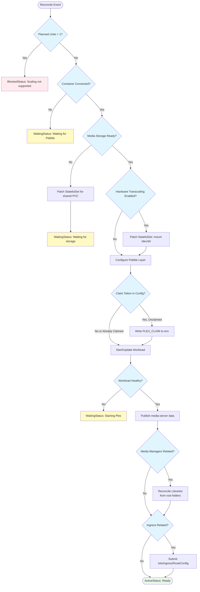
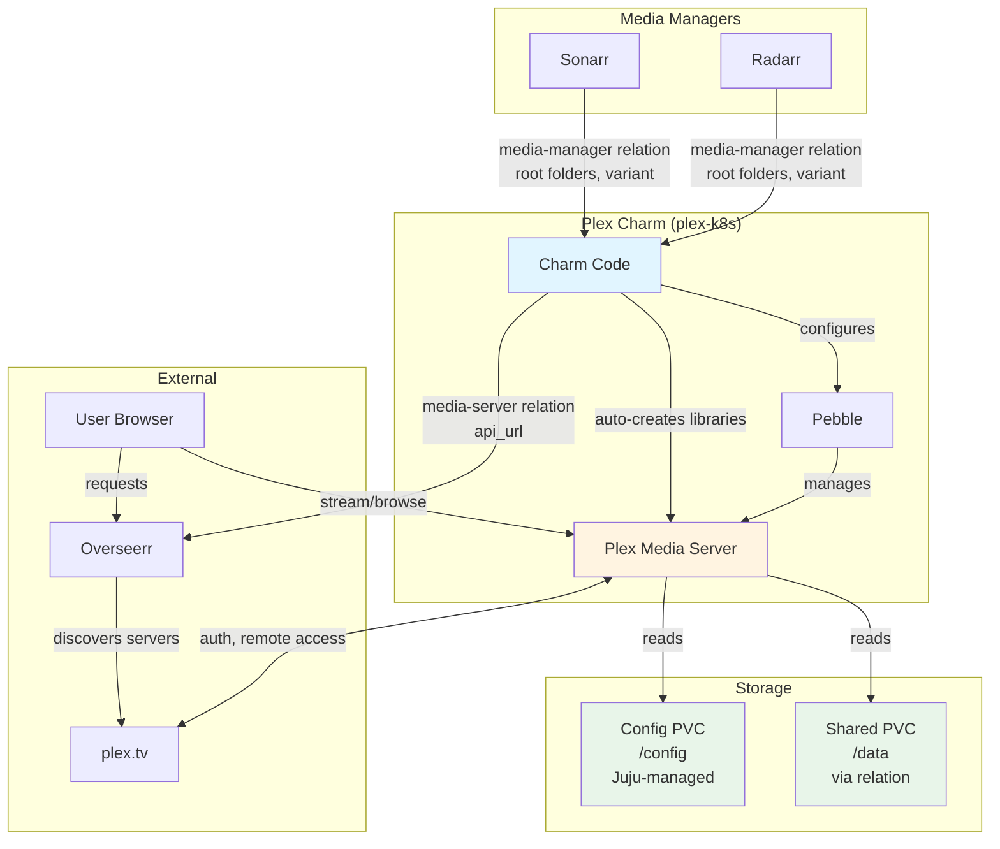

# Plex Media Server Charm Implementation

## Context and Problem Statement

Charmarr requires a Plex Media Server charm to serve media to users. The charm needs to handle initial server claiming, hardware transcoding, storage integration, automatic library creation from media manager relations, and providing connection info for request managers.

**Key capabilities:**
- Auto-creates Plex libraries based on media-manager relation data from Radarr/Sonarr (root folders and content variants)
- Provides `media-server` interface for Overseerr to enable service mesh authorization policies

## Considered Options

### Initial Server Claiming
* **Option 1:** Require claim token via config before first start
* **Option 2:** Manual claiming via web UI after deployment
* **Option 3:** Both - optional config for automation, manual as fallback

### Hardware Transcoding
* **Option 1:** Always mount /dev/dri (fails on nodes without Intel iGPU)
* **Option 2:** Config option to enable hardware transcoding
* **Option 3:** Auto-detect GPU availability

### Library Creation
* **Option 1:** Manual library setup - User configures libraries in Plex UI
* **Option 2:** Auto-create libraries from media-manager relation data

### Plex-to-Overseerr Integration
* **Option 1:** Create `media-server` interface for service mesh authorization
* **Option 2:** No interface - Overseerr auto-discovers via plex.tv only

## Decision Outcome

**Claiming: Option 3** - Both methods supported. Config option for automation, manual claiming always available.

**Hardware transcoding: Option 2** - Config option. Not all nodes have Intel iGPU, and Plex Pass is required.

**Library creation: Option 2** - Auto-create libraries from media-manager relations. Each Radarr/Sonarr instance publishes its root folders and content variant, Plex creates matching libraries.

**Overseerr integration: Option 1** - Provide `media-server` interface. While Overseerr discovers Plex via plex.tv OAuth, the relation enables service mesh authorization policies so Overseerr can communicate with Plex in meshed environments.

## Implementation Details

### Reconciler Flow



### Architecture



### Pebble Layer

Uses the Pebble/LinuxServer.io pattern from [ADR-015](adr-015-pebble-linuxserver-pattern.md):
- Bypass s6-overlay, run Plex binary directly (`/usr/lib/plexmediaserver/Plex Media Server`)
- Use Pebble's `user-id`/`group-id` from storage relation
- Use `fsGroup` for volume permissions

Plex-specific environment variables:
- `VERSION=docker` - Use container's bundled version
- `PLEX_CLAIM` - Claim token for initial server setup (if unclaimed)

### Hardware Transcoding

When `hardware-transcoding` config is enabled, the charm patches the StatefulSet to mount `/dev/dri`:

```python
def _patch_for_hardware_transcoding(self) -> None:
    """Patch StatefulSet to mount /dev/dri for Intel QuickSync."""
    client = lightkube.Client()
    
    patch = {
        "spec": {
            "template": {
                "spec": {
                    "containers": [{
                        "name": "plex",
                        "securityContext": {
                            "privileged": True,  # Required for /dev/dri access
                        },
                        "volumeMounts": [{
                            "name": "dri",
                            "mountPath": "/dev/dri",
                        }],
                    }],
                    "volumes": [{
                        "name": "dri",
                        "hostPath": {
                            "path": "/dev/dri",
                            "type": "Directory",
                        },
                    }],
                }
            }
        }
    }
    
    client.patch(
        StatefulSet,
        name=self.app.name,
        namespace=self.model.name,
        obj=patch,
        patch_type=PatchType.STRATEGIC,
    )
```

**Requirements for hardware transcoding:**
- Intel CPU with integrated graphics (non-F SKUs)
- `/dev/dri` available on node
- Plex Pass subscription
- `--trust` flag for privileged container

### Server Claiming

Plex requires "claiming" to link a server to a Plex account. Two methods supported:

**Method 1: Claim Token (Automated)**
```bash
# Get token from https://plex.tv/claim (expires in 4 minutes)
juju config plex claim-token="claim-xxxxxxxxxxxx"
```

**Method 2: Manual (Web UI)**
1. Access Plex at `http://<plex-ip>:32400/web`
2. Sign in with Plex account
3. Server is automatically claimed

The charm detects if server is already claimed by checking `Preferences.xml`:

```python
def _is_server_claimed(self) -> bool:
    """Check if Plex server is already claimed."""
    container = self.unit.get_container("plex")
    try:
        prefs = container.pull("/config/Library/Application Support/Plex Media Server/Preferences.xml")
        content = prefs.read()
        # Server is claimed if PlexOnlineToken exists
        return "PlexOnlineToken" in content
    except (PathError, FileNotFoundError):
        return False
```

### Automatic Library Creation

When media managers (Radarr/Sonarr) are related via the `media-manager` interface, Plex automatically creates libraries based on their root folders and content variants.

**Library naming convention:**

| Manager | Variant | Library Name |
|---------|---------|--------------|
| Radarr | standard | Movies |
| Radarr | 4k | Movies (4K) |
| Radarr | anime | Anime Movies |
| Sonarr | standard | TV Shows |
| Sonarr | 4k | TV Shows (4K) |
| Sonarr | anime | Anime |

Libraries are only created if a library doesn't already exist for that root folder path, ensuring user customizations are preserved.

### Remote Access via Tailscale

Plex has built-in "Remote Access" that uses UPnP/NAT-PMP to punch through firewalls. For Charmarr deployments using Tailscale:

**Recommended approach:**
1. **Disable Plex Remote Access** in Settings → Network
2. **Use Tailscale URL** as custom server access URL in Plex settings
3. **Configure Overseerr** to use Tailscale URL when setting up Plex manually (if needed)

**Plex settings for Tailscale:**
- Settings → Network → Custom server access URLs: `https://plex.tailnet-name.ts.net:32400`
- This tells Plex clients where to find the server on your Tailnet

**Why this works:**
- Tailscale provides secure, encrypted access without exposing ports
- No UPnP/NAT-PMP complexity
- Works from anywhere on your Tailnet
- Istio ingress handles routing within the cluster

## charmcraft.yaml

```yaml
name: plex-k8s
type: charm
title: Plex Media Server
summary: Media streaming server for Charmarr
description: |
  Plex Media Server streams your media to devices anywhere.

  This charm provides:
  - Automatic media storage integration via relation
  - Automatic library creation from Radarr/Sonarr relations
  - Optional hardware transcoding (Intel QuickSync)
  - Ingress integration for remote access

  After deployment:
  1. Set claim-token config (from plex.tv/claim) to claim server
  2. Relate to radarr-k8s and sonarr-k8s for automatic library setup
  3. Libraries are created automatically based on media manager folders

  Note: Plex is automatically discovered by Overseerr via plex.tv
  after OAuth - no manual URL configuration needed.

links:
  documentation: https://github.com/charmarr/plex-k8s
  source: https://github.com/charmarr/plex-k8s
  issues: https://github.com/charmarr/plex-k8s/issues

assumes:
  - k8s-api
  - juju >= 3.6

platforms:
  amd64:
    - name: ubuntu
      channel: "24.04"

charm-libs:
  - lib: charms.istio_ingress_k8s.v0.istio_ingress_route

parts:
  charm:
    source: .
    plugin: uv
    build-packages: [git]
    build-snaps: [astral-uv]

containers:
  plex:
    resource: plex-image

resources:
  plex-image:
    type: oci-image
    description: OCI image for Plex Media Server (LinuxServer)
    upstream-source: lscr.io/linuxserver/plex:latest

storage:
  config:
    type: filesystem
    location: /config
    minimum-size: 10G
    description: |
      Plex configuration and metadata database.
      Recommend 10GB+ for large libraries (thumbnails, metadata).

provides:
  media-server:
    interface: media-server
    description: Publish Plex API endpoint for request managers (Overseerr)

requires:
  media-storage:
    interface: media-storage
    limit: 1
  media-manager:
    interface: media-manager
    optional: true
    description: |
      Receive media manager info from Radarr/Sonarr for automatic library creation.
      Libraries are created based on each media manager's root folders.
  ingress:
    interface: istio_ingress_route
    limit: 1
    optional: true

config:
  options:
    claim-token:
      type: string
      default: ""
      description: |
        Plex claim token for automated server setup.
        
        Get token from https://plex.tv/claim
        Token expires in 4 minutes and is single-use.
        
        Leave empty to claim manually via web UI after deployment.
        
        Note: Token is only used if server is not already claimed.

    hardware-transcoding:
      type: boolean
      default: false
      description: |
        Enable hardware transcoding using Intel QuickSync.
        
        Requires:
        - Intel CPU with integrated graphics (most non-F SKUs)
        - Node must have /dev/dri available
        - Plex Pass subscription
        - Charm deployed with --trust flag
        
        When enabled, the charm mounts /dev/dri into the container
        and runs with elevated privileges.

    log-level:
      type: string
      default: "info"
      description: |
        Charm logging verbosity.
        Note: Plex doesn't expose granular log levels via environment.

actions:
  refresh-libraries:
    description: |
      Trigger a full library scan in Plex.
      Useful after bulk media additions.
```

## User Experience

### Deployment

```bash
# Basic deployment
juju deploy plex-k8s plex --trust
juju relate plex charmarr-storage

# With hardware transcoding
juju config plex hardware-transcoding=true

# With claim token (optional)
juju config plex claim-token="claim-xxxxxxxxxxxx"

# With ingress
juju relate plex istio-ingress
```

### Library Setup

Libraries are created automatically when Radarr/Sonarr are related:

```bash
# Relate media managers to Plex
juju relate plex radarr
juju relate plex sonarr
juju relate plex radarr-4k
juju relate plex sonarr-anime

# Libraries created automatically:
# - Movies (from radarr at /data/media/movies)
# - TV Shows (from sonarr at /data/media/tv)
# - Movies (4K) (from radarr-4k at /data/media/movies-uhd)
# - Anime (from sonarr-anime at /data/media/anime/tv)
```

### Overseerr Integration

Overseerr discovers Plex via plex.tv OAuth. The `media-server` relation enables service mesh authorization so Overseerr can communicate with Plex in meshed environments.

```bash
juju relate overseerr plex
```

## Consequences

### Good

* **Automatic library creation** - Libraries created from media manager relations without manual setup
* **Hardware transcoding support** - Intel QuickSync for smooth playback
* **Flexible claiming** - Automated or manual, user's choice
* **Works with Tailscale** - Custom server access URL for secure remote access
* **Service mesh support** - media-server relation enables authorization policies

### Bad

* **Privileged container for transcoding** - Security tradeoff for hardware access
* **Claim token expires quickly** - 4-minute window for automated claiming

### Neutral

* **Plex Pass required for transcoding** - Hardware limitation, not charm limitation

## Related MADRs

- [storage/adr-001](../storage/adr-001-shared-pvc-architecture.md) - Shared PVC for media files
- [interfaces/adr-005](../interfaces/adr-005-media-storage.md) - media-storage interface
- [interfaces/adr-006](../interfaces/adr-006-media-manager.md) - media-manager interface (for library creation)
- [apps/adr-012](./adr-012-app-scaling-v1.md) - Single-instance scaling constraints
