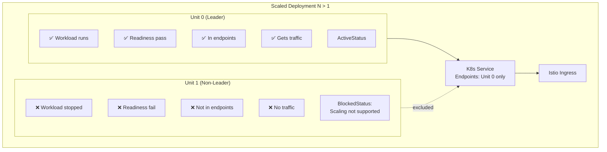

# Scaling Constraints for Charmarr v1 Charms

## Context and Problem Statement

All Charmarr v1 applications use SQLite databases (or INI files) for configuration storage. SQLite doesn't support concurrent writes from multiple processes - attempting to run multiple instances against the same database causes locking errors and potential corruption. Even applications that support PostgreSQL (Radarr, Sonarr, Prowlarr) don't support true horizontal scaling with concurrent instances.

We need a strategy that:
- Prevents data corruption from multiple instances
- Works with Kubernetes Service load balancing
- Provides clear feedback to operators who misconfigure scaling
- Doesn't cause crash loops or resource exhaustion
- Allows for future HA patterns (v2+)

Key challenge: Juju has no native `max-units` constraint. If an operator runs `juju scale-application plex 3`, we must handle it gracefully.

## Considered Options

### Scaling Prevention
* **Option 1:** Block and stop all units if scale > 1
* **Option 2:** Leader runs workload, non-leaders idle with BlockedStatus
* **Option 3:** Allow scaling, hope for the best (no protection)

### Traffic Routing
* **Option 1:** Publish unit FQDN in relations (bypasses Service load balancing)
* **Option 2:** Publish Service FQDN, rely on readiness probes to filter traffic
* **Option 3:** Publish Service FQDN, no protection

## Decision Outcome

**Scaling: Option 2** - Leader runs workload, non-leaders idle
**Traffic: Option 2** - Service FQDN with readiness probe protection

### How It Works



### Kubernetes Readiness Probe Behavior

K8s Services only route traffic to pods that pass their readiness probe:

> "When a Pod is not ready, it is removed from Service load balancers."
> — Kubernetes Documentation

Juju/Pebble automatically configures K8s readiness probes based on Pebble checks with `level: ready`:

```python
"checks": {
    "app-ready": {
        "override": "replace",
        "level": "ready",  # Maps to K8s readiness probe
        "http": {"url": f"http://localhost:{port}/health"},
        "period": "10s",
        "timeout": "3s",
        "threshold": 3,
    }
}
```

When non-leader doesn't start workload:
1. Nothing listening on health endpoint
2. Pebble check fails
3. K8s readiness probe fails
4. Pod marked NotReady
5. Service removes pod from endpoints
6. **No traffic routed to non-leader**

**Critical:** Readiness failure does NOT restart the pod (that's liveness). The pod just sits idle, no crash loops, no RAM death spiral.

### Implementation Pattern

All v1 charms implement this pattern:

```python
def _reconcile(self, event: ops.EventBase) -> None:
    container = self.unit.get_container(self._container_name)
    if not container.can_connect():
        self.unit.status = ops.WaitingStatus("Waiting for Pebble")
        return

    # Scaling check - before any workload configuration
    if self.app.planned_units() > 1:
        if not self.unit.is_leader():
            # Stop workload if running
            if container.get_services().get(self._service_name):
                container.stop(self._service_name)

            self.unit.status = ops.BlockedStatus(
                "Scaling not supported - only leader runs workload"
            )
            return
        else:
            # Leader continues but logs warning
            logger.warning(
                "Scaling > 1 not supported. Non-leader units are idle. "
                "Run: juju scale-application %s 1", self.app.name
            )

    # Continue with normal reconciliation...
    self._configure_pebble_layer()
    # ...
```

### App Status Aggregation

In addition to unit status, the leader should set app status to reflect the misconfiguration:

```python
def _on_collect_app_status(self, event: ops.CollectStatusEvent):
    if self.unit.is_leader() and self.app.planned_units() > 1:
        event.add_status(ops.BlockedStatus(
            f"Scale {self.app.planned_units()} not supported - reduce to 1"
        ))
```

### Relation Data

Charms publish Service FQDN (not unit FQDN) in relation data:

```python
# ✅ Correct - Service FQDN
api_url = f"http://{self.app.name}:{self._port}"

# ❌ Wrong - Unit FQDN (doesn't work with ingress)
api_url = f"http://{self.unit.name.replace('/', '-')}.{self.app.name}-endpoints..."
```

Service FQDN works because readiness probes ensure only the leader pod is in the endpoints.

## Application-Specific Notes

### SQLite Applications (All v1)

| Application | Database | Native HA | Notes |
|-------------|----------|-----------|-------|
| Radarr | SQLite (PG optional) | ❌ | Even with PG, no concurrent instances |
| Sonarr | SQLite (PG optional) | ❌ | Even with PG, no concurrent instances |
| Prowlarr | SQLite (PG optional) | ❌ | Even with PG, no concurrent instances |
| qBittorrent | SQLite + files | ❌ | Single instance by design |
| SABnzbd | INI files | ❌ | Single instance by design |
| Plex | SQLite | ❌ | Will never support PG |
| Jellyfin | SQLite | ❌ | PG "maybe someday" |
| Overseerr | SQLite | ❌ | Single instance by design |

### Future Distributed Transcoding (v2+)

Plex and Jellyfin have community solutions for distributed transcoding:

| Solution | For | How It Works |
|----------|-----|--------------|
| ClusterPlex | Plex | WebSocket orchestrator + worker pods |
| rffmpeg | Jellyfin | SSH-based remote ffmpeg |

These could enable a pattern where:
- Leader: runs main application + orchestrator
- Non-leaders: run as transcoding workers

This is **out of scope for v1** but the leader/non-leader pattern we're establishing doesn't preclude it.

## Consequences

### Good

* No data corruption - only one instance writes to SQLite
* No traffic flickering - K8s handles endpoint filtering automatically
* Clear operator feedback - BlockedStatus visible in `juju status`
* No crash loops - readiness failure doesn't restart pods
* Future-compatible - pattern works for v2 HA/distributed transcoding
* Works with ingress - Service FQDN routes through Istio correctly

### Bad

* Non-leader units consume resources (pod running, just idle)
* Operator must manually scale back down
* No automatic remediation (by design - we don't want to fight the operator)

### Neutral

* Pattern must be implemented in every charm (but it's ~15 lines)
* Documentation needed to explain why scaling doesn't work

## Related ADRs

- [storage/adr-004-config-storage](storage/adr-004-config-storage.md) - Why SQLite for v1
- [apps/adr-004-radarr-sonarr](apps/adr-004-radarr-sonarr.md) - Media manager implementation
- [apps/adr-007-qbit-sabnzbd](apps/adr-007-qbit-sabnzbd.md) - Download client implementation
