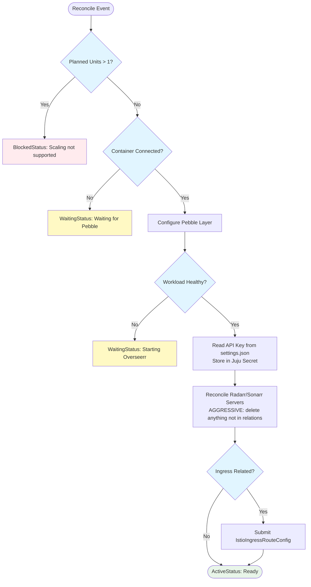

# Overseerr Charm Implementation

## Context and Problem Statement

Charmarr requires an Overseerr charm to provide a user-facing content request interface. Overseerr allows users to request movies and TV shows, which are then automatically added to Radarr/Sonarr. We need to define the implementation details including reconciler pattern, Pebble configuration, relation handling, and integration with media managers.

**Key constraints:**
- Overseerr requires Plex OAuth for initial setup (creates admin user) - cannot be automated
- Plex server discovery happens via plex.tv after OAuth - no `media-server` interface needed
- Radarr/Sonarr configuration CAN be automated via API before/after wizard completion
- Overseerr doesn't touch media files - no `media-storage` relation needed

## Considered Options

### Plex Integration
* **Option 1:** Create `media-server` interface for Plex URL sharing
* **Option 2:** No interface - Overseerr auto-discovers Plex via plex.tv after OAuth

### Radarr/Sonarr Reconciliation
* **Option 1:** Query-first - respect manually configured servers
* **Option 2:** Aggressive declarative - delete anything not in relations

### Quality Profile Selection
* **Option 1:** Always use first profile from relation data
* **Option 2:** Query-first for profiles - use existing if set, otherwise first

### Default Server Selection
* **Option 1:** First related server becomes default per tier (4K/non-4K)
* **Option 2:** Query Overseerr API - only set default if none exists for tier

## Decision Outcome

**Plex Integration: Option 2** - No interface. After Plex OAuth, users click "refresh" and select their Plex server from a dropdown auto-populated by plex.tv. Pre-filling URLs adds zero value.

**Radarr/Sonarr Reconciliation: Option 2** - Aggressive. Juju relations are single source of truth. Manually configured servers get deleted. Consistent with all other Charmarr charms.

**Quality Profile Selection: Option 2** - Query-first. If user changed profile in Overseerr UI, respect it. Otherwise use first from relation data.

**Default Server Selection: Option 2** - Query-first. Only set as default if no default exists for that tier (4K vs non-4K).

## Implementation Details

### Reconciler Flow



### API Key Management

Overseerr generates `apiKey` in `settings.json` on first start:

```python
def _get_api_key(self) -> str | None:
    """Read API key from settings.json."""
    container = self.unit.get_container("overseerr")
    try:
        settings = json.loads(
            container.pull("/app/config/settings.json").read()
        )
        return settings.get("main", {}).get("apiKey")
    except (PathError, json.JSONDecodeError):
        return None

def _ensure_api_key_secret(self) -> str:
    """Ensure API key is stored in Juju secret, return secret ID."""
    api_key = self._get_api_key()

    try:
        secret = self.model.get_secret(label="overseerr-api-key")
        # Drift detection - sync if changed
        stored = secret.get_content()["api-key"]
        if stored != api_key:
            secret.set_content({"api-key": api_key})
    except SecretNotFoundError:
        secret = self.app.add_secret(
            content={"api-key": api_key},
            label="overseerr-api-key",
        )

    return secret.id
```

### Radarr/Sonarr Server Reconciliation

Aggressive reconciliation - servers not in relations get deleted:

```python
def _reconcile_radarr_servers(self) -> None:
    """Reconcile Radarr servers from media-manager relations."""

    # Get desired state from relations
    providers = [
        p for p in self.media_manager.get_providers()
        if p.manager == MediaManager.RADARR
    ]
    desired_names = {p.instance_name for p in providers}

    # Get current state from Overseerr
    current_servers = self._api_call("GET", "/api/v1/settings/radarr")

    # Delete servers not in relations (AGGRESSIVE)
    for server in current_servers:
        if server["name"] not in desired_names:
            logger.info(f"Removing Radarr server: {server['name']}")
            self._api_call("DELETE", f"/api/v1/settings/radarr/{server['id']}")

    # Refresh current state after deletions
    current_servers = self._api_call("GET", "/api/v1/settings/radarr")
    current_by_name = {s["name"]: s for s in current_servers}

    # Add or update servers from relations
    for provider in providers:
        existing = current_by_name.get(provider.instance_name)
        self._configure_radarr_server(provider, existing, current_servers)


def _configure_radarr_server(
    self,
    provider: MediaManagerProviderData,
    existing: dict | None,
    all_servers: list[dict],
) -> None:
    """Configure single Radarr server in Overseerr."""

    # Determine default status (query-first)
    has_default_for_tier = any(
        s.get("isDefault") and s.get("is4k") == provider.is_4k
        for s in all_servers
        if s["name"] != provider.instance_name
    )
    is_default = not has_default_for_tier

    # Determine quality profile (query-first)
    if existing and existing.get("activeProfileId"):
        profile_id = existing["activeProfileId"]
    else:
        profile_id = provider.quality_profiles[0].id

    # Get API key from Juju secret
    api_key = self.model.get_secret(id=provider.api_key_secret_id).get_content()["api-key"]

    # Build server config
    server_config = {
        "name": provider.instance_name,
        "hostname": self._parse_host(provider.api_url),
        "port": self._parse_port(provider.api_url),
        "apiKey": api_key,
        "useSsl": str(provider.api_url).startswith("https"),
        "is4k": provider.is_4k,
        "isDefault": is_default,
        "activeProfileId": profile_id,
        "activeDirectory": provider.root_folders[0],
        "externalUrl": "",  # Optional, leave empty
        "enableScan": True,
        "enableAutomaticSearch": True,
    }

    if existing:
        self._api_call("PUT", f"/api/v1/settings/radarr/{existing['id']}", json=server_config)
    else:
        self._api_call("POST", "/api/v1/settings/radarr", json=server_config)
```

Sonarr follows identical pattern with `/api/v1/settings/sonarr` endpoint.

### Pebble Layer

Uses the Pebble/LinuxServer.io pattern from [ADR-015](adr-015-pebble-linuxserver-pattern.md):
- Bypass s6-overlay, run Overseerr binary directly
- Hardcoded `user-id: 1000` / `group-id: 1000` (no storage relation, see ADR-015)

Overseerr-specific environment:
- `LOG_LEVEL` - from charm config
- `TZ=Etc/UTC`

## charmcraft.yaml

```yaml
name: overseerr-k8s
type: charm
title: Overseerr
summary: Content request management for Plex
description: |
  Overseerr is a request management and media discovery tool for Plex.

  This charm provides:
  - Automatic Radarr/Sonarr configuration via relations
  - Ingress integration for external access

  After deployment:
  1. Access Overseerr UI via ingress or port-forward
  2. Complete Plex OAuth (creates admin account)
  3. Select your Plex server from dropdown (auto-discovered)
  4. Radarr/Sonarr already configured via relations ✓

  Note: Plex setup requires manual OAuth - cannot be automated.
  Radarr/Sonarr configuration is fully automated via Juju relations.

links:
  documentation: https://github.com/charmarr/overseerr-k8s
  source: https://github.com/charmarr/overseerr-k8s
  issues: https://github.com/charmarr/overseerr-k8s/issues

assumes:
  - k8s-api
  - juju >= 3.6

platforms:
  amd64:
    - name: ubuntu
      channel: "24.04"

charm-libs:
  - lib: charms.istio_ingress_k8s.v0.istio_ingress_route

parts:
  charm:
    source: .
    plugin: uv
    build-packages: [git]
    build-snaps: [astral-uv]

containers:
  overseerr:
    resource: overseerr-image

resources:
  overseerr-image:
    type: oci-image
    description: OCI image for Overseerr (LinuxServer)
    upstream-source: lscr.io/linuxserver/overseerr:latest

storage:
  config:
    type: filesystem
    location: /config
    minimum-size: 1G

requires:
  media-manager:
    interface: media-manager
    # Multiple relations - radarr, radarr-4k, sonarr, sonarr-anime, etc.
  ingress:
    interface: istio_ingress_route
    limit: 1
    optional: true

config:
  options:
    log-level:
      type: string
      default: "info"
      description: |
        Application log level.
        One of: debug, info, warn, error

actions:
  rotate-api-key:
    description: |
      Rotate Overseerr API key.
      Note: This regenerates the key in Overseerr and updates the Juju secret.
      External integrations using the old key will need to be updated manually.
```

## User Experience

### Deployment

```bash
# Deploy Overseerr
juju deploy overseerr-k8s overseerr

# Relate to media managers
juju relate overseerr radarr
juju relate overseerr radarr-4k
juju relate overseerr sonarr
juju relate overseerr sonarr-anime

# Optional: ingress
juju relate overseerr istio-ingress
```

### Initial Setup (User Actions)

1. Access Overseerr UI (via ingress or port-forward)
2. Click "Sign in with Plex" → OAuth flow
3. Click refresh next to Server dropdown
4. Select Plex server from list (auto-discovered via plex.tv)
5. Select libraries to sync
6. Click "Continue" → Radarr/Sonarr already configured! ✓

### What's Automated vs Manual

| Task | Automated | Manual |
|------|-----------|--------|
| Radarr/Sonarr servers | ✓ via relations | |
| Quality profiles | ✓ from relation data | |
| Root folders | ✓ from relation data | |
| Default server per tier | ✓ first related | |
| Plex OAuth | | ✓ user does in wizard |
| Plex server selection | | ✓ user selects from dropdown |
| Library sync | | ✓ user selects libraries |
| User permissions | | ✓ admin configures |

## Why No media-server Interface?

We initially planned a `media-server` interface for Plex to publish its URL to Overseerr. Research revealed this adds zero value:

1. User signs into Overseerr with Plex account (OAuth)
2. User clicks "refresh" button next to Server dropdown
3. Overseerr queries plex.tv with user's auth token
4. plex.tv returns list of all Plex servers user has access to
5. User selects server from dropdown (auto-populated)

Users don't type URLs - they select from a dropdown. Pre-filling would be redundant.

## Why No media-storage Interface?

Overseerr doesn't touch media files. It only:
- Submits requests to Radarr/Sonarr via API
- Queries Plex for library status via API

All file operations happen in Radarr/Sonarr/Plex. Overseerr is purely an API orchestrator.

## Consequences

### Good

* **Simple charm** - Only one functional interface (`media-manager`)
* **Aggressive reconciliation** - Consistent with all Charmarr charms
* **Query-first for user preferences** - Respects profile/default changes made in UI
* **No unnecessary interfaces** - Skipping `media-server` and `media-storage` reduces complexity
* **Batteries included** - Radarr/Sonarr pre-configured when user finishes Plex setup

### Bad

* **Plex setup still manual** - OAuth cannot be automated
* **Manual servers get deleted** - Users who want non-charmed arr apps are out of luck
* **No observability in v1** - Deferred

## Related MADRs

- [interfaces/adr-006](../interfaces/adr-006-media-manager.md) - media-manager interface with quality profiles
- [apps/adr-004](./adr-004-radarr-sonarr.md) - Radarr/Sonarr charms that provide media-manager
- [apps/adr-009](./adr-009-plex.md) - Plex charm (no interface to Overseerr)
- [apps/adr-012](./adr-012-app-scaling-v1.md) - Single-instance scaling constraints
