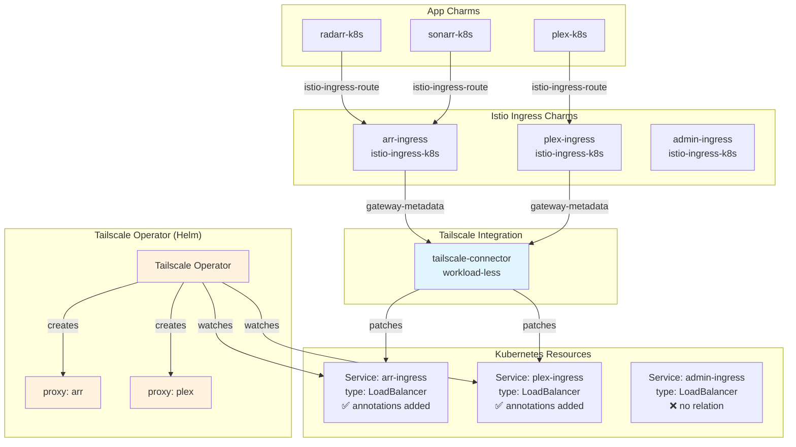
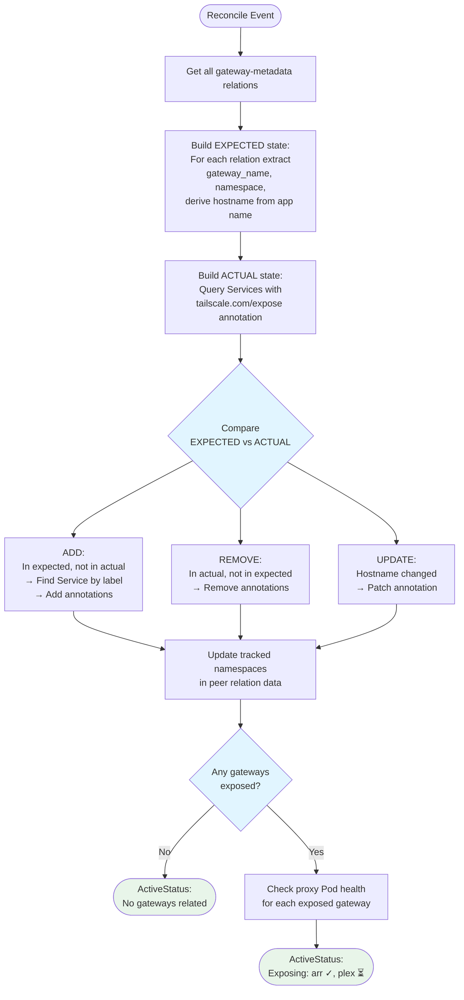

# Tailscale Connector Charm Implementation

## Context and Problem Statement

Charmarr's ingress architecture uses multiple Istio ingress gateways to segment access by security domain (arr-gateway, media-gateway, admin-gateway). These gateways need to be exposed to a Tailscale tailnet for secure remote access without exposing services to the public internet.

The Tailscale Kubernetes operator exposes Services by watching for annotations (`tailscale.com/expose: "true"`). We need a charm that bridges Juju's relation model to this annotation-based system, enabling fully declarative Tailscale exposure through relations rather than manual kubectl commands.

**Key constraints:**
- Tailscale operator is deployed via Helm (not charmed) — we don't manage its lifecycle
- All app charms use `istio-ingress-route` relation to Istio ingress charms
- The `gateway-metadata` relation from istio-ingress-k8s provides: Gateway name, namespace, and ServiceAccount
- We annotate the LoadBalancer **Service**, not the Gateway CRD
- Multiple ingress gateways should be exposable through a single connector instance
- Hostname derived from ingress charm's Juju app name (with optional regex transformation)

## Considered Options

### Charm Architecture
* **Option 1:** Workload-less charm (no container)
* **Option 2:** Lightweight sidecar charm with container

### Service Discovery
* **Option 1:** Derive Service name from Gateway name (convention-based)
* **Option 2:** Query Services by label selector matching Gateway

### Hostname Derivation
* **Option 1:** Use ingress app name directly
* **Option 2:** Configurable suffix/prefix stripping
* **Option 3:** Configurable regex pattern extraction

### Tailscale Operator Readiness
* **Option 1:** Check operator Deployment status before annotating
* **Option 2:** Annotate optimistically, let Tailscale operator handle it

## Decision Outcome

**Charm Architecture: Option 1** - Workload-less. No container needed — pure control plane logic that patches Kubernetes resources.

**Service Discovery: Option 2** - Query by label selector. The Istio ingress charm creates Services with predictable labels. More robust than name conventions.

**Hostname Derivation: Option 3** - Regex pattern. Empty by default (use full app name). User configures pattern to extract portion they want.

**Tailscale Readiness: Option 2** - Annotate optimistically. The Tailscale operator handles annotations appearing before it's ready. Simpler, fewer failure modes.

### Rationale

**Workload-less charm:**
- No workload to manage → simpler, lower resource usage
- Juju 3.6+ fully supports workload-less K8s charms
- Same pattern as charmarr-storage charm

**Label-based Service discovery:**
- Gateway name from relation → query Services with matching labels
- Istio ingress charm labels its Services predictably
- Falls back gracefully if multiple Services match (pick type=LoadBalancer)

**Regex hostname extraction:**
- Empty default = no magic, full app name used
- User opts into pattern if they want transformation
- Handles both prefix and suffix stripping in one config
- First capture group wins — simple mental model

**Optimistic annotation:**
- Tailscale operator watches continuously
- Annotation persists until operator picks it up
- Avoids coupling to operator's deployment details

## Implementation Details

### Architecture



### Reconciler Flow



### Hostname Derivation

```python
def _derive_hostname(self, app_name: str) -> str:
    """Extract hostname from ingress app name.

    If hostname-pattern is empty, returns app_name as-is.
    If pattern is set, returns first capture group.
    Falls back to app_name if regex fails.
    """
    pattern = self.config.get("hostname-pattern", "")

    if not pattern:
        return app_name

    match = re.match(pattern, app_name)
    if match and match.group(1):
        return match.group(1)

    return app_name
```

**Examples with pattern `(?:ingress-)?(.+?)(?:-ingress)?$`:**

| App Name | Hostname |
|----------|----------|
| `arr-ingress` | `arr` |
| `ingress-arr` | `arr` |
| `plex` | `plex` |
| `ingress-media-gateway` | `media-gateway` |

### Service Discovery and Annotation

```python
TAILSCALE_EXPOSE = "tailscale.com/expose"
TAILSCALE_HOSTNAME = "tailscale.com/hostname"

def _find_gateway_service(self, gateway_name: str, namespace: str) -> Service | None:
    """Find the LoadBalancer Service backing a Gateway."""
    services = self._lightkube.list(
        Service,
        namespace=namespace,
        labels={"app.kubernetes.io/name": gateway_name},
    )

    for svc in services:
        if svc.spec.type == "LoadBalancer":
            return svc

    return None

def _expose_gateway(self, service_name: str, namespace: str, hostname: str) -> None:
    """Add Tailscale annotations to Service."""
    patch = {
        "metadata": {
            "annotations": {
                TAILSCALE_EXPOSE: "true",
                TAILSCALE_HOSTNAME: hostname,
            }
        }
    }
    self._lightkube.patch(Service, service_name, patch, namespace=namespace)
    logger.info(f"Exposed {service_name} as {hostname}.tailnet.ts.net")

def _unexpose_gateway(self, service_name: str, namespace: str) -> None:
    """Remove Tailscale annotations from Service."""
    patch = {
        "metadata": {
            "annotations": {
                TAILSCALE_EXPOSE: None,
                TAILSCALE_HOSTNAME: None,
            }
        }
    }
    self._lightkube.patch(Service, service_name, patch, namespace=namespace)
    logger.info(f"Removed Tailscale exposure from {service_name}")
```

### Namespace Tracking

Track which namespaces we've annotated Services in, so we can clean up even after relations are removed:

```python
@property
def _peers(self) -> Relation | None:
    return self.model.get_relation("tailscale-connector-peers")

def _get_tracked_namespaces(self) -> set[str]:
    """Get namespaces from peer relation data."""
    if not self._peers:
        return set()
    data = self._peers.data[self.app].get("tracked_namespaces", "")
    return set(data.split(",")) if data else set()

def _set_tracked_namespaces(self, namespaces: set[str]) -> None:
    """Store namespaces in peer relation data."""
    if self._peers and self.unit.is_leader():
        self._peers.data[self.app]["tracked_namespaces"] = ",".join(namespaces)
```

### Health Check

```python
def _check_proxy_health(self, service_name: str) -> bool:
    """Check if Tailscale proxy Pod is running for a Service."""
    try:
        pods = self._lightkube.list(
            Pod,
            namespace="tailscale",
            labels={"tailscale.com/parent-resource": service_name},
        )

        for pod in pods:
            if pod.status.phase == "Running":
                return True
    except ApiError:
        pass

    return False
```

### Status Reporting

```python
def _update_status(self, exposed: dict[str, str]) -> None:
    """Update charm status with exposed gateways and health.

    Args:
        exposed: Dict of service_name -> hostname
    """
    if not exposed:
        self.unit.status = ActiveStatus("No gateways related")
        return

    statuses = []
    for service_name, hostname in exposed.items():
        healthy = self._check_proxy_health(service_name)
        icon = "✓" if healthy else "⏳"
        statuses.append(f"{hostname} {icon}")

    self.unit.status = ActiveStatus(f"Exposing: {', '.join(statuses)}")
```

## charmcraft.yaml

```yaml
name: tailscale-connector-k8s
type: charm
title: Tailscale Connector
summary: Exposes Istio ingress gateways to Tailscale tailnet
description: |
  A workload-less charm that bridges Juju relations to Tailscale's
  annotation-based Service exposure.

  When related to Istio ingress gateways via the gateway-metadata
  interface, this charm annotates the gateway's LoadBalancer Service
  to trigger Tailscale operator exposure.

  Features:
  - Automatic annotation management via Juju relations
  - Multi-gateway support (relate multiple gateways to one connector)
  - Configurable hostname derivation from app names
  - Cleanup on relation removal
  - Proxy health status reporting

  Prerequisites:
  - Tailscale Kubernetes operator deployed (via Helm)
  - Tailscale operator configured with OAuth credentials
  - Deploy with --trust for Kubernetes API access

links:
  documentation: https://github.com/charmarr/tailscale-connector-k8s
  source: https://github.com/charmarr/tailscale-connector-k8s
  issues: https://github.com/charmarr/tailscale-connector-k8s/issues

assumes:
  - k8s-api
  - juju >= 3.6

platforms:
  amd64:
    - name: ubuntu
      channel: "24.04"

parts:
  charm:
    source: .
    plugin: uv
    build-packages: [git]
    build-snaps: [astral-uv]

# NO containers section - workload-less charm

requires:
  gateway-metadata:
    interface: gateway_metadata
    description: |
      Receives gateway metadata from Istio ingress charms.
      Each relation exposes one gateway to Tailscale.

peers:
  tailscale-connector-peers:
    interface: tailscale_connector_peers
    description: |
      Peer relation for tracking state across units.
      Stores list of namespaces with annotated Services.

config:
  options:
    hostname-pattern:
      type: string
      default: ""
      description: |
        Regex pattern to extract Tailscale hostname from ingress app name.
        First capture group becomes the hostname.

        If empty (default), uses the full ingress app name as hostname.

        Examples:
        - Pattern: "(?:ingress-)?(.+?)(?:-ingress)?$"
        - "arr-ingress" → "arr"
        - "ingress-plex" → "plex"
        - "media" → "media"

    log-level:
      type: string
      default: "info"
      description: |
        Charm logging verbosity.
        One of: debug, info, warning, error

actions:
  list-exposed:
    description: |
      List all gateways currently exposed via Tailscale.
      Shows gateway name, namespace, hostname, and proxy health.
```

## User Experience

### Deployment

```bash
# Prerequisites: Tailscale operator deployed via Helm
# helm install tailscale-operator tailscale/tailscale-operator \
#   --namespace tailscale --create-namespace \
#   --set oauth.clientId=... --set oauth.clientSecret=...

# Deploy connector (workload-less, needs --trust)
juju deploy tailscale-connector-k8s ts-connector --trust

# Relate to ingress gateways that should be exposed
juju relate arr-ingress:gateway-metadata ts-connector:gateway-metadata
juju relate plex-ingress:gateway-metadata ts-connector:gateway-metadata
# admin-ingress intentionally NOT related (LAN-only)

# Check status
juju status
# ts-connector/0  active  Exposing: arr-ingress ✓, plex-ingress ✓
```

### With Hostname Pattern

```bash
# Configure pattern to strip -ingress suffix
juju config ts-connector hostname-pattern='(?:ingress-)?(.+?)(?:-ingress)?$'

# Now:
# arr-ingress → arr.tailnet.ts.net
# plex-ingress → plex.tailnet.ts.net

juju status
# ts-connector/0  active  Exposing: arr ✓, plex ✓
```

### Removing Exposure

```bash
# Stop exposing a gateway
juju remove-relation plex-ingress:gateway-metadata ts-connector:gateway-metadata

# Annotation removed, Tailscale operator deprovisions proxy
juju status
# ts-connector/0  active  Exposing: arr ✓
```

## URL Routing Strategy

All app charms use `istio-ingress-route` relation to submit their routes. Istio handles path-based routing with URLRewrite:

```yaml
apiVersion: gateway.networking.k8s.io/v1
kind: HTTPRoute
metadata:
  name: arr-routes
spec:
  parentRefs:
    - name: arr-ingress
  rules:
    - matches:
        - path:
            type: PathPrefix
            value: /radarr
      filters:
        - type: URLRewrite
          urlRewrite:
            path:
              type: ReplacePrefixMatch
              replacePrefixMatch: /
      backendRefs:
        - name: radarr
          port: 7878

    - matches:
        - path:
            type: PathPrefix
            value: /sonarr
      filters:
        - type: URLRewrite
          urlRewrite:
            path:
              type: ReplacePrefixMatch
              replacePrefixMatch: /
      backendRefs:
        - name: sonarr
          port: 8989
```

Apps receive requests at `/` — they don't need URL base configuration.

### Final URL Structure

| Service | URL |
|---------|-----|
| Radarr | `arr.tailnet.ts.net/radarr` |
| Sonarr | `arr.tailnet.ts.net/sonarr` |
| Prowlarr | `arr.tailnet.ts.net/prowlarr` |
| qBittorrent | `arr.tailnet.ts.net/qbt` |
| SABnzbd | `arr.tailnet.ts.net/sabnzbd` |
| Plex | `plex.tailnet.ts.net` |
| Overseerr | `requests.tailnet.ts.net` |
| admin-ingress | `192.168.x.x` (LAN only) |

## Consequences

### Good

* **Fully declarative** - `juju relate` is the only action needed to expose a gateway
* **Single connector** - One charm instance handles all ingress gateways
* **Clean separation** - Connector doesn't manage Tailscale operator lifecycle
* **No app changes** - App charms only know about Istio ingress, not Tailscale
* **Flexible hostnames** - Empty default for simplicity, regex for power users
* **Automatic cleanup** - Annotations removed when relations break
* **Health visibility** - Status shows which proxies are actually running
* **Workload-less** - Minimal resource footprint

### Bad

* **Requires --trust** - Needs RBAC permissions to patch Services
* **Label dependency** - Assumes Istio charm labels Services predictably
* **Regex complexity** - Users who want hostname transformation need to write regex
* **No ACL management** - ACL policies configured in Tailscale admin console

### Neutral

* **Optimistic annotation** - Works but delays feedback if Tailscale operator isn't running
* **Peer relation for state** - Adds complexity but needed for cleanup across restarts

## Deferred to v1.x/v2

- **Tailscale Funnel** - Public exposure via `tailscale.com/funnel` annotation
- **Custom domain / BYOD** - Requires external DNS and cert-manager
- **ACL policy hints** - Suggest ACL rules based on gateway security domain
- **Tailscale tags** - Configure device tags via `tailscale.com/tags` annotation

## Related MADRs

- [networking/adr-001-ingress](../networking/adr-001-ingress.md) - Three-gateway architecture
- [networking/adr-005-istio-mesh-vpn-integration](../networking/adr-005-istio-mesh-vpn-integration.md) - Mesh boundaries
- [apps/adr-004-radarr-sonarr](./adr-004-radarr-sonarr.md) - App charm ingress relations
