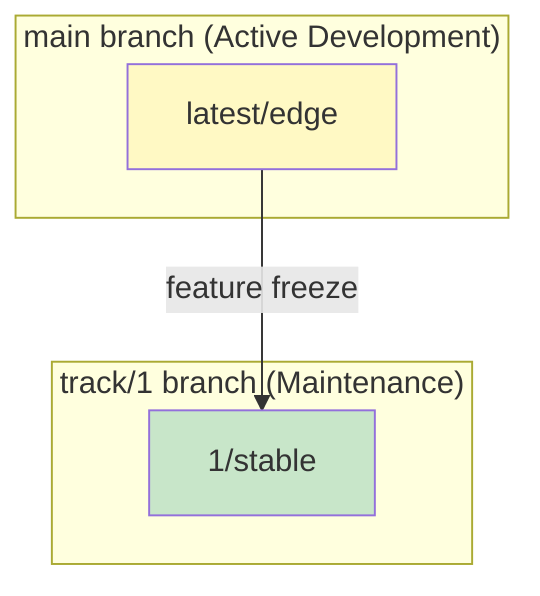
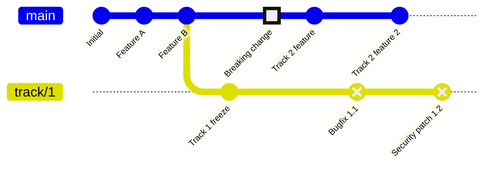
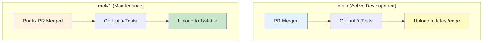
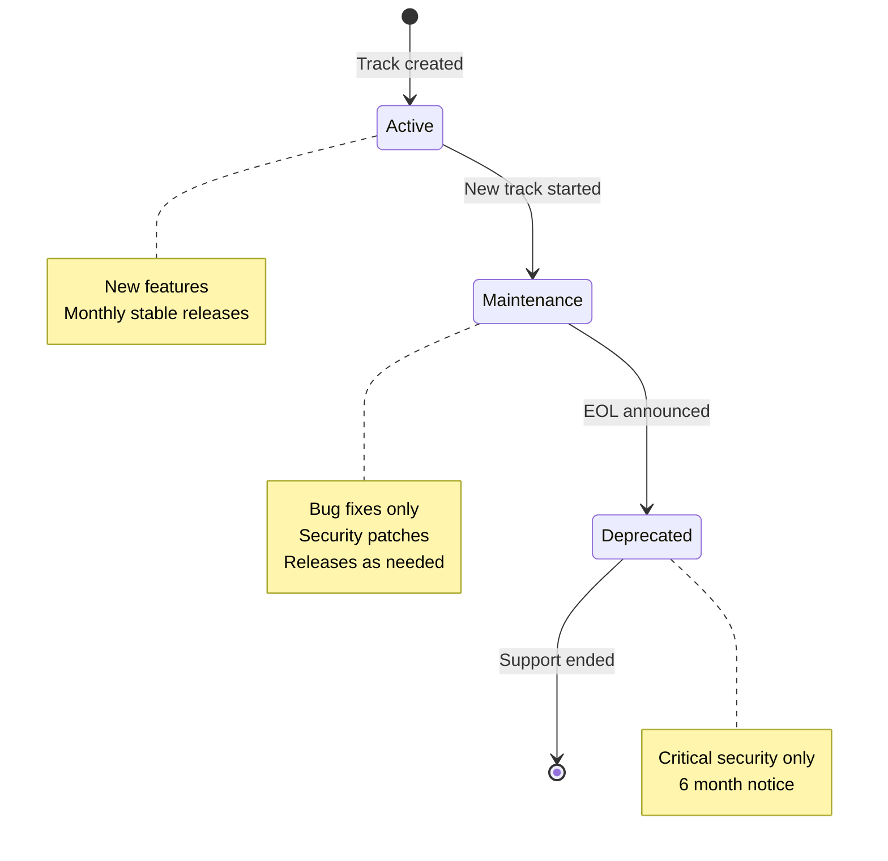

# Charm and Terraform Release Flow

## Context and Problem Statement

Charmarr consists of multiple Juju charms and Terraform modules that need coordinated versioning and release management. Charmhub uses a track/channel model (not semver), while Terraform modules typically use git tags. We need a release flow that:

- Supports rapid iteration (edge) and stable production releases
- Aligns charm channels with Terraform module versions
- Works across a monorepo (charmarr) and standalone charm repos (e.g., gluetun-k8s)
- Enables reusable CI/CD workflows via a central `.github` repository
- Supports parallel maintenance of multiple tracks (e.g., Track 1 bug fixes while Track 2 gets new features)

## Considered Options

### Channel Strategy
* **Option 1:** Full channel ladder (edge → beta → candidate → stable)
* **Option 2:** Simplified channels (edge → stable only)

### Terraform Module Location
* **Option 1:** Terraform modules in separate repository
* **Option 2:** Terraform modules alongside charms in same repo

### CI/CD Workflows
* **Option 1:** Workflows duplicated per repository
* **Option 2:** Reusable workflows in central `.github` repository

### Juju/K8s Version Targets
* **Option 1:** Juju 4 + Canonical Kubernetes (bleeding edge)
* **Option 2:** Juju 3.6 + MicroK8s (stable, homelab-focused)

### Multi-Track Maintenance
* **Option 1:** Single branch, tag-based releases only
* **Option 2:** Long-lived branches per track (e.g., `track-1`, `main` for current)

## Decision Outcome

### Channels: Option 2 - Simplified (edge/stable)

**Rationale:**
- Charmarr targets homelabs, not enterprise staging requirements
- Users can test on edge themselves before upgrading
- Reduces release management overhead
- Beta/candidate channels can be added later if needed

### Terraform: Option 2 - Alongside charms

**Rationale:**
- TF modules are tightly coupled to charm config/relations
- Atomic commits when both change together
- Prevents drift between charm and TF module
- One less repo to manage

### CI/CD: Option 2 - Central `.github` repository

**Rationale:**
- Charmarr monorepo + standalone repos (gluetun-k8s, etc.) share workflows
- Single source of truth for CI/CD logic
- Updates propagate to all repos automatically
- GitHub supports reusable workflows across organizations

### Versions: Option 2 - Juju 3.6 / K8s 1.28+ / MicroK8s

**Rationale:**
- Juju 3.6 is battle-tested with larger community
- MicroK8s is the primary deployment target for homelabs
- Juju 4 is still maturing; can add support later
- Forward-compatible design allows future Juju 4 adoption

### Multi-Track: Option 2 - Long-lived branches per track

**Rationale:**
- Enables bug fixes and security patches for older tracks
- Clear separation between maintenance and feature development
- Standard industry practice (similar to Node.js LTS model)

## Implementation Details

### Charmhub Release Model



**Channel strategy:**
- `main` branch → `latest/edge` (continuous deployment)
- `track/N` branches → `N/stable` (feature-frozen, patches only)
- No `N/edge` channel needed - users wanting edge use `latest/edge`, users wanting stability use `N/stable`

**Tracks:** Increment only for breaking changes (config schema, relation interfaces, Juju requirements). Track 1 may last 2+ years before deprecation.

**Revisions:** Auto-incremented by Charmhub on each upload.

### Branching Strategy



**Branch lifecycle:**

| Branch | Purpose | Publishes to |
|--------|---------|--------------|
| `main` | Active development | `latest/edge` |
| `track/1` | Track 1 maintenance | `1/stable` |
| `track/2` | (future) Track 2 maintenance | `2/stable` |

**Track transition process:**

1. Feature freeze on `main` for current track
2. Create `track/N` branch from `main`
3. Bump track number in `main`
4. Resume feature development on `main` for new track
5. Maintenance PRs target `track/N` branch

### Multi-Track Release Flow



### OCI Image Strategy

All OCI images pinned to specific versions in `charmcraft.yaml`:

```yaml
resources:
  radarr-image:
    type: oci-image
    # LinuxServer format: APP_VERSION-lsREVISION
    upstream-source: lscr.io/linuxserver/radarr:6.0.4.10291-ls290
  recyclarr-image:
    type: oci-image
    # Standard semver
    upstream-source: ghcr.io/recyclarr/recyclarr:7.5.2
```

**Renovate update strategy:**
- `main` branch: All updates (major/minor/patch) with automerge for patch
- `track/*` branches: Minor/patch only (no breaking changes)
- Different regex versioning patterns for each image format (see `renovate.json`)

**Image format examples:**
| Image | Version format | Example |
|-------|---------------|---------|
| radarr/sonarr/prowlarr | `MAJOR.MINOR.PATCH.BUILD-lsREV` | `6.0.4.10291-ls290` |
| plex | `MAJOR.MINOR.PATCH.BUILD-HASH-lsREV` | `1.42.2.10156-f737b826c-ls288` |
| qbittorrent | `MAJOR.MINOR.PATCH-rREV-lsREV` | `5.1.4-r1-ls436` |
| sabnzbd/overseerr | `MAJOR.MINOR.PATCH-lsREV` | `4.5.5-ls240` |
| gluetun/flaresolverr | `vMAJOR.MINOR.PATCH` | `v3.41.0` |
| recyclarr | `MAJOR.MINOR.PATCH` | `7.5.2` |

- Users can override at deploy: `juju deploy --resource radarr-image=...`

### Terraform Module Versioning

**Per-charm modules:** Git tags with charm prefix and major version
```
charmarr-storage-k8s/v1.0.0   # Track 1
charmarr-storage-k8s/v1.1.0   # Track 1 patch
charmarr-storage-k8s/v2.0.0   # Track 2
```

**Product module:** Separate version sequence per track
```
charmarr/v1.0.0   # Uses Track 1 charms
charmarr/v2.0.0   # Uses Track 2 charms
```

**Source reference:**
```hcl
module "storage" {
  source = "github.com/charmarr/charmarr//charms/charmarr-storage-k8s/terraform?ref=charmarr-storage-k8s/v1.0.0"
}
```

### Version Alignment

| Charm Channel | TF Module Major | Git Branch |
|---------------|-----------------|------------|
| latest/edge   | (development)   | `main`     |
| 1/stable      | v1.x.x          | `track/1`  |
| 2/stable      | v2.x.x          | `track/2`  |

TF module minor/patch releases for bug fixes and new optional variables.
TF module major releases align with charm track bumps.

### Release Cadence

| Channel | Trigger | Branch |
|---------|---------|--------|
| latest/edge | Every merge | `main` |
| N/stable | Every merge (patches only) | `track/N` |
| TF tags | With stable releases | `track/N` |

### Track Lifecycle



### Repository Structure

**Charmarr monorepo:**
```
charmarr/
├── charms/
│   ├── charmarr-storage-k8s/
│   │   ├── charmcraft.yaml
│   │   ├── pyproject.toml
│   │   ├── tox.ini
│   │   ├── src/
│   │   ├── tests/
│   │   └── terraform/
│   ├── radarr-k8s/
│   └── ...
├── terraform/
│   └── charmarr/              # Product module
├── tests/
│   └── integration/           # Cross-charm tests
└── renovate.json
```

**Standalone charm repos (e.g., gluetun-k8s):**
```
gluetun-k8s/
├── charmcraft.yaml
├── pyproject.toml
├── tox.ini
├── src/
├── tests/
├── terraform/
└── renovate.json
```

**Central `.github` repository:**
```
.github/
├── workflow-templates/
│   ├── charm-ci.yaml
│   ├── charm-publish.yaml      # Publishes to specified channel
│   └── integration-test.yaml
└── actions/
    ├── build-charm/
    ├── upload-charmhub/
    └── detect-changes/
```

### Reusable Workflow Usage

Charm repos reference central workflows:

```yaml
# .github/workflows/ci.yaml
name: CI
on:
  pull_request:
    branches: [main, 'track/*']
jobs:
  lint-and-test:
    uses: charmarr/.github/.github/workflows/charm-ci.yaml@v1
    with:
      charm-path: charms/radarr-k8s
```

```yaml
# .github/workflows/publish.yaml (per-charm)
name: "Radarr K8s: Publish"
on:
  workflow_call:
    inputs:
      dry-run:
        type: boolean
        default: false
jobs:
  publish:
    uses: charmarr/.github/.github/workflows/charm-publish.yaml@v1
    with:
      charm-path: charms/radarr-k8s
      channel: latest/edge  # or "1/stable" on track/1 branch
      dry-run: ${{ inputs.dry-run || false }}
    secrets:
      CHARMHUB_TOKEN: ${{ secrets.CHARMHUB_TOKEN }}
```

### Platform Requirements

```yaml
# charmcraft.yaml
assumes:
  - k8s-api
  - juju >= 3.6
```

**Test matrix:**
- Primary: MicroK8s 1.28+ / Juju 3.6
- Secondary: Canonical Kubernetes / Juju 3.6
- Future: Juju 4 (when stable)

## Consequences

### Good

* Simplified channel model: `latest/edge` for development, `N/stable` for production
* No redundant `N/edge` channel - users wanting edge use `latest/edge`
* TF modules stay in sync with charms via atomic commits
* Central `.github` repo enables consistent CI/CD across all charm repos
* Juju 3.6 + MicroK8s targets the primary homelab audience
* Git tags enable precise TF module version pinning
* Long-lived branches enable parallel maintenance of multiple tracks
* Users on older tracks continue receiving bug fixes and security patches
* OCI images pinned with full version tags for reproducibility

### Bad

* No candidate channel for extended testing before stable
* Central `.github` repo is a single point of failure for CI/CD
* Standalone repos must manually sync workflow updates
* Maintaining multiple branches increases complexity
* Backporting fixes to maintenance branches requires additional effort

### Neutral

* Track bumps are rare (potentially yearly) - low overhead but requires planning
* Renovate handles OCI image updates - automated but creates PR noise
* Branch protection rules needed for `track/*` branches
* Different Renovate update policies for `main` vs `track/*` branches

## Related ADRs

- [apps/adr-001-v1-apps](./adr-001-v1-apps.md) - V1 application scope
- [testing/adr-001-testing-strategy](../testing/adr-001-testing-strategy.md) - Testing approach
