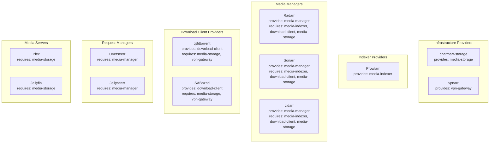

# Charmarr Interface Architecture - Capability-Based Relation Design

## Context and Problem Statement

Charmarr requires Juju relation interfaces to enable communication between charms for indexer synchronization, download coordination, storage sharing, VPN routing, and content request management. The interface design must balance several competing concerns: enabling tight integration between components while maintaining loose coupling, supporting multiple implementations of the same capability (e.g., multiple indexer managers or download clients), and avoiding the tight coupling to specific application implementations that would prevent extensibility. The fundamental question is: how should we group and design interfaces to maximize reusability while maintaining clear boundaries?

## Considered Options

* **Option 1: Application-specific interfaces** - Each application provides its own unique interface (prowlarr-indexer, radarr-media, qbittorrent-downloader)
* **Option 2: Capability-based interfaces with common abstractions** - Interfaces represent capabilities (media-indexer, download-client) that multiple implementations can satisfy
* **Option 3: Monolithic all-in-one interface** - Single "charmarr" interface that handles all data exchange
* **Option 4: Per-media-type interfaces** - Separate interfaces for each media type (movie-manager, tv-manager, music-manager)

## Decision Outcome

Chosen option: **"Option 2: Capability-based interfaces with common abstractions"**, because it enables workload-agnostic integration, supports multiple implementations of the same capability, and maintains clear separation of concerns while avoiding unnecessary fragmentation.

### Interface Taxonomy

Five core interfaces organized by capability, not by specific application:

**media-indexer** - Indexer configuration and synchronization
- Purpose: Share indexer definitions and enable automatic sync between indexer managers and media managers
- Rationale: Centralizes indexer management, eliminating per-app indexer configuration

**download-client** - Download job submission and monitoring
- Purpose: Enable media managers to submit download jobs to torrent/usenet clients
- Rationale: Abstracts over different download client types (torrent vs usenet) and implementations

**media-storage** - Shared media storage mounting
- Purpose: Provide shared filesystem access for hardlinks across all media applications
- Rationale: Hardlinks require shared filesystem, this is foundational to the architecture

**vpn-gateway** - VPN-routed network traffic
- Purpose: Route download client traffic through VPN for privacy
- Rationale: Download clients need VPN, other components (media managers, servers) do not

**media-manager** - Content request submission
- Purpose: Enable request managers to discover media managers and submit user requests
- Rationale: Decouples user-facing request interfaces from media management backend

### Interface Implementation Map

### Design Principles

**Capability-based naming**: Interface names describe what they do (media-indexer, download-client), not which application provides them. This enables drop-in replacements - any indexer manager can implement media-indexer, not just Prowlarr.

**Workload-agnostic abstraction**: Interfaces define data exchange contracts without embedding application-specific logic. A charm implementing the requirer side of media-indexer doesn't need to know if the provider is Prowlarr or a future alternative.

**Strict scope discipline**: Each interface has exactly one well-defined purpose. The media-indexer interface handles indexer synchronization and nothing else - it doesn't handle download client configuration or storage mounting even though the same charms might need those capabilities. This prevents scope creep and keeps interfaces composable.

**Bidirectional within scope**: Both provider and requirer can publish data through the relation, but only data relevant to that interface's purpose. For example, media-indexer allows bidirectional API endpoint exchange because both sides need to call each other's APIs, but neither side publishes storage paths or VPN configuration.

**Multiple instance support**: Interfaces must support multiple instances of the same application type (radarr-4k and radarr-1080p both implementing media-manager). This is handled through instance naming in the data models rather than interface versioning.

**No application prefixing**: Rejected "arr-" or "charmarr-" prefixes on interface names. These couple the interfaces to the specific project/ecosystem and make them less reusable. "media-indexer" is more descriptive and transferable than "arr-indexer".

### Rejected Alternatives

**Why not application-specific interfaces:** Creating prowlarr-indexer, radarr-media-manager, sonarr-media-manager as separate interfaces would prevent alternative implementations. If someone built a Prowlarr alternative, they'd need to implement a different interface even though the capability is identical. This violates the Juju principle of interface-based abstraction.

**Why not per-media-type interfaces:** Splitting into movie-manager, tv-manager, music-manager would create unnecessary fragmentation. The capability is the same (manage media, search indexers, submit downloads) regardless of media type. Media type is metadata in the data model, not a reason for separate interfaces.

**Why not monolithic interface:** A single "charmarr" interface handling all data exchange would couple all components together. Changes to download client integration would require updates to media server charms even though they don't interact. This violates separation of concerns and makes the system fragile.

**Why not tighter scope:** We considered having separate interfaces for "indexer-advertisement" (provider publishes capabilities) and "indexer-sync" (provider pushes updates). This over-engineers the problem - these are phases of the same workflow, not distinct capabilities. The media-indexer interface handles both because they're part of the same concern.

### Interface-to-Application Mapping

| Interface | Providers | Requirers | Bidirectional |
|-----------|-----------|-----------|---------------|
| media-indexer | Prowlarr, future indexer managers | Radarr, Sonarr, Lidarr, Readarr, Whisparr | Yes - both exchange API endpoints |
| download-client | qBittorrent, SABnzbd, future clients | All media managers | No - provider advertises, requirers consume |
| media-storage | charmarr-storage | All media apps (managers, clients, servers) | No - provider advertises, requirers consume |
| vpn-gateway | vpnarr, future VPN providers | Download clients only | No - provider advertises, requirers consume |
| media-manager | All media managers | Overseerr, Jellyseerr, future request managers | No - provider advertises, requirers consume |

### Extensibility Guarantees

The capability-based approach enables several extension scenarios without interface changes:

**Alternative implementations**: Any charm can implement media-indexer as a provider, not just Prowlarr. Jackett, NZBHydra2, or custom indexer managers can integrate by implementing the same interface.

**Multiple instances**: Users can deploy radarr-4k and radarr-1080p simultaneously, both implementing media-manager with different quality profiles. Instance naming in the data model handles this without interface versioning.

**New media types**: Adding support for new media types (audiobooks, comics) requires adding enum values to the data model, not new interfaces. The media-manager interface abstracts over media types.

**Mixed ecosystems**: Nothing prevents using Prowlarr for indexers, qBittorrent for torrents, SABnzbd for usenet, and a custom-built media manager, as long as each implements the appropriate interface.

### Consequences

* Good, because interfaces are reusable beyond the Charmarr ecosystem - any Juju charm can implement them
* Good, because adding alternative implementations (Jackett instead of Prowlarr) requires no interface changes
* Good, because scope discipline prevents interface bloat and maintains clear boundaries
* Good, because capability-based naming makes interfaces self-documenting
* Good, because bidirectional data exchange is explicit and scoped to the interface purpose
* Good, because multiple instances of the same app type are naturally supported
* Bad, because capability abstraction requires more upfront design versus application-specific interfaces
* Bad, because developers must understand which interface to use for each capability rather than just matching application names
* Neutral, because five interfaces create more relation endpoints to manage than a monolithic approach, but this is intentional for separation of concerns
