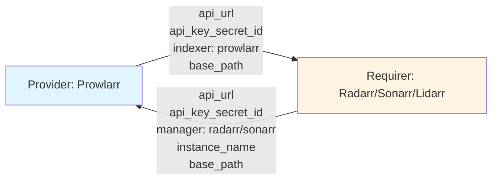

# Media Indexer Interface Design

## Context and Problem Statement

The media-indexer interface connects indexer managers (Prowlarr) with media managers (Radarr, Sonarr, Lidarr, etc.) to enable automatic indexer synchronization. We need to define the data models, interface classes, and event handling patterns for type-safe, validated integration that works with the reconciler pattern.

Key requirements:
- Support multiple instances of the same media manager (e.g., radarr-4k, radarr-1080p)
- Both sides publish their application type for future extensibility
- Type-safe validation to prevent interface contract violations
- Single reconciler event pattern for charm simplicity
- Minimal Juju event observation (only what's necessary)

## Considered Options

### Data Model Options
**Option 1: Generic "ArrApp" enum for everything**
- Single enum containing prowlarr, radarr, sonarr, etc.
- Confusing: Prowlarr is not an "arr app" like Radarr
- No clear semantic distinction

**Option 2: Separate typed enums (MediaIndexer, MediaManager)**
- Clear semantic separation of roles
- Reserves "Type" suffix for semantic categories (e.g., DownloadClientType: torrent vs usenet)
- Extensible for future alternatives (Jackett, NzbHydra2)
- Both sides publish what they are

**Option 3: Include redundant media_type field**
- Explicitly specify both app and media type
- Redundant: Radarr always manages movies, deterministic from manager_type

### Event Handling Options
**Option 1: Three custom events (joined, changed, departed)**
- Mirrors Juju events directly
- Reconciler doesn't need granularity

**Option 2: Single 'changed' event**
- Covers all state transitions
- Reconciler handles current state, not transitions
- Simpler charm code

**Option 3: Observe all 5 Juju relation events**
- relation-created, relation-joined, relation-changed, relation-departed, relation-broken
- Redundant: relation-changed always follows relation-joined immediately

**Option 4: Observe only relation-changed and relation-broken**
- Minimal necessary events for reconciler pattern
- relation-changed covers joins and updates
- relation-broken covers cleanup

## Decision Outcome

**Data Models: Separate typed enums (Option 2)** - Enums defined in [lib/adr-001](../lib/adr-001-shared-arr-code.md)
**Events: Single custom event + observe only changed/broken (Options 2 + 4)**

### Provider Pattern: Active vs Passive

**IMPORTANT**: The Prowlarr provider is **ACTIVE** (unusual pattern):
- Prowlarr reads requirer data and actively syncs indexers TO media managers via API calls
- This differs from passive providers (storage, download-client) that just publish data and let requirers configure themselves
- Rationale: Prowlarr has centralized knowledge of all indexers and should push them out, rather than each arr app pulling them

**Contrast with passive providers:**
- **Storage charm**: Just publishes PVC name, requirers mount it themselves
- **Download-client charm**: Just publishes credentials, requirers configure themselves via their own API

**Pattern choice**: Active provider chosen because Prowlarr needs to make API calls to each media manager to add indexers. The provider is best positioned to do this work centrally, rather than having each media manager query Prowlarr's API.

### Data Exchange Overview



### Data Models (Pydantic 2.0)

```python
from typing import Optional
from pydantic import BaseModel, HttpUrl, Field
from charmarr_lib.models import MediaIndexer, MediaManager

# Note: MediaIndexer and MediaManager enums are defined in charmarr-lib
# See lib/adr-001 for the consolidated enum definitions

class MediaIndexerProviderData(BaseModel):
    """Data published by indexer managers (Prowlarr)."""
    api_url: HttpUrl = Field(description="Base URL of the indexer manager API")
    api_key_secret_id: str = Field(description="Juju secret ID")
    indexer: MediaIndexer = Field(description="The indexer application")
    base_path: Optional[str] = Field(
        default=None,
        description="Base path if running under subpath (e.g., /prowlarr)"
    )

class MediaIndexerRequirerData(BaseModel):
    """Data published by media managers (Radarr/Sonarr/etc)."""
    api_url: HttpUrl = Field(description="Base URL of the media manager API")
    api_key_secret_id: str = Field(description="Juju secret ID")
    manager: MediaManager = Field(description="The media manager application")
    instance_name: str = Field(
        description="Unique instance name (e.g., radarr-4k, sonarr-anime)"
    )
    base_path: Optional[str] = Field(
        default=None,
        description="Base path if running under subpath (e.g., /radarr)"
    )
```

### Provider/Requirer Classes

```python
class MediaIndexerProviderEvents(ObjectEvents):
    changed = EventSource(MediaIndexerChangedEvent)

class MediaIndexerProvider(Object):
    """Provider side of media-indexer interface (used by Prowlarr)."""
    on = MediaIndexerProviderEvents()
    
    def __init__(self, charm, relation_name: str = "media-indexer"):
        super().__init__(charm, relation_name)
        events = charm.on[relation_name]
        # Only observe these two Juju events
        self.framework.observe(events.relation_changed, self._emit_changed)
        self.framework.observe(events.relation_broken, self._emit_changed)
    
    def publish_data(self, data: MediaIndexerProviderData) -> None:
        """Publish provider data to all relations."""
        ...
    
    def get_requirers(self) -> List[MediaIndexerRequirerData]:
        """Get all connected media managers with valid data."""
        ...
    
    def is_ready(self) -> bool:
        """Check if provider has published data and has ≥1 valid requirer."""
        ...

class MediaIndexerRequirerEvents(ObjectEvents):
    changed = EventSource(MediaIndexerChangedEvent)

class MediaIndexerRequirer(Object):
    """Requirer side of media-indexer interface (used by Radarr/Sonarr/etc)."""
    on = MediaIndexerRequirerEvents()
    
    def __init__(self, charm, relation_name: str = "media-indexer"):
        super().__init__(charm, relation_name)
        events = charm.on[relation_name]
        # Only observe these two Juju events
        self.framework.observe(events.relation_changed, self._emit_changed)
        self.framework.observe(events.relation_broken, self._emit_changed)
    
    def publish_data(self, data: MediaIndexerRequirerData) -> None:
        """Publish requirer data to relation."""
        ...
    
    def get_provider_data(self) -> Optional[MediaIndexerProviderData]:
        """Get Prowlarr's data if available."""
        ...
    
    def is_ready(self) -> bool:
        """Check if both requirer and provider have published valid data."""
        ...
```

### Charm Usage (Reconciler Pattern)

```python
# Prowlarr charm
class ProwlarrCharm(CharmBase):
    def __init__(self, *args):
        super().__init__(*args)
        self.provider = MediaIndexerProvider(self, "media-indexer")
        self.framework.observe(self.provider.on.changed, self._reconcile)
    
    def _reconcile(self, event):
        if not self.provider.is_ready():
            return
        for requirer in self.provider.get_requirers():
            self.sync_to_prowlarr(requirer)

# Radarr charm
class RadarrCharm(CharmBase):
    def __init__(self, *args):
        super().__init__(*args)
        self.requirer = MediaIndexerRequirer(self, "media-indexer")
        self.framework.observe(self.requirer.on.changed, self._reconcile)
    
    def _reconcile(self, event):
        if not self.requirer.is_ready():
            return
        provider = self.requirer.get_provider_data()
        self.configure_indexer(provider)
```

### Consequences

**Good:**
- Clear semantic separation: MediaIndexer vs MediaManager
- Reserves "Type" suffix for protocol categories (e.g., DownloadClientType: torrent vs usenet)
- Both sides publish their application for extensibility (app-specific logic if needed)
- Type-safe enums prevent invalid identifiers
- Single custom event simplifies charm code
- Minimal Juju event observation (only changed + broken)
- `is_ready()` helper simplifies precondition checks
- `instance_name` enables multiple deployments (radarr-4k, sonarr-anime)
- Symmetric Provider/Requirer design
- No redundant media_type field (deterministic from manager)

**Bad:**
- Adding new app types requires updating enums in charmarr-lib
- Library observes Juju events internally (adds abstraction layer)
- Instance names managed manually by operators

## Implementation Notes

- Models and classes live in `charmarr-lib`, shared by all charms
- Library observes relation-changed (covers joins + updates) and relation-broken (cleanup)
- Emits single `changed` custom event for all state transitions
- Prowlarr charm maps `manager` field to `/api/v1/applications` payload format
- relation-changed always follows relation-joined, so observing both is redundant
- Reconciler pattern: charm checks current state, not individual transitions
