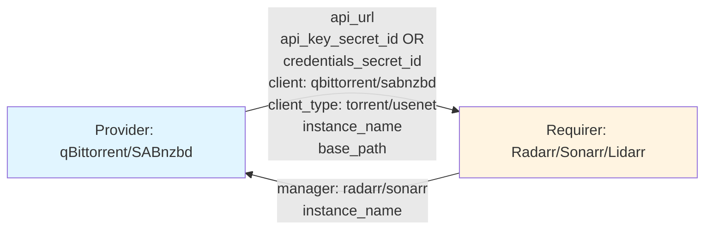

# Download Client Interface Design

## Context and Problem Statement

The download-client interface connects download clients (qBittorrent, SABnzbd, Deluge, Transmission) with media managers (Radarr, Sonarr, Lidarr) to enable automatic download job management. We need to define data models, interface classes, and event handling patterns for type-safe integration that supports multiple download client instances per media manager.

Key requirements:
- Support multiple instances of same download client (qbittorrent-vpn, qbittorrent-local)
- Handle different authentication methods (API key for SABnzbd, username/password for qBittorrent)
- Distinguish between torrent and usenet clients (semantic categories)
- Download clients are passive (don't need to react to requirers)
- Media managers need to react to provider changes

## Considered Options

### Authentication Options
**Option 1: Only API key field**
- Simple single field
- Doesn't work for qBittorrent/Deluge (use username/password)
- Forces download clients to generate API keys

**Option 2: Separate API key AND username/password fields**
- Supports both authentication methods
- Download client publishes whichever it uses
- Flexible for different client types

### Naming Options
**Option 1: Provider publishes arbitrary name**
- Download client chooses its own display name
- Could conflict with multiple instances

**Option 2: Provider publishes Juju app name**
- Guaranteed unique (Juju enforces)
- Media manager uses this as identifier when auto-adding
- Clear mapping between Juju and configured client

### Event Handling Options
**Option 1: Both Provider and Requirer emit events**
- Symmetric with media-indexer interface
- Provider doesn't need to react to anything

**Option 2: Only Requirer emits events**
- Provider is passive, just publishes data
- Requirer reacts to provider changes
- Simpler, less overhead

## Decision Outcome

**Authentication: Support both methods (Option 2)**
**Naming: Juju app name (Option 2)**
**Events: Only Requirer (Option 2)**

### Data Exchange Overview



**Note:** Provider publishes either `api_key_secret_id` (SABnzbd) OR `credentials_secret_id` (qBittorrent, Deluge), not both. The credentials secret contains both username and password fields.

### Data Models (Pydantic 2.0)

```python
from enum import Enum
from typing import Optional
from pydantic import BaseModel, HttpUrl, Field

class DownloadClient(str, Enum):
    """Download client applications."""
    QBITTORRENT = "qbittorrent"
    SABNZBD = "sabnzbd"
    DELUGE = "deluge"
    TRANSMISSION = "transmission"

class DownloadClientType(str, Enum):
    """Download protocol categories."""
    TORRENT = "torrent"
    USENET = "usenet"

class DownloadClientProviderData(BaseModel):
    """Data published by download clients."""
    api_url: HttpUrl = Field(description="Base URL of the download client API")
    api_key_secret_id: Optional[str] = Field(
        default=None,
        description="Juju secret ID for API key (SABnzbd)"
    )
    credentials_secret_id: Optional[str] = Field(
        default=None,
        description="Juju secret ID containing username and password (qBittorrent, Deluge). The secret contains both fields in a single secret."
    )
    client: DownloadClient = Field(description="The download client application")
    client_type: DownloadClientType = Field(description="Protocol type")
    instance_name: str = Field(
        description="Juju app name (e.g., qbittorrent-vpn, sabnzbd-local)"
    )
    base_path: Optional[str] = Field(
        default=None,
        description="Base path if running under subpath"
    )

class DownloadClientRequirerData(BaseModel):
    """Data published by media managers."""
    manager: MediaManager = Field(description="The media manager application")
    instance_name: str = Field(
        description="Unique instance name (e.g., radarr-4k)"
    )
```

### Provider/Requirer Classes

```python
class DownloadClientProvider(Object):
    """Provider side - used by qBittorrent, SABnzbd, etc.
    
    Note: No custom events - provider is passive.
    """
    
    def __init__(self, charm, relation_name: str = "download-client"):
        super().__init__(charm, relation_name)
        # No event observation - provider just publishes data
    
    def publish_data(self, data: DownloadClientProviderData) -> None:
        """Publish provider data to all relations."""
        if not self._charm.unit.is_leader():
            return
        for relation in self._charm.model.relations.get(self._relation_name, []):
            relation.data[self._charm.app]["config"] = data.model_dump_json()

class DownloadClientRequirerEvents(ObjectEvents):
    """Custom events for DownloadClientRequirer."""
    changed = EventSource(DownloadClientChangedEvent)

class DownloadClientRequirer(Object):
    """Requirer side - used by Radarr, Sonarr, etc."""
    on = DownloadClientRequirerEvents()
    
    def __init__(self, charm, relation_name: str = "download-client"):
        super().__init__(charm, relation_name)
        events = charm.on[relation_name]
        # Requirer observes relation events and emits custom event
        self.framework.observe(events.relation_changed, self._emit_changed)
        self.framework.observe(events.relation_broken, self._emit_changed)
    
    def publish_data(self, data: DownloadClientRequirerData) -> None:
        """Publish requirer data to all relations."""
        if not self._charm.unit.is_leader():
            return
        for relation in self._charm.model.relations.get(self._relation_name, []):
            relation.data[self._charm.app]["config"] = data.model_dump_json()
    
    def get_providers(self) -> List[DownloadClientProviderData]:
        """Get all connected download clients with valid data."""
        ...
    
    def is_ready(self) -> bool:
        """Check if requirer has published data and has at least one provider."""
        ...
```

### Charm Usage

```python
# qBittorrent charm (Provider - no event observation)
class QBittorrentCharm(CharmBase):
    def __init__(self, *args):
        super().__init__(*args)
        self.provider = DownloadClientProvider(self, "download-client")
        # Observe own events, not relation events
        self.framework.observe(self.on.config_changed, self._reconcile)
    
    def _reconcile(self, event):
        data = DownloadClientProviderData(
            api_url="http://qbittorrent:8080",
            credentials_secret_id=self.credentials_secret_id,  # Single secret with username + password
            client=DownloadClient.QBITTORRENT,
            client_type=DownloadClientType.TORRENT,
            instance_name=self.app.name,  # "qbittorrent-vpn"
        )
        self.provider.publish_data(data)

# Radarr charm (Requirer - observes provider changes)
class RadarrCharm(CharmBase):
    def __init__(self, *args):
        super().__init__(*args)
        self.requirer = DownloadClientRequirer(self, "download-client")
        self.framework.observe(self.requirer.on.changed, self._reconcile)
    
    def _reconcile(self, event):
        if not self.requirer.is_ready():
            return
        
        # Add all connected download clients to Radarr
        for provider in self.requirer.get_providers():
            self.add_download_client_to_radarr(
                name=provider.instance_name,  # Use as identifier
                host=provider.api_url,
                client_type=provider.client,
                ...
            )
```

### Consequences

**Good:**
- Supports both API key (SABnzbd) and username/password (qBittorrent) authentication
- `instance_name` = Juju app name (guaranteed unique, clear mapping)
- `client_type` distinguishes torrent vs usenet (semantic category)
- Provider is passive (no events needed, simpler implementation)
- Only requirer reacts to changes (more efficient)
- Multiple download client instances supported (qbittorrent-vpn, qbittorrent-local)
- Requirer data minimal (download client doesn't need info about requesters)

**Bad:**
- Provider data has optional fields (either api_key_secret_id OR credentials_secret_id)
- Validation can't enforce "must have api_key_secret_id XOR credentials_secret_id" at Pydantic level
- Need to validate auth field combinations at charm level
- Adding new download clients requires updating DownloadClient enum

## Implementation Notes

- Models and classes live in `charmarr-lib`, shared by all charms
- Provider observes NO relation events (passive, just publishes)
- Requirer observes relation-changed and relation-broken, emits single `changed` event
- Media manager uses `provider.instance_name` as client identifier in Radarr/Sonarr API
- Download client charm sets `instance_name = self.app.name`
- SABnzbd publishes only `api_key_secret_id`
- qBittorrent/Deluge publish only `credentials_secret_id` (single secret containing both username and password)
- Media manager charm validates auth fields before use
