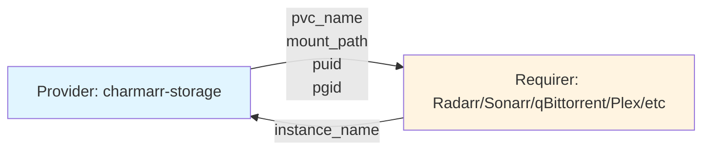

# Media Storage Interface Design

## Context and Problem Statement

The media-storage interface connects the charmarr-storage charm (which creates and manages a shared PVC) with all media applications (Radarr, Sonarr, qBittorrent, SABnzbd, Plex, Jellyfin, Overseerr). We need to define data models and interface classes that enable all apps to mount the same shared PVC for hardlinks to work across the entire media stack, as required by Trash Guides best practices.

Key requirements:
- Single shared PVC mounted by all applications
- Hardlinks must work across all apps (download clients, media managers, media servers)
- Consistent file ownership via PUID/PGID across all containers
- Storage provider is passive (creates PVC and publishes details)
- Apps need PVC name and mount path to patch their StatefulSets

## Considered Options

### Data Exchange Options
* **Option 1:** Include provisioning mode (NFS vs StorageClass)
* **Option 2:** Minimal - only PVC name and mount path
* **Option 3:** Include PUID/PGID for file ownership consistency

### Requirer Data Options
* **Option 1:** No requirer data
* **Option 2:** Publish instance_name only

### Event Handling Options
* **Option 1:** Both Provider and Requirer emit events
* **Option 2:** Only Requirer emits events (passive provider)

## Decision Outcome

**Data Exchange: Option 3 (include PUID/PGID)**
**Requirer Data: Option 2 (instance_name only)**
**Events: Option 2 (only Requirer emits events)**

### Rationale

**Include PUID/PGID** because:
- LinuxServer.io containers use PUID/PGID environment variables for file ownership
- All containers writing to shared storage must use the same UID/GID
- Without coordination, files created by one app may be unreadable by others
- Storage charm is the single source of truth for ownership configuration
- Eliminates per-charm UID/GID configuration (reduces user error)

**Passive provider** because:
- Storage charm only needs to create PVC and publish details
- No need to react when apps connect/disconnect
- Simpler implementation, matches pattern of other Charmarr interfaces

### Data Exchange Overview



## Data Models (Pydantic 2.0)

```python
from pydantic import BaseModel, Field

class MediaStorageProviderData(BaseModel):
    """Data published by charmarr-storage charm."""
    
    pvc_name: str = Field(
        description="Name of the shared PVC to mount (e.g., 'charmarr-shared-media')"
    )
    mount_path: str = Field(
        default="/data",
        description="Mount path for the shared storage inside containers"
    )
    puid: int = Field(
        default=1000,
        description="User ID for file ownership (LinuxServer PUID)"
    )
    pgid: int = Field(
        default=1000,
        description="Group ID for file ownership (LinuxServer PGID)"
    )

class MediaStorageRequirerData(BaseModel):
    """Data published by apps mounting storage."""
    
    instance_name: str = Field(
        description="Juju application name (e.g., 'radarr-4k')"
    )
```

## Interface Classes

### MediaStorageProvider

```python
class MediaStorageProvider(Object):
    """Provider side - used by charmarr-storage.
    
    Note: No custom events - provider is passive.
    """
    
    def __init__(self, charm: CharmBase, relation_name: str = "media-storage"):
        super().__init__(charm, relation_name)
        # No event observation - provider just publishes data
    
    def publish_data(self, data: MediaStorageProviderData) -> None:
        """Publish provider data to all relations."""
        for relation in self.model.relations.get(self.relation_name, []):
            relation.data[self.model.app].update(data.model_dump_json())
    
    def get_connected_apps(self) -> list[str]:
        """Get list of connected application names (for logging/metrics)."""
        apps = []
        for relation in self.model.relations.get(self.relation_name, []):
            requirer_data = relation.data.get(relation.app, {})
            if "instance_name" in requirer_data:
                apps.append(requirer_data["instance_name"])
        return apps
```

### MediaStorageRequirer

```python
class MediaStorageRequirerEvents(ObjectEvents):
    """Custom events for MediaStorageRequirer."""
    changed = EventSource(MediaStorageChangedEvent)

class MediaStorageRequirer(Object):
    """Requirer side - used by all media apps."""
    on = MediaStorageRequirerEvents()
    
    def __init__(self, charm: CharmBase, relation_name: str = "media-storage"):
        super().__init__(charm, relation_name)
        events = charm.on[relation_name]
        self.framework.observe(events.relation_changed, self._emit_changed)
        self.framework.observe(events.relation_broken, self._emit_changed)
    
    def _emit_changed(self, event) -> None:
        """Emit single changed event for any relation change."""
        self.on.changed.emit()
    
    def publish_data(self, data: MediaStorageRequirerData) -> None:
        """Publish requirer data."""
        for relation in self.model.relations.get(self.relation_name, []):
            relation.data[self.model.unit].update(data.model_dump_json())
    
    def get_provider(self) -> MediaStorageProviderData | None:
        """Get storage provider data if available."""
        for relation in self.model.relations.get(self.relation_name, []):
            provider_data = relation.data.get(relation.app, {})
            if provider_data:
                return MediaStorageProviderData.model_validate_json(provider_data)
        return None
    
    def is_ready(self) -> bool:
        """Check if storage is available."""
        return self.get_provider() is not None
```

## Consumer Usage

### Pebble Environment Configuration

Apps use PUID/PGID from storage relation in their Pebble layer:

```python
def _build_pebble_layer(self) -> ops.pebble.LayerDict:
    """Build Pebble layer with PUID/PGID from storage."""
    
    storage = self.media_storage.get_provider()
    puid = storage.puid if storage else 1000
    pgid = storage.pgid if storage else 1000
    
    return {
        "services": {
            "radarr": {
                "override": "replace",
                "command": "/init",
                "startup": "enabled",
                "environment": {
                    "PUID": str(puid),
                    "PGID": str(pgid),
                    "TZ": "Etc/UTC",
                },
            }
        },
    }
```

### StatefulSet Patching

Apps patch their StatefulSets to mount the shared PVC:

```python
def _patch_statefulset_for_storage(self) -> None:
    """Patch StatefulSet to mount shared PVC."""
    
    storage = self.media_storage.get_provider()
    if not storage:
        return
    
    # Use lightkube to patch StatefulSet
    # See storage/adr-003-pvc-patching-in-arr-charms.md
    patch = {
        "spec": {
            "template": {
                "spec": {
                    "volumes": [{
                        "name": "shared-media",
                        "persistentVolumeClaim": {
                            "claimName": storage.pvc_name
                        }
                    }],
                    "containers": [{
                        "name": self._container_name,
                        "volumeMounts": [{
                            "name": "shared-media",
                            "mountPath": storage.mount_path
                        }]
                    }]
                }
            }
        }
    }
    
    client = Client()
    client.patch(
        StatefulSet,
        self.app.name,
        patch,
        namespace=self.model.name,
        patch_type=PatchType.STRATEGIC
    )
```

## PUID/PGID Rationale

### Why Storage Charm Controls PUID/PGID

LinuxServer.io containers (used by all Charmarr workloads) support PUID/PGID environment variables to set the user/group that runs the application. This affects file ownership for any files created by the container.

**Problem without coordination:**
```
Container A (PUID=1000) creates file → owned by 1000:1000
Container B (PUID=1001) tries to read → permission denied
```

**Solution via storage relation:**
```
charmarr-storage publishes: puid=1000, pgid=1000
All containers use same PUID/PGID → consistent file ownership
```

### Default Values

- **PUID=1000, PGID=1000**: Standard first non-root user on most Linux systems
- Configurable via charmarr-storage charm config for custom setups
- NFS deployments may require specific UID/GID to match NFS server exports

### User Configuration

```bash
# Default (most users)
juju deploy charmarr-storage --trust

# Custom UID/GID (e.g., for NFS with specific ownership)
juju deploy charmarr-storage --trust \
    --config puid=1050 \
    --config pgid=1050
```

## Consequences

### Good

* **Single source of truth** - Storage charm controls both PVC and ownership
* **Consistent file permissions** - All apps use same PUID/PGID automatically
* **No per-app configuration** - Users don't need to remember to set PUID/PGID everywhere
* **Hardlinks work** - Same UID/GID ensures hardlinks are readable/writable by all apps
* **Passive provider** - Simpler implementation, matches Charmarr patterns
* **Minimal interface** - Only essential data exchanged

### Bad

* **Coupling** - Apps depend on storage relation for PUID/PGID (but they already depend on it for PVC)
* **Default assumption** - Assumes LinuxServer.io container pattern (but this is our standard)
* **Single PUID/PGID** - Cannot have different ownership for different apps (but this would break hardlinks anyway)

## Related MADRs

- [apps/adr-005-charmarr-storage](../apps/adr-005-charmarr-storage.md) - Storage charm implementation
- [storage/adr-001](../storage/adr-001-shared-pvc-architecture.md) - Shared PVC architecture
- [storage/adr-002](../storage/adr-002-charmarr-storage-charm.md) - Storage charm responsibilities
- [storage/adr-003](../storage/adr-003-pvc-patching-in-arr-charms.md) - How apps mount shared PVC
