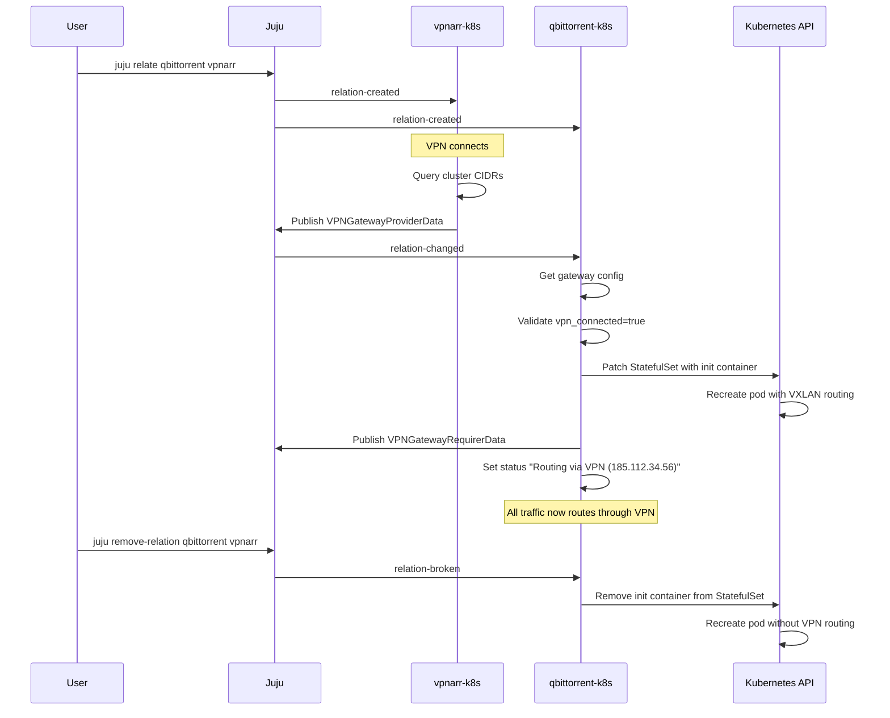

# VPN Gateway Interface

## Context and Problem Statement

Download clients (qBittorrent, SABnzbd) need to route their traffic through a VPN gateway (vpnarr-k8s) via VXLAN overlay networking. The download client charms must receive VXLAN configuration from the gateway and patch their StatefulSets to inject the routing init container. This interface must enable clean integration between the VPN gateway and download clients while following Juju's relation-based orchestration model and the established Charmarr interface patterns.

## Considered Options

* Active provider + active requirer pattern (both sides react)
* Passive provider + active requirer pattern (provider publishes, requirer reacts)
* Minimal data model (only routing essentials)
* Rich data model (include VPN metadata for display)

## Decision Outcome

Chosen option: **"Passive provider + active requirer with minimal data model"**, because:

1. **Passive provider pattern**: The VPN gateway doesn't need to track or react to individual download clients - it's a network service that just needs to publish configuration. This matches the pattern used for `download-client`, `media-storage`, and `media-manager` interfaces.

2. **Active requirer pattern**: Download clients must react when gateway config changes to patch their StatefulSets with the VXLAN init container. They observe the `changed` event and reconcile.

3. **Minimal data model**: Provider publishes only what requirers actually use for routing configuration (`vxlan_id`, `vxlan_gateway_ip`, `cluster_cidrs`) plus `vpn_connected` for health checks and `external_ip` for verification. VPN metadata (provider, protocol, location) belongs in charm status and observability, not relation data.

### Consequences

* Good, because follows established Charmarr interface patterns (passive provider)
* Good, because minimal relation data reduces complexity and bandwidth
* Good, because VPN gateway complexity isolated from download clients
* Good, because single `changed` event enables clean reconciler pattern
* Good, because `external_ip` enables user verification of VPN functionality
* Good, because topology visible via `juju status --relations`
* Bad, because download clients need lightkube for StatefulSet patching
* Bad, because download clients need RBAC permissions to patch their own StatefulSets

## Interface Data Models

### Enums (defined in charmarr-lib)

```python
from enum import Enum

class VPNProvider(str, Enum):
    """Supported VPN providers."""
    NORDVPN = "nordvpn"
    MULLVAD = "mullvad"
    PROTONVPN = "protonvpn"
    SURFSHARK = "surfshark"
    CUSTOM = "custom"

class VPNProtocol(str, Enum):
    """VPN protocols supported by gluetun."""
    WIREGUARD = "wireguard"
    OPENVPN = "openvpn"
```

**Note**: These enums are NOT used in relation data but are available for charm config and internal use.

### Provider Data (Published by vpnarr-k8s)

```python
from typing import Optional
from pydantic import BaseModel, Field

class VPNGatewayProviderData(BaseModel):
    """
    Data published by VPN gateway provider.

    Contains only essential routing configuration and health status.
    VPN metadata (provider, protocol, location) is displayed in charm
    status and observability metrics, not passed through relation data.
    """

    # VXLAN routing configuration - used by init container
    vxlan_id: int = Field(
        description="VXLAN ID for overlay network, e.g., 42"
    )
    vxlan_gateway_ip: str = Field(
        description="Gateway IP address in VXLAN subnet, e.g., '172.16.0.1'"
    )
    cluster_cidrs: str = Field(
        description="Comma-separated CIDRs to NOT route through VPN (pod CIDR, service CIDR), e.g., '10.42.0.0/16,10.96.0.0/12'"
    )

    # Gateway health - used for blocking/waiting
    vpn_connected: bool = Field(
        description="Whether VPN tunnel is established and healthy"
    )

    # Verification/debugging
    external_ip: Optional[str] = Field(
        default=None,
        description="Current VPN exit IP address for user verification"
    )

    # Identity
    instance_name: str = Field(
        description="Juju application name, e.g., 'vpnarr'"
    )
```

### Requirer Data (Published by Download Clients)

```python
class VPNGatewayRequirerData(BaseModel):
    """Data published by VPN gateway requirers (download clients)."""

    client: DownloadClient = Field(
        description="Download client type (qbittorrent, sabnzbd, etc.)"
    )
    instance_name: str = Field(
        description="Unique identifier, e.g., 'qbittorrent-vpn'"
    )
```

**Note**: Requirer data is minimal because vpnarr is a passive provider that doesn't need to track or react to individual clients.

## Provider/Requirer Classes

### Custom Events

```python
from ops.framework import EventBase, EventSource, ObjectEvents

class VPNGatewayChangedEvent(EventBase):
    """Event emitted when VPN gateway relation changes."""
    pass

class VPNGatewayRequirerEvents(ObjectEvents):
    """Custom events for VPNGatewayRequirer."""
    changed = EventSource(VPNGatewayChangedEvent)
```

### Provider Class (vpnarr-k8s charm)

```python
from ops.charm import CharmBase
from ops.framework import Object
from typing import Optional

class VPNGatewayProvider(Object):
    """
    Provider side of vpn-gateway relation.

    Used by vpnarr-k8s charm to publish VPN gateway configuration.
    This is a passive provider - it only publishes data when its own
    state changes (VPN connects, config updates). It does not observe
    relation events or react to requirers joining/leaving.
    """

    def __init__(self, charm: CharmBase, relation_name: str = "vpn-gateway"):
        super().__init__(charm, relation_name)
        self.relation_name = relation_name

    def publish_data(self, data: VPNGatewayProviderData) -> None:
        """
        Publish VPN gateway configuration to all related download clients.

        Args:
            data: VPN gateway configuration including VXLAN setup and status
        """
        for relation in self.model.relations[self.relation_name]:
            relation.data[self.model.app].update(data.model_dump(mode="json"))
```

**Key design notes:**
- No `is_ready()` method - passive providers don't need it
- No event observation - publishes when charm's own state changes
- Simple publish method updates all relations

### Requirer Class (qbittorrent-k8s, sabnzbd-k8s charms)

```python
class VPNGatewayRequirer(Object):
    """
    Requirer side of vpn-gateway relation.

    Used by download client charms to consume VPN gateway configuration
    and patch their StatefulSets with VXLAN routing init container.
    Observes relation changes and emits a single 'changed' event for
    the reconciler pattern.
    """

    on = VPNGatewayRequirerEvents()

    def __init__(self, charm: CharmBase, relation_name: str = "vpn-gateway"):
        super().__init__(charm, relation_name)
        self.relation_name = relation_name

        # Observe relation events and emit single 'changed' event
        events = charm.on[relation_name]
        self.framework.observe(events.relation_changed, self._emit_changed)
        self.framework.observe(events.relation_broken, self._emit_changed)

    def _emit_changed(self, event) -> None:
        """Emit high-level 'changed' event for reconciler pattern."""
        self.on.changed.emit()

    def publish_data(self, data: VPNGatewayRequirerData) -> None:
        """
        Publish download client info to vpnarr gateway.

        Args:
            data: Download client identification info
        """
        for relation in self.model.relations[self.relation_name]:
            relation.data[self.model.app].update(data.model_dump(mode="json"))

    def get_gateway(self) -> Optional[VPNGatewayProviderData]:
        """
        Get VPN gateway configuration from the related vpnarr.

        Returns:
            Gateway configuration if available and valid, None otherwise
        """
        for relation in self.model.relations[self.relation_name]:
            if not relation.app:
                continue

            data = relation.data[relation.app]
            if not data:
                continue

            try:
                return VPNGatewayProviderData.model_validate(data)
            except Exception:
                # Invalid or incomplete data, skip
                continue

        return None

    def is_ready(self) -> bool:
        """
        Check if requirer has a valid gateway connection.

        Returns:
            True if gateway config is available and VPN is connected
        """
        gateway = self.get_gateway()
        return gateway is not None and gateway.vpn_connected
```

**Key design notes:**
- Observes `relation-changed` and `relation-broken` (not `relation-created` or `relation-joined` - see rationale below)
- Single `changed` event simplifies charm logic (reconciler pattern)
- `is_ready()` checks both presence and `vpn_connected` status
- `get_gateway()` returns None for missing/invalid data (graceful degradation)

## Event Handling Rationale

The requirer observes only two Juju relation events:

1. **`relation-changed`**: Covers all data updates
   - Initial data after relation joins
   - VPN reconnection status updates
   - Configuration changes

2. **`relation-broken`**: Handles cleanup when relation is removed
   - Remove VXLAN init container
   - Revert to non-VPN routing

**Why not `relation-created` or `relation-joined`?**
- `relation-changed` is guaranteed to fire immediately after `relation-joined`
- `relation-created` fires before any data is available
- Observing redundant events adds no value for reconciler pattern

## Usage Examples

### Provider Side (vpnarr-k8s charm)

```python
class VpnarrCharm(CharmBase):
    def __init__(self, *args):
        super().__init__(*args)
        self.gateway_provider = VPNGatewayProvider(self, "vpn-gateway")

        # vpnarr doesn't observe provider events - it's passive
        # Just publishes when its own state changes
        self.framework.observe(self.on.config_changed, self._reconcile)
        self.framework.observe(self.on.gluetun_pebble_ready, self._reconcile)
        self.framework.observe(self.on.update_status, self._reconcile)

    def _reconcile(self, event):
        """Publish gateway config when VPN is connected."""
        if not self._vpn_connected():
            self.unit.status = WaitingStatus("VPN connecting...")
            return

        # Get cluster network info from K8s API
        pod_cidr = self._get_pod_cidr()  # e.g., "10.42.0.0/16"
        service_cidr = self._get_service_cidr()  # e.g., "10.96.0.0/12"

        gateway_data = VPNGatewayProviderData(
            vxlan_id=42,
            vxlan_gateway_ip="172.16.0.1",
            cluster_cidrs=f"{pod_cidr},{service_cidr}",
            vpn_connected=True,
            external_ip=self._get_external_ip(),  # Query from gluetun
            instance_name=self.app.name
        )

        self.gateway_provider.publish_data(gateway_data)

        # Display VPN info in charm status (not in relation data)
        location = self.config["server-countries"]  # e.g., "Switzerland"
        ext_ip = gateway_data.external_ip
        self.unit.status = ActiveStatus(f"VPN active: {location} ({ext_ip})")

    def _vpn_connected(self) -> bool:
        """Check gluetun container health."""
        # Query gluetun health endpoint or check container status
        ...

    def _get_external_ip(self) -> str:
        """Query current VPN exit IP from gluetun."""
        # GET http://localhost:8000/v1/publicip/ip
        ...
```

### Requirer Side (qbittorrent-k8s charm)

```python
class QbittorrentCharm(CharmBase):
    def __init__(self, *args):
        super().__init__(*args)
        self.gateway_requirer = VPNGatewayRequirer(self, "vpn-gateway")

        # Observe gateway changes and reconcile
        self.framework.observe(self.gateway_requirer.on.changed, self._reconcile)
        self.framework.observe(self.on.config_changed, self._reconcile)

    def _reconcile(self, event):
        """Reconcile StatefulSet with VPN routing config."""
        gateway = self.gateway_requirer.get_gateway()

        if not gateway:
            # No gateway relation yet
            self.unit.status = BlockedStatus("Waiting for VPN gateway relation")
            return

        if not gateway.vpn_connected:
            self.unit.status = BlockedStatus("VPN gateway not connected")
            return

        # Patch StatefulSet with init container for VXLAN routing
        self._patch_statefulset_with_vpn(gateway)

        # Publish requirer info
        requirer_data = VPNGatewayRequirerData(
            client=DownloadClient.QBITTORRENT,
            instance_name=self.app.name
        )
        self.gateway_requirer.publish_data(requirer_data)

        # Display routing status
        ext_ip = gateway.external_ip or "unknown"
        self.unit.status = ActiveStatus(f"Routing via VPN ({ext_ip})")

    def _patch_statefulset_with_vpn(self, gateway: VPNGatewayProviderData):
        """Patch StatefulSet with VPN routing init container."""
        from lightkube import Client
        from lightkube.resources.apps_v1 import StatefulSet

        patch = {
            "spec": {
                "template": {
                    "spec": {
                        "initContainers": [{
                            "name": "vpn-route-init",
                            "image": "ghcr.io/angelnu/pod-gateway:v1.11.1",
                            "command": ["/bin/client_init.sh"],
                            "env": [
                                {"name": "VXLAN_ID", "value": str(gateway.vxlan_id)},
                                {"name": "VXLAN_GATEWAY", "value": gateway.vxlan_gateway_ip},
                                {"name": "NOT_ROUTED_TO_GATEWAY_CIDRS", "value": gateway.cluster_cidrs}
                            ],
                            "securityContext": {
                                "capabilities": {"add": ["NET_ADMIN"]}
                            }
                        }]
                    }
                }
            }
        }

        client = Client()
        client.patch(
            StatefulSet,
            self.app.name,
            patch,
            namespace=self.model.name
        )
```

## User Workflow

```bash
# Deploy VPN gateway
juju deploy vpnarr-k8s vpnarr --config vpn-provider=nordvpn \
                               --config wireguard-key=secret:vpn-creds

# Deploy download client
juju deploy qbittorrent-k8s qbittorrent

# Relate to enable VPN routing
juju relate qbittorrent:vpn-gateway vpnarr:vpn-gateway

# Check status
juju status
# vpnarr/0: active - VPN active: Switzerland (185.112.34.56)
# qbittorrent/0: active - Routing via VPN (185.112.34.56)

# Verify VPN routing is working
juju ssh qbittorrent/0
curl ifconfig.me  # Should show VPN exit IP
```

## Integration Flow



## Relation Schema (metadata.yaml)

**vpnarr-k8s:**
```yaml
provides:
  vpn-gateway:
    interface: vpn-gateway
```

**qbittorrent-k8s, sabnzbd-k8s:**
```yaml
requires:
  vpn-gateway:
    interface: vpn-gateway
    limit: 1  # Only one VPN gateway per download client
```

## Design Rationale Details

### Why Minimal Data Model?

**Included fields:**
- `vxlan_id`, `vxlan_gateway_ip`, `cluster_cidrs`: Required by init container for routing
- `vpn_connected`: Required for health checks and blocking
- `external_ip`: Useful for user verification ("Is my VPN working?")
- `instance_name`: Standard across all interfaces for logging

**Excluded fields (available via charm status/observability instead):**
- `vpn_provider` (nordvpn, mullvad): User knows from deployment, charm can display in status
- `vpn_protocol` (wireguard, openvpn): Implementation detail, not used by requirers
- `server_location` (Switzerland): Nice to know, but charm can display: "VPN active: Switzerland (185.112.34.56)"
- `status` enum (initializing, connected, error): Boolean `vpn_connected` is sufficient

**Rationale**: Relation data should contain only what requirers need for functional integration. Display information belongs in `charm.unit.status`, logs, and COS metrics/dashboards.

### Why Passive Provider?

The VPN gateway is a **network service** that provides routing functionality. It doesn't need to:
- Track which download clients are using it
- React when clients join or leave
- Modify its behavior based on client count
- Coordinate with clients beyond publishing config

This is the same pattern as:
- `download-client`: Download clients don't track which media managers use them
- `media-storage`: Storage charm doesn't track which apps mount the PVC
- `media-manager`: Media managers don't track which request tools integrate

**Contrast with media-indexer**: Prowlarr is an **active provider** because it needs to sync indexer configuration TO each media manager's API when they join. The VPN gateway has no such requirement.

### Why Include external_ip?

While not strictly necessary for routing, `external_ip` provides significant user value:

1. **Verification**: Users can confirm VPN is working by seeing the exit IP
2. **Debugging**: If VPN isn't working, mismatched IPs help diagnose
3. **Display**: Charm status can show "Routing via VPN (185.112.34.56)"
4. **Minimal cost**: Single field, updated infrequently

Alternative approaches considered and rejected:
- **Action-based**: `juju run vpnarr/0 get-external-ip` - more friction for users
- **Observability only**: Metrics/logs - not visible in `juju status`
- **Omit entirely**: Users left wondering if VPN is working

### Why cluster_cidrs as Single String?

**Chosen**: `cluster_cidrs: str` (comma-separated)
```python
cluster_cidrs = "10.42.0.0/16,10.96.0.0/12"
```

**Rejected**: `cluster_cidrs: List[str]`
```python
cluster_cidrs = ["10.42.0.0/16", "10.96.0.0/12"]
```

**Rationale**:
- Juju relation data is string-based, lists require JSON serialization
- Init container expects comma-separated string anyway: `NOT_ROUTED_TO_GATEWAY_CIDRS`
- Simpler model validation (single string vs list of strings)
- Typical deployments have 2 CIDRs (pod + service), not worth list complexity

## Security Considerations

### VPN Credentials

VPN credentials (WireGuard private key, OpenVPN credentials) are **NOT** in relation data. They are managed as:

1. **Juju Secrets**: Created by user, referenced in charm config
   ```bash
   juju add-secret vpn-creds wireguard-key="private_key_here"
   juju deploy vpnarr-k8s --config wireguard-key-secret=secret:vpn-creds
   ```

2. **Config options**: For non-secret config like provider, server countries
   ```yaml
   vpn-provider: nordvpn
   server-countries: Switzerland,Malaysia
   ```

## Future Extensions (V2 Scope)

### Port Forwarding
Some VPN providers (Mullvad, ProtonVPN) support port forwarding for better torrent seeding. V2 could add:

```python
class VPNGatewayProviderData(BaseModel):
    # ... existing fields ...

    # Port forwarding (V2)
    port_forwarding_enabled: bool = False
    forwarded_port: Optional[int] = None  # e.g., 51413
```

Download clients would:
1. Check `port_forwarding_enabled`
2. Configure listening port to `forwarded_port`
3. Improve seeding ratios through NAT traversal

### Multiple Gateway Support
Currently `limit: 1` in metadata.yaml. V2 could support multiple gateways:

```bash
juju deploy vpnarr-k8s vpnarr-swiss --config server-countries=Switzerland
juju deploy vpnarr-k8s vpnarr-us --config server-countries="United States"

juju relate qbittorrent vpnarr-swiss
juju relate sabnzbd vpnarr-us  # Different VPN for different clients
```

Requires no interface changes - already supports multiple relations naturally.

### Health Monitoring
V2 could add richer health data:

```python
class VPNGatewayProviderData(BaseModel):
    # ... existing fields ...

    # Health monitoring (V2)
    uptime_seconds: int
    reconnection_count: int
    last_reconnection: Optional[str]  # ISO timestamp
```

Enables download clients to detect unstable VPN connections and possibly implement circuit breaking.

## Related MADRs

- **Download Client VPN Integration Method**: Defines StatefulSet patching approach using lightkube (referenced by this interface)
- **Download Client Interface**: Defines how media managers integrate with download clients (complementary to VPN routing)
- **Media Storage Interface**: Similar passive provider + active requirer pattern
