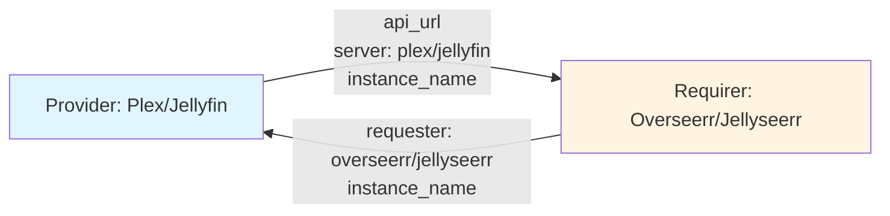
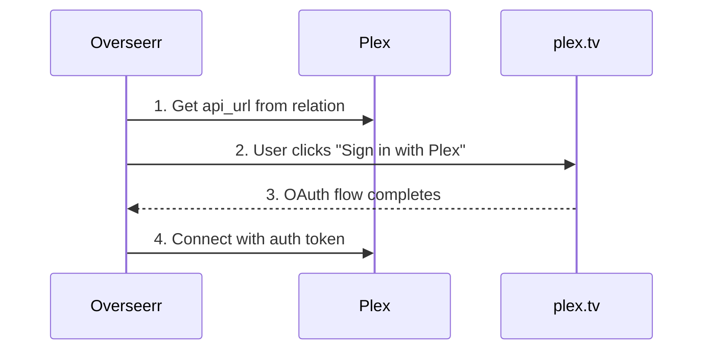
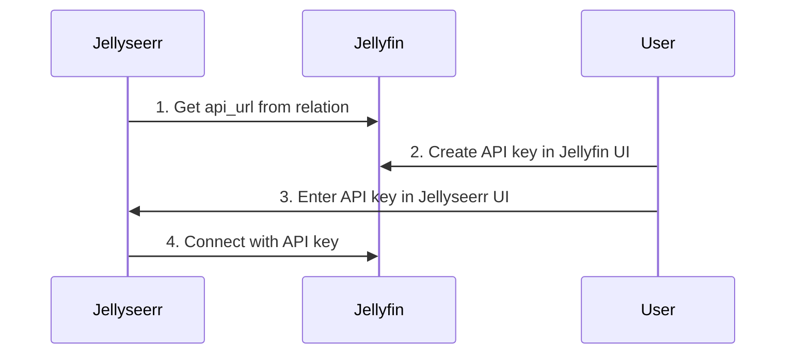

# Media Server Interface Design

## Context and Problem Statement

Request management tools (Overseerr, Jellyseerr) need to connect to media servers (Plex, Jellyfin) for library access and playback integration. The `media-server` interface enables service discovery between these components.

Key considerations:
- Plex uses OAuth via plex.tv for authentication (no API key in relation)
- Jellyfin uses user-created API keys (created in UI, entered in Jellyseerr UI)
- Interface should handle service discovery only, not authentication
- Multiple media server instances should be supported

## Considered Options

### Authentication Handling
* **Option 1:** Include API key in relation data (like other interfaces)
* **Option 2:** Service discovery only - authentication handled separately per media server's model
* **Option 3:** Hybrid - optional API key field

### Interface Direction
* **Option 1:** Media server provides, request manager requires (passive provider)
* **Option 2:** Bidirectional data exchange
* **Option 3:** Request manager provides, media server requires

## Decision Outcome

**Authentication: Option 2** - Service discovery only
**Direction: Option 1** - Passive provider pattern (consistent with other interfaces)

### Rationale

**No API key in interface** because:
- Plex: Authentication via OAuth through plex.tv, not API key
- Jellyfin: API key tied to user's Jellyfin account, created in Jellyfin UI, manually entered in Jellyseerr
- Forcing API key would require manual configuration anyway for Jellyfin
- Overseerr's Plex integration uses OAuth flow, not API key

The interface handles **service discovery only**. Each media server has its own authentication model that the request manager handles appropriately.

### Data Exchange Overview



### Data Models (Pydantic 2.0)

```python
from enum import Enum
from typing import Optional
from pydantic import BaseModel, HttpUrl, Field

class MediaServer(str, Enum):
    """Media server applications."""
    PLEX = "plex"
    JELLYFIN = "jellyfin"
    EMBY = "emby"

class RequestManager(str, Enum):
    """Request management applications."""
    OVERSEERR = "overseerr"
    JELLYSEERR = "jellyseerr"

class MediaServerProviderData(BaseModel):
    """Data published by media server charms (Plex, Jellyfin)."""
    api_url: HttpUrl = Field(
        description="Base URL of the media server (e.g., http://plex:32400)"
    )
    server: MediaServer = Field(
        description="The media server application type"
    )
    instance_name: str = Field(
        description="Juju app name (e.g., plex, jellyfin-4k)"
    )

class MediaServerRequirerData(BaseModel):
    """Data published by request manager charms (Overseerr, Jellyseerr)."""
    requester: RequestManager = Field(
        description="The request manager application type"
    )
    instance_name: str = Field(
        description="Juju app name (e.g., overseerr)"
    )
```

### Provider/Requirer Classes

```python
class MediaServerProvider(Object):
    """Provider side - used by Plex, Jellyfin, Emby.

    Note: No custom events - provider is passive.
    """

    def __init__(self, charm, relation_name: str = "media-server"):
        super().__init__(charm, relation_name)
        # No event observation - provider just publishes data

    def publish_data(self, data: MediaServerProviderData) -> None:
        """Publish provider data to all relations."""
        for relation in self.model.relations[self._relation_name]:
            relation.data[self.model.app].update(data.model_dump_json())

    def get_requirers(self) -> list[MediaServerRequirerData]:
        """Get all connected request managers with valid data."""
        ...

class MediaServerRequirerEvents(ObjectEvents):
    """Custom events for MediaServerRequirer."""
    changed = EventSource(MediaServerChangedEvent)

class MediaServerRequirer(Object):
    """Requirer side - used by Overseerr, Jellyseerr."""
    on = MediaServerRequirerEvents()

    def __init__(self, charm, relation_name: str = "media-server"):
        super().__init__(charm, relation_name)
        events = charm.on[relation_name]
        self.framework.observe(events.relation_changed, self._emit_changed)
        self.framework.observe(events.relation_broken, self._emit_changed)

    def publish_data(self, data: MediaServerRequirerData) -> None:
        """Publish requirer data to relation."""
        ...

    def get_providers(self) -> list[MediaServerProviderData]:
        """Get all connected media servers with valid data."""
        ...

    def is_ready(self) -> bool:
        """Check if requirer has at least one provider."""
        ...
```

### Authentication Flow by Media Server

#### Plex + Overseerr



**Relation provides:** `api_url` (where Plex is)
**User provides:** OAuth sign-in via Overseerr UI

#### Jellyfin + Jellyseerr



**Relation provides:** `api_url` (where Jellyfin is)
**User provides:** API key (created in Jellyfin, entered in Jellyseerr)

### Charm Usage

```python
# Plex charm (Provider)
class PlexCharm(CharmBase):
    def __init__(self, *args):
        super().__init__(*args)
        self.media_server = MediaServerProvider(self, "media-server")
        self.framework.observe(self.on.config_changed, self._reconcile)

    def _reconcile(self, event):
        # ... workload configuration ...

        # Publish to relation
        self.media_server.publish_data(MediaServerProviderData(
            api_url=f"http://{self.app.name}:32400",
            server=MediaServer.PLEX,
            instance_name=self.app.name,
        ))

# Overseerr charm (Requirer)
class OverseerrCharm(CharmBase):
    def __init__(self, *args):
        super().__init__(*args)
        self.media_server = MediaServerRequirer(self, "media-server")
        self.framework.observe(self.media_server.on.changed, self._reconcile)

    def _reconcile(self, event):
        # Get connected media servers
        for provider in self.media_server.get_providers():
            if provider.server == MediaServer.PLEX:
                # Configure Plex server in Overseerr
                # (actual auth happens via OAuth in UI)
                self._configure_plex_server(provider.api_url)
            elif provider.server == MediaServer.JELLYFIN:
                # Configure Jellyfin server
                # (API key entered manually in UI)
                self._configure_jellyfin_server(provider.api_url)
```

### Overseerr/Jellyseerr Configuration

When Overseerr receives a `media-server` relation:

**For Plex:**
```python
def _configure_plex_server(self, api_url: str) -> None:
    """Pre-configure Plex server URL in Overseerr.

    User still needs to complete OAuth in Overseerr UI.
    """
    # Overseerr API: POST /api/v1/settings/plex
    # Sets hostname/port so user just needs to click "Sign in"
```

**For Jellyfin (via Jellyseerr):**
```python
def _configure_jellyfin_server(self, api_url: str) -> None:
    """Pre-configure Jellyfin server URL in Jellyseerr.

    User still needs to enter API key in Jellyseerr UI.
    """
    # Jellyseerr API: POST /api/v1/settings/jellyfin
    # Sets hostname/port, user adds API key in UI
```

## Interface Summary

| Interface | Providers | Requirers | Auth Model |
|-----------|-----------|-----------|------------|
| `media-server` | Plex, Jellyfin, Emby | Overseerr, Jellyseerr | Service discovery only |

Compare to other interfaces:

| Interface | Auth in Relation? | Why |
|-----------|-------------------|-----|
| `media-indexer` | ✅ API key via Juju Secret | Prowlarr generates key, arr apps consume |
| `download-client` | ✅ Credentials via Juju Secret | Charm generates/reads credentials |
| `media-manager` | ✅ API key via Juju Secret | Arr apps generate key, Overseerr consumes |
| `media-server` | ❌ No | Plex=OAuth, Jellyfin=user-created key |

## Consequences

### Good

* Clean separation - interface handles discovery, auth handled per media server's model
* No forced authentication model - works with Plex OAuth and Jellyfin API keys
* Simple data model - just URL and type
* Consistent with Charmarr pattern - passive provider, active requirer
* Supports multiple media servers (plex + jellyfin in same deployment)

### Bad

* User must complete authentication manually in request manager UI
* Not fully "relate and it works" - requires one manual step
* Jellyseerr users must create API key in Jellyfin first

### Neutral

* Different from other interfaces that include credentials
* Reflects reality of how these applications authenticate

## Related ADRs

- [interfaces/adr-001-charmarr-interfaces](adr-001-charmarr-interfaces.md) - Interface taxonomy
- [interfaces/adr-006-media-manager](adr-006-media-manager.md) - Similar pattern for Overseerr ↔ arr apps
- [apps/adr-009-plex](../apps/adr-009-plex.md) - Plex charm implementation
