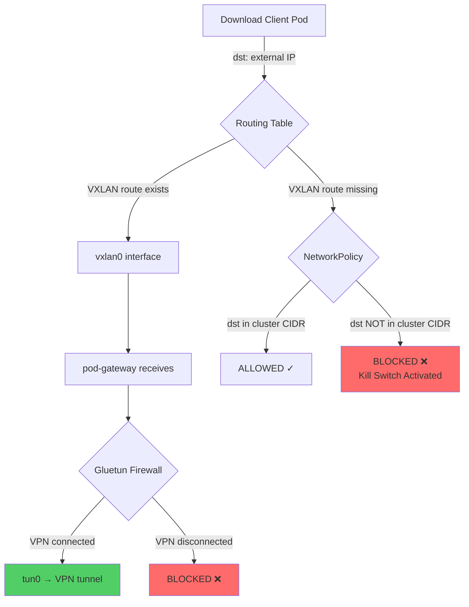

# VPN Kill Switch Implementation Strategy

## Context and Problem Statement

Download clients must never leak traffic to the internet if the VPN disconnects or if routing configuration fails. A "kill switch" prevents the user's real IP address from being exposed to trackers/providers. How do we implement a reliable kill switch that catches both VPN failures and routing misconfigurations?

## Considered Options

* **Gluetun firewall only** - Rely solely on gluetun's built-in iptables kill switch
* **NetworkPolicy only** - Use Kubernetes NetworkPolicy to restrict egress
* **NetworkPolicy + gluetun firewall (two-layer defense)** - Defense in depth with both mechanisms
* **Istio AuthorizationPolicy** - Use Istio mesh policies to control egress

## Decision Outcome

Chosen option: **"NetworkPolicy + gluetun firewall (two-layer defense)"**, because NetworkPolicy catches routing misconfigurations (init container failures, deleted routes) that occur before traffic reaches the gateway, while gluetun's firewall catches VPN disconnections at the gateway itself. This follows k8s@home's battle-tested pattern and provides defense in depth.

### Consequences

* Good, because NetworkPolicy enforced at host node (outside pod namespace, can't be bypassed even if pod compromised)
* Good, because NetworkPolicy catches routing failures (init container didn't run, VXLAN interface down, routes deleted)
* Good, because gluetun firewall catches VPN disconnections at the gateway
* Good, because defense in depth - two independent enforcement points
* Good, because VXLAN traffic allowed (outer packet dst = gateway pod IP in cluster CIDR)
* Bad, because requires cluster CIDR discovery and configuration in NetworkPolicy
* Bad, because two systems to understand (but both are standard Kubernetes/VPN patterns)

**NetworkPolicy allows:**
* Cluster pod CIDR (10.0.0.0/8 or auto-discovered)
* Cluster service CIDR (10.96.0.0/12 or auto-discovered)
* DNS (kube-system namespace, port 53)

**NetworkPolicy blocks:**
* All other egress (external IPs not in cluster CIDR)

**How VXLAN traffic bypasses the block:**
1. Download client sends to external IP (1.2.3.4)
2. Routing table matches VXLAN route
3. Packet encapsulated: **outer dst = gateway pod IP (cluster CIDR)**
4. NetworkPolicy evaluates outer packet: dst in cluster CIDR → ALLOWED
5. Gateway decapsulates, gluetun enforces VPN

**Rejected alternatives:**
* Gluetun only: Doesn't catch routing failures (if VXLAN doesn't set up, traffic leaks via default route)
* NetworkPolicy only: Doesn't protect against VPN disconnection at gateway (would need to detect and reconfigure)
* Istio AuthorizationPolicy: Operates at Layer 7/4, only sees ztunnel-intercepted traffic, misses VXLAN traffic (wrong layer for IP routing control)

**Why NOT Istio AuthorizationPolicy:**
* AuthorizationPolicy enforcement point: ztunnel (inside pod, sees only eth0 traffic)
* VXLAN traffic uses vxlan0 interface, bypasses ztunnel entirely
* AuthorizationPolicy has no visibility into routing table decisions
* Layer mismatch: AuthorizationPolicy is Layer 7/4 (HTTP/TCP), kill switch needs Layer 3 (IP)
