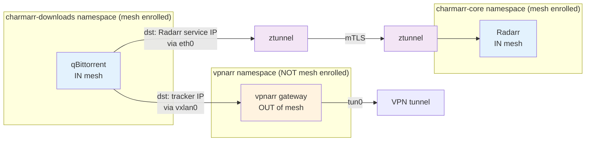

# Istio Ambient Mesh Integration Strategy

**Status:** Accepted

## Context and Problem Statement

Charmarr uses Istio Ambient mesh for mTLS and observability between arr services. Download clients need to communicate with arr services (Radarr tells qBittorrent to download) while also routing external traffic through VPN. How do we integrate VXLAN-based VPN routing with Istio Ambient mesh without conflicts?

Related: See [Networking ADR-001](adr-001-ingress.md) for Istio gateway design.

## Considered Options

* **Download clients OUT of mesh** - Don't enroll download client namespace in Istio
* **Download clients IN mesh, gateway OUT** - Enroll clients, exclude gateway pod
* **Everything IN mesh** - Enroll both download clients and gateway
* **Use Istio egress gateway instead of pod-gateway** - Rely entirely on Istio

## Decision Outcome

Chosen option: **"Download clients IN mesh, gateway OUT"**, because download clients benefit from Istio mTLS/observability when communicating with arr services, while the gateway pod operates below the mesh layer and must remain unenrolled. Routing table decisions happen before ztunnel interception, enabling VXLAN and mesh traffic to coexist.

### Consequences

* Good, because download clients get mTLS for arr ↔ client communication
* Good, because Istio observability shows download client traffic to arr services
* Good, because VXLAN traffic bypasses ztunnel (different interface), no conflict
* Good, because routing decision happens before ztunnel interception (clean separation)
* Good, because gateway pod outside mesh keeps VPN routing simple (no sidecar interference)
* Bad, because requires user to ensure vpnarr namespace is NOT labeled for mesh enrollment
* Bad, because two namespaces with different enrollment states (operational complexity)

**Traffic flow mechanics:**

**Internal traffic (qBittorrent → Radarr):**
1. Destination matches cluster service CIDR
2. Routing table: Send via eth0 (NOT vxlan0)
3. ztunnel intercepts (both pods in mesh)
4. mTLS encrypted, Istio telemetry captured
5. Result: Full mesh benefits

**External traffic (qBittorrent → tracker):**
1. Destination does NOT match cluster CIDR
2. Routing table: Send via vxlan0 interface
3. VXLAN encapsulation to gateway pod
4. ztunnel never sees this traffic (bypass)
5. pod-gateway decapsulates, forwards through gluetun
6. gluetun sends through VPN tunnel
7. Result: VPN routing without mesh interference

**Critical insight:** Routing table consulted BEFORE ztunnel interception. This is why coexistence works - the decision to use vxlan0 vs eth0 happens at Layer 3 (routing), while ztunnel operates at Layer 4+ (connection).

**Namespace enrollment:**
* charmarr-downloads namespace: `istio.io/dataplane-mode: ambient` ✓
* vpnarr namespace: No label (user responsibility) ✗

**Rejected alternatives:**
* Clients OUT of mesh: Loses mTLS/observability for arr ↔ client communication, unnecessary sacrifice
* Everything IN mesh: Gateway pod doesn't need mesh, sidecar would interfere with VPN routing, adds complexity
* Istio egress gateway: See [Networking ADR-002](adr-002-vpn-gateway.md), wrong layer for VPN routing
