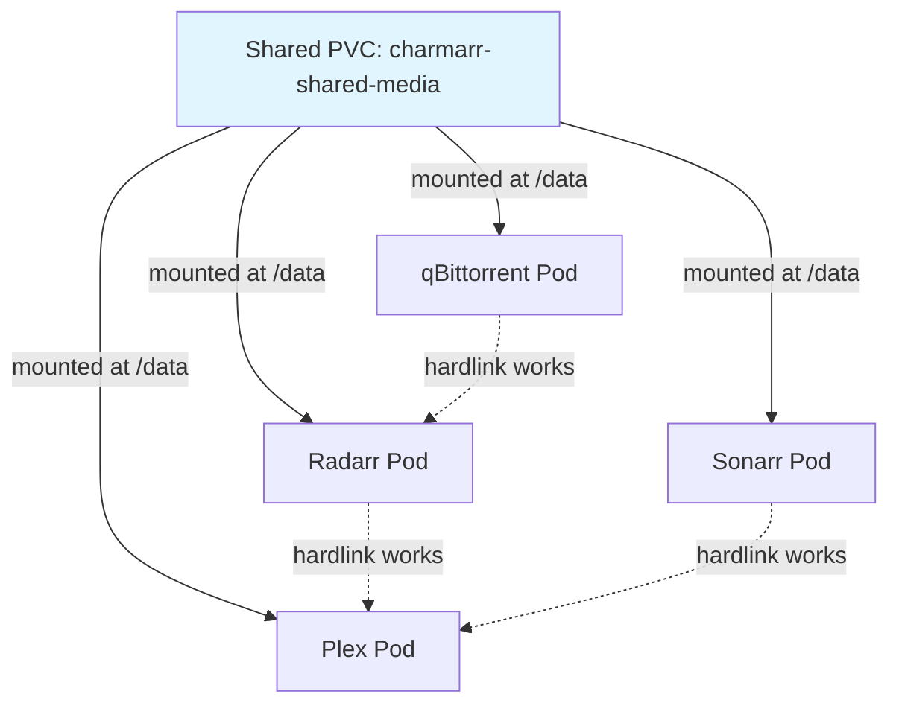

# Shared PVC Architecture for Media Storage

**Status:** Accepted

**Related ADRs:**
- [ADR-002: Charmarr Storage Charm](adr-002-charmarr-storage-charm.md) - Defines who manages this shared PVC
- [ADR-004: PVC Patching in Arr Charms](adr-004-pvc-patching-in-arr-charms.md) - Defines how charms mount this shared PVC

## Context and Problem Statement

Charmarr deploys arr stack applications (Radarr, Sonarr, Plex, etc.) that need to share media files and downloads. The Trash Guides best practices require that downloads and media library exist on the same filesystem to enable hardlinks, which prevents duplicate storage usage when seeding torrents. Juju's standard storage model creates separate PersistentVolumeClaims for each charm, resulting in separate filesystems where hardlinks cannot work across boundaries. How should we architect storage so that all arr applications can access the same filesystem while maintaining clean Juju charm patterns?

## Considered Options

* Use separate PVCs per charm following standard Juju storage patterns
* Use a single shared PVC that all arr charms mount simultaneously
* Use a shared network filesystem mounted outside Kubernetes
* Use symlinks instead of hardlinks to avoid the same-filesystem requirement

## Decision Outcome

Chosen option: "Use a single shared PVC that all arr charms mount simultaneously", because this is the only approach that satisfies the [TRaSH Guides](https://trash-guides.info/) hardlink requirement while keeping storage management within Kubernetes and Juju. Multiple pods can mount the same PVC when it has ReadWriteMany access mode (for NFS) or when all pods are on the same node with ReadWriteOnce (for local storage). This pattern is already proven to work by the k8s-at-home community's media server deployments.



### Implementation Details

The shared PVC follows the TRaSH Guides recommended directory structure within the mounted volume:

```
/data (mount point for all charms)
├── torrents/
│   ├── movies/
│   ├── tv/
│   └── music/
├── usenet/
│   ├── incomplete/
│   └── complete/
│       ├── movies/
│       ├── tv/
│       └── music/
└── media/
    ├── movies/
    ├── tv/
    └── music/
```

Each arr charm mounts the shared PVC at `/data` and uses subdirectories according to Trash Guides conventions. Radarr writes downloads to `/data/torrents/movies` and manages the library at `/data/media/movies`. Sonarr uses `/data/torrents/tv` and `/data/media/tv`. Plex reads from `/data/media`. When Radarr imports a completed download, it creates a hardlink from the download location to the media location, allowing the torrent client to continue seeding while Plex serves the file, with only one copy consuming disk space.

**Access Modes and Multi-Node Considerations:**

For NFS-backed storage, the PVC uses ReadWriteMany access mode, allowing pods to be scheduled on any node in the cluster. For local storage with TopoLVM, the PVC uses ReadWriteOnce access mode, which restricts all pods mounting this PVC to the same node. This is acceptable for single-node deployments and many homelab scenarios where all services run on one server.

**Separation of Config and Data Storage:**

While media and downloads use the shared PVC, each charm maintains separate storage for its configuration and database using standard Juju storage declarations. This config storage is charm-specific, not shared, and can use faster local storage like SSD while the shared media storage might use larger capacity spinning disks or network storage.

### Consequences

* Good, because hardlinks work correctly across all arr applications, preventing duplicate storage usage for seeded torrents
* Good, because follows proven k8s-at-home patterns that the community already uses successfully
* Good, because storage expansion only needs to happen in one place rather than coordinating across multiple PVCs
* Good, because standardizing on Trash Guides directory structure ensures compatibility with existing arr stack documentation and tools
* Good, because separating config storage from media storage allows different storage backends optimized for each use case
* Bad, because we cannot use Juju's built-in storage declarations for the shared data volume
* Bad, because all charms must coordinate to use the same directory structure within the shared storage
* Bad, because with ReadWriteOnce local storage, all pods must be scheduled on the same node
* Bad, because if one charm misbehaves and fills the shared storage, it affects all charms
