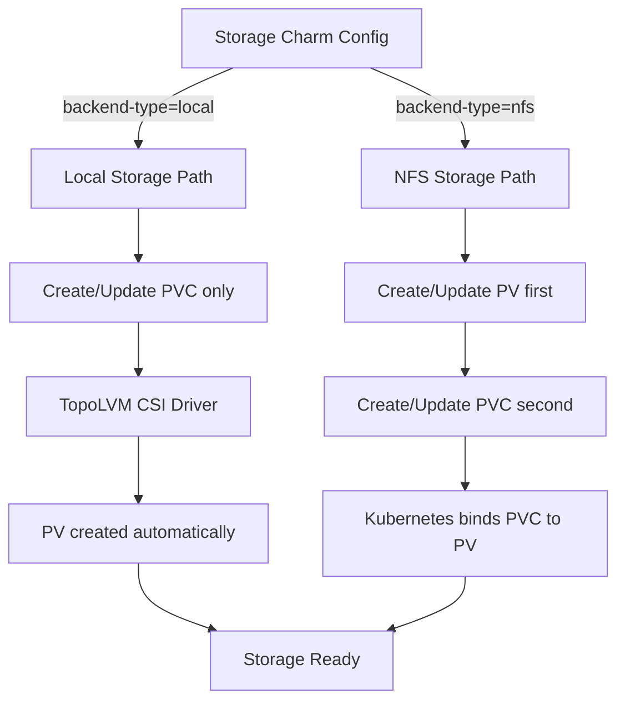

# Backend-Specific Storage Management Strategy

**Status:** Accepted

**Related ADRs:**
- [ADR-002: Charmarr Storage Charm](adr-002-charmarr-storage-charm.md) - Establishes the storage charm that implements backend-specific logic

## Context and Problem Statement

The storage charm (defined in [ADR-002](adr-002-charmarr-storage-charm.md)) needs to support multiple storage backends (LocalFS and NFS for now, with plans for CephFS) with fundamentally different characteristics. Local storage with [TopoLVM](https://github.com/topolvm/topolvm) uses dynamic provisioning where the CSI driver creates and manages PersistentVolumes automatically. NFS storage requires static PersistentVolumes that explicitly point to NFS server exports. These backends have different resource ownership models and different expansion mechanisms. How should the storage charm handle these differences while providing a consistent interface to consuming charms?

## Considered Options

* Attempt to automatically detect backend type and handle both transparently
* Require explicit backend-type configuration and use separate code paths for each
* Only support one backend type initially and add others later
* Create separate storage charms for each backend type (charmarr-storage-local, charmarr-storage-nfs)

## Decision Outcome

Chosen option: "Require explicit backend-type configuration and use separate code paths for each", because explicit configuration makes the charm's behavior predictable and avoids fragile auto-detection logic. Users clearly declare their intent, and the charm implements clean separation between backend types in the reconciler. The semantic meaning of configuration parameters like size differs by backend, and making this explicit prevents confusion.

### Implementation Details

**Local Storage Backend (TopoLVM):**

When `backend-type` is set to "local", the storage charm only manages the PersistentVolumeClaim. The CSI driver (TopoLVM) handles PersistentVolume creation and lifecycle automatically.

Resource ownership:
- **PVC**: Created and managed by the storage charm
- **PV**: Created and managed automatically by TopoLVM CSI driver
- **Logical Volume**: Created and managed by TopoLVM on the underlying LVM volume group

The `size` parameter controls the PVC's storage request. When the user changes the size configuration, the reconciler:
1. Patches the PVC with `spec.resources.requests.storage` set to the new size
2. Watches the PVC for the `FileSystemResizePending` condition
3. Watches for the `FileSystemResizeSuccessful` condition indicating completion
4. Updates relation data with the new size
5. Transitions to active status

If expansion fails (e.g., insufficient space in volume group), TopoLVM reports the error through a PVC condition like `VolumeResizeFailed` with a message explaining the issue. The reconciler detects this and transitions the charm to error status, surfacing the message to users through Juju status.

**NFS Storage Backend:**

When `backend-type` is set to "nfs", the storage charm manages both the PersistentVolume and PersistentVolumeClaim. The PV must exist with sufficient capacity before the PVC can claim storage from it.

Resource ownership:
- **PV**: Created and managed by the storage charm
- **PVC**: Created and managed by the storage charm
- **NFS Export**: Exists externally, managed by user's infrastructure

The `size` parameter controls both the PV capacity and PVC request, kept synchronized. When the user changes the size configuration, the reconciler:
1. Patches the PV with `spec.capacity.storage` set to the new size
2. Patches the PVC with `spec.resources.requests.storage` set to the new size
3. Verifies both updates succeeded (these are metadata-only changes)
4. Updates relation data with the new size
5. Transitions to active status

The actual NFS export capacity must be managed outside Kubernetes. The charm assumes the user has expanded the underlying NFS filesystem before requesting a size increase. If the NFS export is actually smaller than the requested size, Kubernetes won't detect this immediately, but applications will encounter disk full errors when attempting to use the supposedly expanded space.

**Reactive Validation Approach:**

We considered implementing proactive validation where the charm would verify that requested capacity is actually available before attempting expansion. This would require:
- For local storage: Querying TopoLVM or Kubernetes APIs to determine free space in the LVM volume group
- For NFS storage: Mounting the NFS export and checking filesystem capacity

This approach was rejected because:
- It adds significant complexity to the charm
- It requires additional RBAC permissions to access node-level resources
- It creates dependencies on CSI driver-specific implementations
- For NFS, it would require mounting storage in the charm pod just for validation
- The failure would still need to be handled anyway, so reactive handling is sufficient

Instead, the charm assumes users are sensible and have ensured their infrastructure has capacity before requesting expansions. When capacity is insufficient, the charm handles the resulting errors gracefully and communicates them through Juju status. The COS observability stack provides monitoring and alerting for actual storage usage.

### Consequences

* Good, because explicit configuration makes behavior predictable and debuggable
* Good, because separate code paths are easier to understand and maintain than conditional logic trying to handle both
* Good, because users understand what resources the charm manages based on backend type
* Good, because semantic differences in parameters (like size meaning) are documented and clear
* Good, because avoiding proactive validation keeps the charm implementation simpler and more focused
* Good, because each backend uses the most appropriate provisioning mechanism for its characteristics
* Good, because reactive error handling with clear status messages gives users actionable feedback
* Bad, because users must explicitly configure backend type rather than it being detected automatically
* Bad, because adding new backend types requires adding new code paths to the reconciler
* Bad, because the storage charm has backend-specific dependencies and logic
* Bad, because for NFS, the charm cannot verify that the underlying export actually has the requested capacity
* Bad, because users might forget to expand the NFS filesystem before expanding in Kubernetes, leading to confusing failures later
* Bad, because reactive validation means capacity errors are discovered only when expansion is attempted
