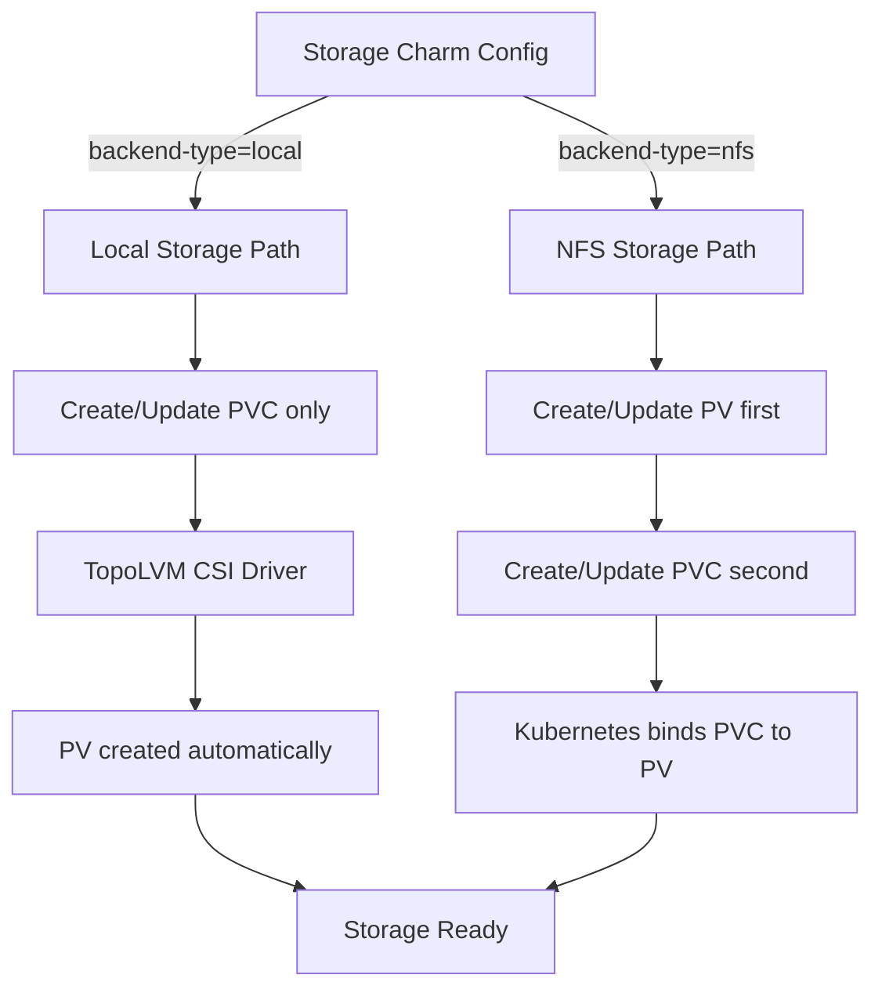

# Backend-Specific Storage Management Strategy

**Status:** Accepted

**Related ADRs:**
- [ADR-002: Charmarr Storage Charm](adr-002-charmarr-storage-charm.md) - Establishes the storage charm that implements backend-specific logic

## Context and Problem Statement

The storage charm (defined in [ADR-002](adr-002-charmarr-storage-charm.md)) needs to support multiple storage backends with fundamentally different characteristics. Local storage with TopoLVM uses dynamic provisioning where the CSI driver creates and manages PersistentVolumes automatically. NFS storage requires static PersistentVolumes that explicitly point to NFS server exports. These backends have different resource ownership models and different expansion mechanisms. How should the storage charm handle these differences while providing a consistent interface to consuming charms?

## Considered Options

* Attempt to automatically detect backend type and handle both transparently
* Require explicit backend-type configuration and use separate code paths for each
* Only support one backend type initially and add others later
* Create separate storage charms for each backend type (charmarr-storage-local, charmarr-storage-nfs)

## Decision Outcome

Chosen option: "Require explicit backend-type configuration and use separate code paths for each", because explicit configuration makes the charm's behavior predictable and avoids fragile auto-detection logic. Users clearly declare their intent, and the charm implements clean separation between backend types in the reconciler. The semantic meaning of configuration parameters like size differs by backend, and making this explicit prevents confusion.

### Implementation Details

**Local Storage Backend (TopoLVM):**

When `backend-type` is set to "local", the storage charm only manages the PersistentVolumeClaim. The CSI driver (TopoLVM) handles PersistentVolume creation and lifecycle automatically.

**When to Use TopoLVM:**
- You need **ReadWriteOnce** block storage with capacity-aware scheduling across multiple nodes
- Running **databases or stateful applications** that need node-local storage (not applicable to Charmarr's shared media)
- You want **LVM features** like thin provisioning and snapshots across a cluster
- Building infrastructure for **workloads other than shared media** that benefit from distributed block storage

**When NOT to Use TopoLVM:**
- **Single-node setups** where capacity-aware scheduling provides no benefit
- **Multi-node shared media workloads** (like Charmarr) - use NFS instead for ReadWriteMany access
- You already have **ZFS/BTRFS** managing your storage with redundancy and snapshots
- **Simplicity is prioritized** over enterprise features for homelab setups
- **Testing/development** environments where you want minimal dependencies

**Critical Insight for Charmarr:** TopoLVM provides ReadWriteOnce access, meaning only one node can mount a given PVC at a time. For Charmarr's shared media PVC, this defeats the purpose of multi-node deployment - all arr pods would be forced to run on the same node anyway. If you're going multi-node, use NFS with ReadWriteMany instead.

**Alternative Local Storage Provisioners:**

For single-node deployments, consider these simpler options:

**local-path-provisioner** (Rancher):
```yaml
# Provisions storage from a directory on the host
# Example: /var/local-path-provisioner
# No LVM required, dynamic provisioning works
# Perfect for MicroK8s homelab
```
- ✅ Simple setup, no LVM knowledge needed
- ✅ Dynamic provisioning works fine
- ✅ Can sit on top of ZFS/BTRFS for redundancy
- ❌ No thin provisioning
- ❌ Harder to migrate to multi-node

**hostPath with manual PV** (Simplest):
```yaml
# Direct mount of host directory
# Example: /mnt/media-storage (could be ZFS dataset)
# Completely manual, Terraform creates PV
```
- ✅ Zero Kubernetes dependencies
- ✅ Explicit control over data location
- ✅ Works great with ZFS datasets or BTRFS subvolumes
- ❌ No dynamic provisioning
- ❌ Manual PV management via Terraform

**Using ZFS/BTRFS with Local Storage:**

If you're using ZFS or BTRFS for your underlying storage, you can layer Kubernetes storage on top:

```bash
# Example: ZFS pool with mirrored vdevs for redundancy
zpool create media-pool mirror /dev/sda /dev/sdb mirror /dev/sdc /dev/sdd
zfs create media-pool/charmarr-data

# Option 1: Use with local-path-provisioner
# Point local-path to /media-pool/charmarr-data

# Option 2: Use with hostPath PV
# Mount /media-pool/charmarr-data directly

# Option 3: Use with TopoLVM
# Create LVM VG on top of ZFS zvol (advanced, rarely needed)
```

The key insight: **Redundancy happens at the filesystem layer (ZFS/BTRFS/RAID), not the Kubernetes layer.** Kubernetes provisioners (TopoLVM, local-path) manage allocation and mounting, but don't protect your data. You need ZFS mirroring/RAIDZ, BTRFS RAID1/10, or hardware RAID for actual redundancy.

Resource ownership:
- **PVC**: Created and managed by the storage charm
- **PV**: Created and managed automatically by TopoLVM CSI driver (or local-path, or manually via Terraform)
- **Logical Volume**: Created and managed by TopoLVM on the underlying LVM volume group (TopoLVM only)
- **Filesystem**: Managed by your infrastructure (ZFS pool, BTRFS filesystem, ext4/xfs on RAID, etc.)

The `size` parameter controls the PVC's storage request. When the user changes the size configuration, the reconciler:
1. Patches the PVC with `spec.resources.requests.storage` set to the new size
2. Watches the PVC for the `FileSystemResizePending` condition
3. Watches for the `FileSystemResizeSuccessful` condition indicating completion
4. Updates relation data with the new size
5. Transitions to active status

If expansion fails (e.g., insufficient space in volume group), TopoLVM reports the error through a PVC condition like `VolumeResizeFailed` with a message explaining the issue. The reconciler detects this and transitions the charm to error status, surfacing the message to users through Juju status.

**NFS Storage Backend:**

When `backend-type` is set to "nfs", the storage charm manages both the PersistentVolume and PersistentVolumeClaim. The PV must exist with sufficient capacity before the PVC can claim storage from it.

Resource ownership:
- **PV**: Created and managed by the storage charm
- **PVC**: Created and managed by the storage charm
- **NFS Export**: Exists externally, managed by user's infrastructure

The `size` parameter controls both the PV capacity and PVC request, kept synchronized. When the user changes the size configuration, the reconciler:
1. Patches the PV with `spec.capacity.storage` set to the new size
2. Patches the PVC with `spec.resources.requests.storage` set to the new size
3. Verifies both updates succeeded (these are metadata-only changes)
4. Updates relation data with the new size
5. Transitions to active status

The actual NFS export capacity must be managed outside Kubernetes. The charm assumes the user has expanded the underlying NFS filesystem before requesting a size increase. If the NFS export is actually smaller than the requested size, Kubernetes won't detect this immediately, but applications will encounter disk full errors when attempting to use the supposedly expanded space.

**Reactive Validation Approach:**

We considered implementing proactive validation where the charm would verify that requested capacity is actually available before attempting expansion. This would require:
- For local storage: Querying TopoLVM or Kubernetes APIs to determine free space in the LVM volume group
- For NFS storage: Mounting the NFS export and checking filesystem capacity

This approach was rejected because:
- It adds significant complexity to the charm
- It requires additional RBAC permissions to access node-level resources
- It creates dependencies on CSI driver-specific implementations
- For NFS, it would require mounting storage in the charm pod just for validation
- The failure would still need to be handled anyway, so reactive handling is sufficient

Instead, the charm assumes users are sensible and have ensured their infrastructure has capacity before requesting expansions. When capacity is insufficient, the charm handles the resulting errors gracefully and communicates them through Juju status. The COS observability stack provides monitoring and alerting for actual storage usage.

**Practical Deployment Examples:**

Example 1 - **Single-node MicroK8s with ZFS pool (local-path):**
```bash
# Infrastructure setup
zpool create -f media mirror /dev/sda /dev/sdb  # Mirrored for redundancy
zfs create -o mountpoint=/mnt/charmarr-data media/charmarr

# Terraform creates hostPath PV pointing to ZFS dataset
# or deploys local-path-provisioner with storage path /mnt/charmarr-data

# Deploy storage charm
juju deploy charmarr-storage --config backend-type=local \
  --config storage-class=local-path --config size=2Ti
```

Example 2 - **Single-node MicroK8s with NFS server on localhost (future-proof approach):**
```bash
# Infrastructure setup - ZFS pool with redundancy
zpool create -f media mirror /dev/sda /dev/sdb  # Mirrored for redundancy
zfs create media/charmarr
zfs set sharenfs="rw=@192.168.1.0/24,no_root_squash" media/charmarr

# Or manually configure NFS exports
echo "/media/charmarr 192.168.1.0/24(rw,sync,no_subtree_check,no_root_squash)" >> /etc/exports
exportfs -ra

# Deploy storage charm pointing to localhost
# Use the node's actual IP, not 127.0.0.1, so NFS client in pod can reach it
juju deploy charmarr-storage --config backend-type=nfs \
  --config nfs-server=192.168.1.100 \
  --config nfs-path=/media/charmarr \
  --config size=2Ti

# Advantages:
# - ReadWriteMany mode even on single node (future-proofing)
# - Consistent NFS architecture from day one
# - Easy migration: later just change nfs-server to dedicated NAS IP
# - ZFS snapshots, compression, and redundancy built-in
```

Example 3 - **Multi-node cluster with NFS (recommended for Charmarr):**
```bash
# NFS server (could be dedicated NAS or one of the k8s nodes)
# Exports /mnt/media-pool/charmarr via NFS
# NFS server handles redundancy (ZFS RAIDZ2, BTRFS RAID1, hardware RAID, etc.)

# Terraform creates static PV pointing to NFS export
# Or storage charm creates PV (our architecture)

# Deploy storage charm  
juju deploy charmarr-storage --config backend-type=nfs \
  --config nfs-server=192.168.1.10 \
  --config nfs-path=/mnt/media-pool/charmarr \
  --config size=4Ti

# Result: All arr pods can run on any node (ReadWriteMany) while accessing same media
```

Example 4 - **Any cluster with dedicated NAS (TrueNAS/Synology):**
```bash
# NAS exports /mnt/media-pool/charmarr via NFS
# NAS handles redundancy (ZFS RAIDZ2, etc.) 

# Terraform creates static PV pointing to NAS export
# Or storage charm creates PV (our architecture)

# Deploy storage charm  
juju deploy charmarr-storage --config backend-type=nfs \
  --config nfs-server=192.168.1.10 \
  --config nfs-path=/mnt/media-pool/charmarr \
  --config size=4Ti
```

Example 5 - **Single-node with BTRFS RAID1:**
```bash
# Infrastructure setup
mkfs.btrfs -m raid1 -d raid1 /dev/sda /dev/sdb  # RAID1 for redundancy
mount /dev/sda /mnt/charmarr-data

# Use local-path-provisioner or hostPath
juju deploy charmarr-storage --config backend-type=local \
  --config storage-class=local-path --config size=2Ti
```

Example 6 - **Multi-node with TopoLVM (for other workloads, not Charmarr media):**
```bash
# This example shows TopoLVM for completeness, but is NOT recommended for
# Charmarr's shared media storage. Use NFS instead (see Example 3).
# TopoLVM is useful for databases or apps that need RWO storage per node.

# Infrastructure setup per node
pvcreate /dev/sdb /dev/sdc
vgcreate app-vg /dev/sdb /dev/sdc  # For application databases, not media

# Terraform deploys TopoLVM CSI driver
# Creates StorageClass "topolvm-provisioner"

# This would be for a different charm's config storage, not shared media
```

**Migration Path Example:**

Starting with Example 2 (single-node NFS on localhost) provides a clean migration to multi-node:

```bash
# Phase 1: Single node at 192.168.1.100 with local NFS
juju deploy charmarr-storage --config backend-type=nfs \
  --config nfs-server=192.168.1.100 \
  --config nfs-path=/media/charmarr \
  --config size=2Ti

# Phase 2: Add second k8s node at 192.168.1.101
# Move NFS to dedicated server at 192.168.1.10 (or keep on .100)
# Just reconfigure the storage charm:
juju config charmarr-storage nfs-server=192.168.1.10

# Storage charm updates PV, all arr pods can now schedule on either node
# No change to arr charms, no change to data location
```

The pattern: **Redundancy at filesystem layer** (ZFS mirror/RAIDZ, BTRFS RAID, hardware RAID, NAS), **provisioning at Kubernetes layer** (local-path for single-node, NFS for multi-node media workloads or future-proof single-node).



### Consequences

* Good, because explicit configuration makes behavior predictable and debuggable
* Good, because separate code paths are easier to understand and maintain than conditional logic trying to handle both
* Good, because users understand what resources the charm manages based on backend type
* Good, because semantic differences in parameters (like size meaning) are documented and clear
* Good, because avoiding proactive validation keeps the charm implementation simpler and more focused
* Good, because each backend uses the most appropriate provisioning mechanism for its characteristics
* Good, because reactive error handling with clear status messages gives users actionable feedback
* Good, because supports both simple single-node setups (local-path, hostPath) and enterprise multi-node setups (TopoLVM, NFS)
* Good, because allows users to leverage existing filesystem-level redundancy (ZFS, BTRFS) rather than requiring Kubernetes-level solutions
* Bad, because users must explicitly configure backend type rather than it being detected automatically
* Bad, because adding new backend types requires adding new code paths to the reconciler
* Bad, because the storage charm has backend-specific dependencies and logic
* Bad, because for NFS, the charm cannot verify that the underlying export actually has the requested capacity
* Bad, because users might forget to expand the NFS filesystem before expanding in Kubernetes, leading to confusing failures later
* Bad, because reactive validation means capacity errors are discovered only when expansion is attempted
* Bad, because requires users to understand the relationship between Kubernetes provisioners and underlying filesystems (e.g., TopoLVM on LVM on ZFS is possible but complex)
