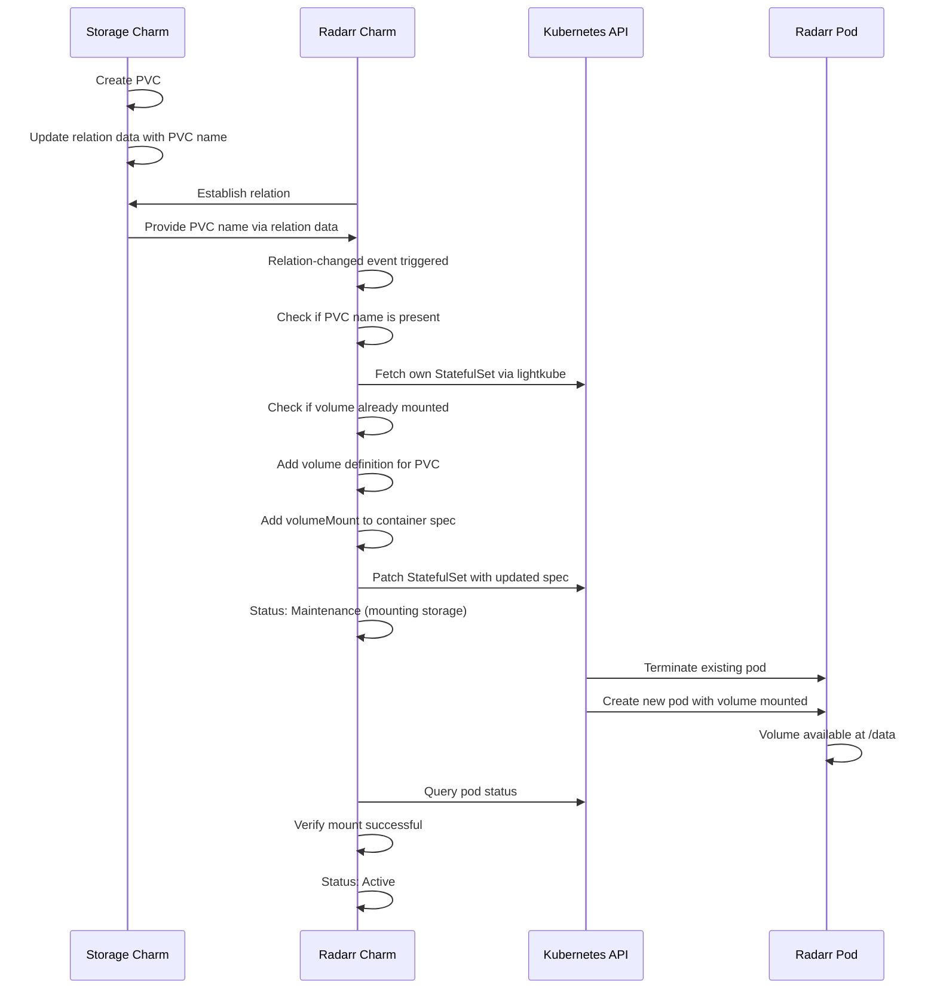

# StatefulSet Volume Patching via Lightkube

**Status:** Proposed

**Related ADRs:**
- [ADR-001: Shared PVC Architecture](adr-001-shared-pvc-architecture.md) - Establishes the shared PVC that needs to be mounted
- [ADR-002: Charmarr Storage Charm](adr-002-charmarr-storage-charm.md) - Defines the storage charm that provides PVC information via relations

## Context and Problem Statement

Consuming charms like Radarr and Sonarr need to mount the shared PVC created by the storage charm (see [ADR-001](adr-001-shared-pvc-architecture.md) and [ADR-002](adr-002-charmarr-storage-charm.md)). Juju's standard storage model uses metadata declarations where charms specify storage requirements at deploy time with `--storage` flags, and Juju automatically creates PVCs and mounts them. However, the shared PVC already exists and is managed by a different charm. How can consuming charms mount a PVC that was created externally and is provided through relation data rather than through Juju's storage system?

## Considered Options

* Use Juju storage declarations with existingClaim somehow (not exposed in Juju's abstraction)
* Have consuming charms use lightkube to patch their own StatefulSet to add volume mounts
* Deploy consuming charms with sidecar containers that handle mounting separately
* Use init containers to copy data from shared storage to per-charm storage

## Decision Outcome

Chosen option: "Have consuming charms use lightkube to patch their own StatefulSet to add volume mounts", because this allows charms to dynamically add volumes after deployment based on relation data, which is not possible with static metadata declarations. Charms can use the lightkube library to fetch their StatefulSet, add volume and volumeMount definitions referencing the PVC by name, and patch the resource back. This pattern works within Juju's sidecar charm model and has been used successfully for other types of pod spec modifications.

**CRITICAL NOTE**: This approach requires validation before full implementation. While patching pod labels and resource constraints is known to work, patching volume mounts causes pod restarts and may interact with Juju's StatefulSet management in unexpected ways. ADR-004 should remain in "Proposed" status until validation testing confirms this pattern works correctly.

### Implementation Details

**Idempotency and State Checking:**

Kubernetes patch operations are semantically idempotent at the API level. If you patch a resource with values it already has, Kubernetes accepts the patch but doesn't consider it a change and doesn't trigger reconciliation or increment the resource version. However, consuming charms should still check current state before patching for efficiency reasons. Making unnecessary API calls wastes resources and increases load on the API server.

The charm reconciler should:
1. Fetch the current StatefulSet using lightkube
2. Inspect the existing volumes list to see if the shared storage volume already exists
3. Inspect the volumeMounts on the workload container to see if the mount is already present
4. Only construct and apply a patch if the desired configuration differs from current state
5. After patching, watch for the StatefulSet rollout to complete

Example reconciler logic:
```python
def _reconcile_shared_storage(self, pvc_name: str):
    """Ensure shared storage PVC is mounted at /data."""
    client = Client()
    sts = client.get(StatefulSet, name=self.app.name, namespace=self.model.name)

    # Check if volume already exists
    existing_volumes = sts.spec.template.spec.volumes or []
    has_volume = any(v.name == "charmarr-shared-data" for v in existing_volumes)

    if not has_volume:
        # Add volume definition
        volume = Volume(
            name="charmarr-shared-data",
            persistentVolumeClaim=PersistentVolumeClaimVolumeSource(
                claimName=pvc_name
            )
        )
        if sts.spec.template.spec.volumes is None:
            sts.spec.template.spec.volumes = []
        sts.spec.template.spec.volumes.append(volume)

        # Add volume mount to workload container
        for container in sts.spec.template.spec.containers:
            if container.name == self.app.name:
                mount = VolumeMount(name="charmarr-shared-data", mountPath="/data")
                if container.volumeMounts is None:
                    container.volumeMounts = []
                container.volumeMounts.append(mount)

        # Apply the patch
        client.patch(StatefulSet, name=self.app.name, obj=sts, namespace=self.model.name)

        # Transition to maintenance status during rollout
        self.unit.status = MaintenanceStatus("Mounting shared storage")
```

**Pod Restart Behavior:**

When the StatefulSet pod template is patched to add volumes or volume mounts, Kubernetes triggers a rolling update of the StatefulSet. For a single-replica StatefulSet (which is typical for arr applications), this means:
1. Kubernetes terminates the existing pod
2. Kubernetes creates a new pod with the updated spec
3. The new pod includes the volume mounted at `/data`
4. Applications inside the pod can access the shared storage

This restart causes brief downtime for the application. The charm should communicate this through status transitions: maintenance status during patching and rollout, then active status once the new pod is running and healthy.

**Sidecar Pattern and Mount Visibility:**

Juju Kubernetes charms use the sidecar pattern where each charm runs in a pod with multiple containers:
- The charm container running the charm code
- The workload container(s) running the actual application (e.g., Radarr)

When a volume is defined at the pod level in the StatefulSet spec, it becomes available to all containers in the pod. The charm only needs to define the volume once and add volumeMounts to the specific containers that need it. Typically, only the workload container needs the shared storage mounted at `/data`, but the charm container could also mount it if needed for validation or other purposes.

**Relation-Driven Configuration Flow:**

The complete flow from deploying charms to having shared storage mounted:

1. User deploys charmarr-storage charm, which creates the shared PVC
2. User deploys Radarr charm, which starts in blocked status waiting for required relations
3. User runs `juju relate radarr charmarr-storage` to establish the relation
4. Relation-joined event fires in both charms
5. Storage charm provides PVC name and configuration via relation data
6. Relation-changed event fires in Radarr charm with the PVC information
7. Radarr's reconciler detects it has PVC name but storage isn't mounted yet
8. Radarr patches its StatefulSet to add volume and mount
9. Kubernetes rolls out the StatefulSet, restarting the pod
10. Radarr's reconciler verifies the mount succeeded (checks if `/data` exists and is writable)
11. Radarr transitions to active status and begins normal operation

**Blocked State Handling:**

When a consuming charm like Radarr is deployed without the required storage relation, it should enter blocked status with a clear message. The charm should not attempt to patch its StatefulSet or start its application until it has received the PVC name through the relation. This prevents errors and makes the dependency clear to users.

Example status handling:
```python
def _on_relation_changed(self, event):
    pvc_name = event.relation.data[event.app].get("pvc-name")

    if not pvc_name:
        self.unit.status = BlockedStatus("Waiting for storage charm to provide PVC")
        return

    # Proceed with mounting
    self._reconcile_shared_storage(pvc_name)
```

**Error Handling Scenarios:**

Several error scenarios need handling:
- PVC name provided but PVC doesn't exist in Kubernetes: Patch will succeed but pod will fail to start, enter CrashLoopBackOff
- StatefulSet patch fails due to permissions: Charm goes to error status with RBAC-related message
- Pod fails to mount volume after patch: Charm detects via pod status and enters error state
- Storage relation is broken while application is running: Charm should NOT remove the volume mount to avoid disruption

**Differences from Standard Juju Storage:**

This approach diverges from standard Juju storage patterns in important ways:
- Storage is not declared in charm metadata
- Storage is not provisioned through `--storage` flags during deployment
- Storage mounting happens dynamically based on relation data
- The charm explicitly manages Kubernetes resources rather than letting Juju handle it
- Multiple charms mount the same PVC, which Juju's storage model doesn't support

These differences mean this pattern requires more careful implementation and testing than standard Juju storage usage, but it's necessary to achieve the shared filesystem requirement for hardlinks.



### Consequences

* Good, because enables dynamic volume mounting based on relation data rather than static deploy-time declarations
* Good, because works within Juju's charm patterns using standard lightkube library that's already used for other patching
* Good, because charms can verify mount success through reconciliation loops
* Good, because allows sharing PVCs across charms without requiring Juju core changes
* Good, because Kubernetes patches are idempotent at the API level, preventing duplicate work
* Good, because sidecar pattern naturally supports mounting volumes at pod level for all containers
* Good, because blocked status clearly communicates when required relations are missing
* Bad, because requires validation that Juju doesn't interfere with manual StatefulSet patches
* Bad, because StatefulSet patching triggers pod restarts which causes brief downtime during initial setup
* Bad, because charms should check state before patching for efficiency, adding complexity to reconciler
* Bad, because this pattern is less common than standard Juju storage, so fewer examples exist
* Bad, because charm needs RBAC permissions to patch StatefulSets in its namespace
* Bad, because error scenarios (missing PVC, mount failures) require careful handling
* **Unknown**, because interaction between Juju's StatefulSet management and manual patches needs testing to confirm Juju accepts these changes gracefully
